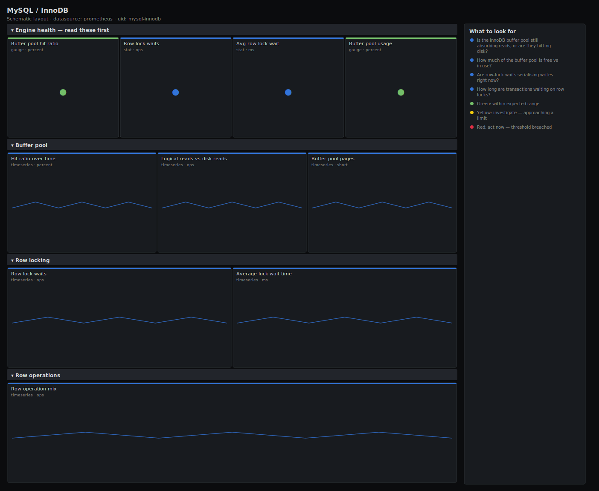

# MySQL / InnoDB

> InnoDB engine internals for MySQL and MariaDB via mysqld_exporter: buffer-pool hit ratio and usage, free vs total pages, row-lock waits and wait time, and the row operation mix. Answers "is the buffer pool big enough, and is row-level locking serialising my writes?".

**Primary search phrase:** MySQL InnoDB Grafana dashboard  
**Category:** `mysql` · **UID:** `mysql-innodb` · **Datasource:** Prometheus



## Questions this dashboard answers

- Is the InnoDB buffer pool still absorbing reads, or are they hitting disk?
- How much of the buffer pool is free vs in use?
- Are row-lock waits serialising writes right now?
- How long are transactions waiting on row locks?
- What is the read/write row-operation mix?

## Production lessons — why this dashboard exists

Two InnoDB numbers explain most database latency that is not a missing index. The **buffer-pool hit ratio**: a healthy OLTP server sits above 99%, and every percent below that is reads turning into disk I/O — the buffer pool is too small for the working set. And **row-lock waits**: InnoDB locks at the row level, so hot rows (counters, queue heads, a single account row) serialise concurrent writers and the wait time balloons under load. This dashboard leads with both, then shows pages-free so you can tell a cold-but-fine cache from one genuinely starved for memory.

## Data source requirements

- **Prometheus** datasource (selected at import time via `${DS_PROMETHEUS}`).
- `mysqld_exporter` with InnoDB status enabled (the `mysql_global_status_innodb_buffer_pool_*` and `mysql_global_status_innodb_row_lock_*` series, plus the `mysql_global_status_commands_total` command counters).

## Template variables

| Variable | Label | Type | Purpose |
|----------|-------|------|---------|
| `${instance}` | Instance | query | MySQL/MariaDB server(s) to display; supports multi-select. |

## Panels

### Engine health — read these first

- **Buffer pool hit ratio** (gauge, `percent`) — Share of InnoDB logical reads served from the buffer pool over 5m. OLTP servers should stay above 99%.
- **Row lock waits** (stat, `ops`) — Row-lock wait events per second. A sustained rate means hot rows are serialising writers.
- **Avg row lock wait** (stat, `ms`) — Mean time a transaction waited for a row lock, derived from lock time over lock waits.
- **Buffer pool usage** (gauge, `percent`) — Share of buffer-pool pages currently in use. Near 100% is normal once warmed; pair with the hit ratio.

### Buffer pool

- **Hit ratio over time** (timeseries, `percent`) — The headline hit ratio as a trend — spot the moment the working set outgrew the pool.
- **Logical reads vs disk reads** (timeseries, `ops`) — Buffer-pool read requests against the subset that fell through to disk. A widening gap is good.
- **Buffer pool pages** (timeseries, `short`) — Free vs total pages per instance. A persistently high free count means the pool is oversized.

### Row locking

- **Row lock waits** (timeseries, `ops`) — Lock-wait events per second. Correlate spikes with deploys or hot-row write bursts.
- **Average lock wait time** (timeseries, `ms`) — Mean wait per lock event. Rising time with steady waits means contention is deepening.

### Row operations

- **Row operation mix** (timeseries, `ops`) — Read vs write balance at the SQL command layer — context for the locking above.

## Import

**Grafana UI** — *Dashboards → New → Import*, upload `dashboards/mysql/innodb.json`, then pick your datasource when prompted.

**API:**

```bash
scripts/import-dashboard.sh dashboards/mysql/innodb.json
```

**Provisioning** — drop the JSON into a provisioned folder (see [provisioning guide](../../provisioning.md)).

## Recommended alerts

Ready-to-use rules ship in `alerts/mysql.rules.yml`.

### MySQLInnoDBBufferPoolHitLow (`warning`)

```promql
100 * (1 - sum by (instance) (rate(mysql_global_status_innodb_buffer_pool_reads[5m])) / clamp_min(sum by (instance) (rate(mysql_global_status_innodb_buffer_pool_read_requests[5m])), 1)) < 99
```

- **Fires after:** `15m`
- **Why it matters:** Reads are falling through to disk, so query latency has already risen — the working set no longer fits in RAM.
- **Investigate:** Compare buffer-pool size to the active data set; check for a large scan or a cold cache after restart.
- **Recovery:** Clears when the ratio recovers above 99% for 5m.
- **False positives:** Expected for the minutes after a restart while the pool warms, or during a deliberate full-table report.

### MySQLInnoDBRowLockWaitsHigh (`warning`)

```promql
sum by (instance) (rate(mysql_global_status_innodb_row_lock_waits[5m])) > 10
```

- **Fires after:** `10m`
- **Why it matters:** Hot rows are serialising concurrent writers, increasing latency and risking lock-wait timeouts.
- **Investigate:** Identify the hot table/row; look for a counter, queue head or account row updated by many sessions.
- **Recovery:** Clears when row-lock waits drop below 10/s for 5m.
- **False positives:** Brief bursts during a migration or a nightly batch are usually benign.

### MySQLInnoDBBufferPoolExhausted (`warning`)

```promql
mysql_global_status_innodb_buffer_pool_pages_free / clamp_min(mysql_global_status_innodb_buffer_pool_pages_total, 1) < 0.02
```

- **Fires after:** `15m`
- **Why it matters:** With almost no free pages, InnoDB evicts on every new read; combined with a low hit ratio this means memory pressure.
- **Investigate:** Check the hit ratio alongside this — full-but-high-hit is fine; full-and-low-hit means the pool is too small.
- **Recovery:** Clears when free pages rise above 2% for 5m.
- **False positives:** A fully warmed pool is normally near-full; this is only a problem when the hit ratio is also low.

## Troubleshooting

| Symptom | Likely cause | First action |
|---------|--------------|--------------|
| Hit ratio sits at exactly 100% | No InnoDB reads in the window, so the clamp dominates the ratio. | Read it together with logical-reads/s; the ratio is only meaningful under load. |
| Average lock wait is zero while waits climb | row_lock_time is reported in milliseconds and rounds to zero for very short waits. | Watch the waits-per-second panel; tiny but frequent waits still indicate contention. |
| Buffer pool usage pinned at 100% | The pool is fully warmed, which is normal and healthy. | Only act when usage is high and the hit ratio is simultaneously low. |

## Performance considerations

All counters use a 5m rate window so a restart never spikes them. Derived ratios clamp their denominator with `clamp_min(...,1)` to stay defined at zero traffic, and per-instance aggregations keep series count proportional to servers.

## Customization

Tune the 99% hit-ratio target to your engine — analytics workloads run lower by design. If your exporter exposes `mysql_global_status_innodb_rows_read/inserted/...`, swap the row-operation panel to those for a truer engine-level view than the SQL command counters.

## Related resources

- [Advanced observability guides](https://devopsaitoolkit.com/guides/)
- [Grafana & Prometheus tutorials](https://devopsaitoolkit.com/blog/)
- [AI Incident Response Assistant](https://devopsaitoolkit.com/dashboard/incident-response)
- [PromQL cookbook](../../../promql/README.md) · [Alerting guide](../../alerting.md) · [Dashboard catalog](../../catalog.md)
