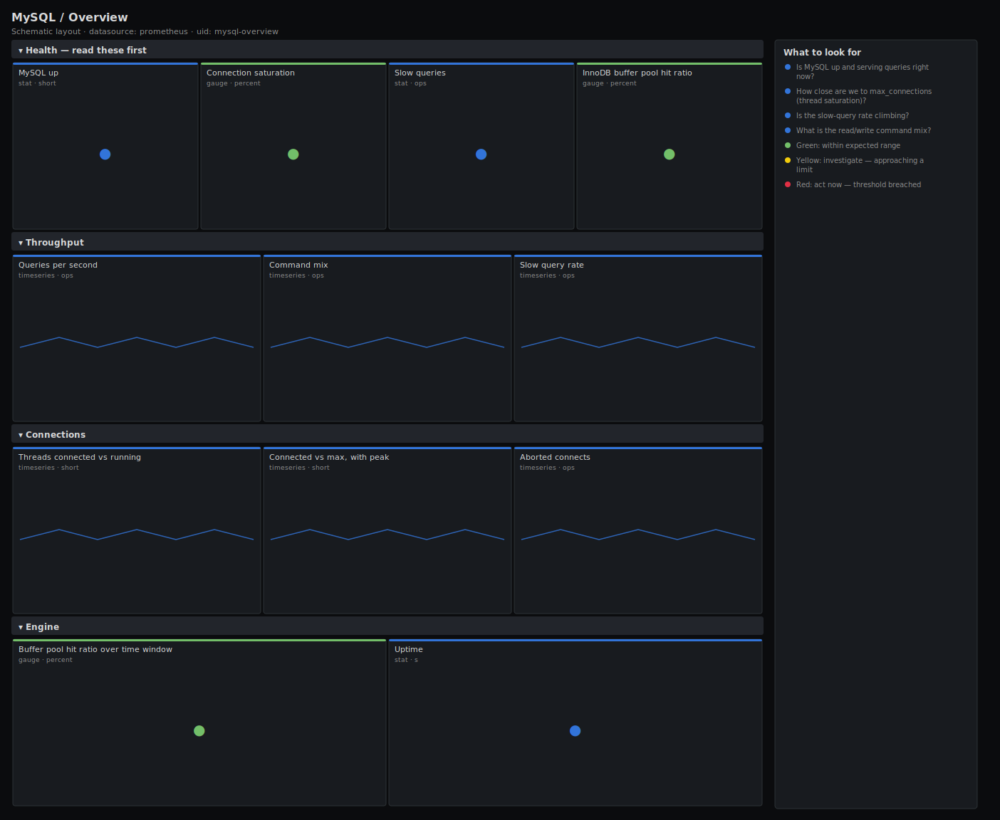

# MySQL / Overview

> Top-level health for MySQL and MariaDB servers scraped by mysqld_exporter: liveness, thread/connection saturation against max_connections, query and slow-query rates, the command mix, InnoDB buffer-pool hit ratio and uptime. Answers "is this server healthy and does it have connection and cache headroom?".

**Primary search phrase:** MySQL Grafana dashboard  
**Category:** `mysql` · **UID:** `mysql-overview` · **Datasource:** Prometheus



## Questions this dashboard answers

- Is MySQL up and serving queries right now?
- How close are we to max_connections (thread saturation)?
- Is the slow-query rate climbing?
- What is the read/write command mix?
- Is the InnoDB buffer pool still absorbing reads?

## Production lessons — why this dashboard exists

MySQL outages cluster around two numbers: threads_connected hitting max_connections (after which the server returns "Too many connections" and the app falls over) and a slow-query rate that quietly multiplies until threads pile up. This dashboard leads with both, plus the buffer-pool hit ratio, because a buffer pool that stops absorbing reads turns every query into disk I/O and is usually the root cause behind the slow queries. Threads_running matters more than threads_connected during an incident: a thousand connected but five running is idle pooling; fifty running is real concurrency the server is struggling to clear.

## Data source requirements

- **Prometheus** datasource (selected at import time via `${DS_PROMETHEUS}`).
- `mysqld_exporter` pointed at each server (the `mysql_up`, `mysql_global_status_threads_*`, `mysql_global_variables_max_connections`, `mysql_global_status_queries`, `mysql_global_status_slow_queries` and `mysql_global_status_innodb_buffer_pool_*` series).

## Template variables

| Variable | Label | Type | Purpose |
|----------|-------|------|---------|
| `${instance}` | Instance | query | MySQL/MariaDB server(s) to display; supports multi-select. |

## Panels

### Health — read these first

- **MySQL up** (stat, `short`) — Liveness from mysqld_exporter. 1 = the exporter reached the server.
- **Connection saturation** (gauge, `percent`) — Worst instance's threads_connected as a percentage of max_connections.
- **Slow queries** (stat, `ops`) — Slow queries per second across selected servers — queries exceeding long_query_time.
- **InnoDB buffer pool hit ratio** (gauge, `percent`) — Share of InnoDB reads served from the buffer pool over 5m. Below ~99% means disk reads.

### Throughput

- **Queries per second** (timeseries, `ops`) — Total query throughput. The baseline for everything else on this dashboard.
- **Command mix** (timeseries, `ops`) — Read vs write balance from the SELECT/INSERT/UPDATE/DELETE counters.
- **Slow query rate** (timeseries, `ops`) — Slow queries per second over time. A rising line precedes thread pile-ups.

### Connections

- **Threads connected vs running** (timeseries, `short`) — Connected threads are the pool; running threads are the real concurrency the server must clear.
- **Connected vs max, with peak** (timeseries, `short`) — Threads connected against max_connections and the high-water mark since startup.
- **Aborted connects** (timeseries, `ops`) — Failed connection attempts per second — auth failures, bad handshakes or a saturated server.

### Engine

- **Buffer pool hit ratio over time window** (gauge, `percent`) — Same hit ratio as the headline gauge, as a second confirmation read.
- **Uptime** (stat, `s`) — Time since the MySQL server last started. A reset to near-zero means an unexpected restart.

## Import

**Grafana UI** — *Dashboards → New → Import*, upload `dashboards/mysql/overview.json`, then pick your datasource when prompted.

**API:**

```bash
scripts/import-dashboard.sh dashboards/mysql/overview.json
```

**Provisioning** — drop the JSON into a provisioned folder (see [provisioning guide](../../provisioning.md)).

## Recommended alerts

Ready-to-use rules ship in `alerts/mysql.rules.yml`.

### MySQLInstanceDown (`critical`)

```promql
mysql_up == 0
```

- **Fires after:** `1m`
- **Why it matters:** The exporter cannot reach the server — application queries are likely failing too.
- **Investigate:** Check the mysqld service and host; confirm the exporter credentials and that the server accepts connections.
- **Recovery:** Clears once mysql_up reports 1 again.
- **False positives:** Exporter restart or credential rotation can briefly trip this — keep `for` at 1m.

### MySQLConnectionSaturationHigh (`warning`)

```promql
100 * mysql_global_status_threads_connected / on (instance) mysql_global_variables_max_connections > 85
```

- **Fires after:** `10m`
- **Why it matters:** At 100% the server returns "Too many connections" and the whole application fails, even with spare CPU.
- **Investigate:** Open MySQL / Overview; check threads_running, aborted_connects and whether a pooler is missing.
- **Recovery:** Clears when saturation drops below 85% for 5m.
- **False positives:** Short spikes during deploys or pool warm-up; raise `for` if your pooler recycles connections.

### MySQLSlowQueryRateHigh (`warning`)

```promql
sum by (instance) (rate(mysql_global_status_slow_queries[5m])) > 1
```

- **Fires after:** `10m`
- **Why it matters:** A rising slow-query rate ties up threads and is the usual precursor to connection exhaustion.
- **Investigate:** Enable the slow query log; check the buffer-pool hit ratio and look for a missing index or a full scan.
- **Recovery:** Clears when the slow-query rate drops below 1/s for 5m.
- **False positives:** A low long_query_time or a heavy nightly report can inflate the rate; tune the threshold per workload.

## Troubleshooting

| Symptom | Likely cause | First action |
|---------|--------------|--------------|
| All panels show "No data" | mysqld_exporter not scraped or wrong `$instance`. | Check `mysql_up` in Explore and confirm the instance label matches your scrape config. |
| Command-mix panel is empty | This build of the exporter uses per-command counters under a different name. | Confirm `mysql_global_status_commands_total` exists; some versions expose `mysql_global_status_com_select` etc. instead. |
| Buffer pool hit ratio reads 100% with no traffic | read_requests rate is ~0, so the clamp dominates. | Read it alongside the queries-per-second panel; it is only meaningful under load. |

## Performance considerations

Rates use a 5m window (≥4× a typical 15–30s scrape) so a restart does not spike them. The buffer-pool ratio clamps its denominator with `clamp_min(...,1)` to stay defined at zero traffic. Saturation joins on `instance` to keep one series per server.

## Customization

Tune the 85% saturation and 99% buffer-pool thresholds to your SLOs. If your exporter exposes per-command `mysql_global_status_com_*` gauges instead of `mysql_global_status_commands_total`, swap the command-mix targets accordingly.

## Related resources

- [Advanced observability guides](https://devopsaitoolkit.com/guides/)
- [Grafana & Prometheus tutorials](https://devopsaitoolkit.com/blog/)
- [AI Incident Response Assistant](https://devopsaitoolkit.com/dashboard/incident-response)
- [PromQL cookbook](../../../promql/README.md) · [Alerting guide](../../alerting.md) · [Dashboard catalog](../../catalog.md)
