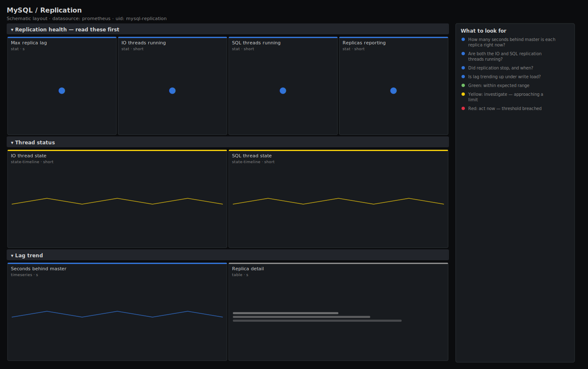

# MySQL / Replication

> Replica health for MySQL and MariaDB via mysqld_exporter: seconds behind master, the running state of the IO and SQL replication threads over time, and the lag trend. Answers "are my replicas keeping up, and have the replication threads stopped?".

**Primary search phrase:** MySQL replication Grafana dashboard  
**Category:** `mysql` · **UID:** `mysql-replication` · **Datasource:** Prometheus



## Questions this dashboard answers

- How many seconds behind master is each replica right now?
- Are both the IO and SQL replication threads running?
- Did replication stop, and when?
- Is lag trending up under write load?

## Production lessons — why this dashboard exists

MySQL replication fails in two distinct ways and you must watch both. **Lag** (seconds_behind_master) is a data-loss and staleness budget: read replicas serving stale data, or a failover that drops the lagging window of writes. And a **stopped thread**: the SQL thread hits a duplicate-key or schema error and halts, at which point seconds_behind_master often reads NULL/0 and looks deceptively healthy while the replica silently stops applying changes. This dashboard leads with lag and a state-timeline of both threads so a stopped SQL thread is impossible to miss — that is the failure that quietly diverges a replica for hours.

## Data source requirements

- **Prometheus** datasource (selected at import time via `${DS_PROMETHEUS}`).
- `mysqld_exporter` with the slave-status collector on each replica (the `mysql_slave_status_seconds_behind_master`, `mysql_slave_status_slave_io_running` and `mysql_slave_status_slave_sql_running` series).

## Template variables

| Variable | Label | Type | Purpose |
|----------|-------|------|---------|
| `${instance}` | Instance | query | MySQL/MariaDB replicas to display; supports multi-select. |

## Panels

### Replication health — read these first

- **Max replica lag** (stat, `s`) — Highest seconds_behind_master across selected replicas — the staleness and failover exposure.
- **IO threads running** (stat, `short`) — Replicas whose IO thread (pulling the binlog from the master) is running.
- **SQL threads running** (stat, `short`) — Replicas whose SQL thread (applying the relay log) is running. A stopped SQL thread halts replication.
- **Replicas reporting** (stat, `short`) — Number of servers exporting slave status — i.e. configured as replicas.

### Thread status

- **IO thread state** (state-timeline, `short`) — Running (green) vs stopped (red) over time for each replica's IO thread.
- **SQL thread state** (state-timeline, `short`) — Running (green) vs stopped (red) over time. A red band here is a replica that stopped applying changes.

### Lag trend

- **Seconds behind master** (timeseries, `s`) — Per-replica lag over time. Sustained climbs mean the replica cannot apply changes as fast as they arrive.
- **Replica detail** (table, `s`) — Current lag per replica, most-behind first.

## Import

**Grafana UI** — *Dashboards → New → Import*, upload `dashboards/mysql/replication.json`, then pick your datasource when prompted.

**API:**

```bash
scripts/import-dashboard.sh dashboards/mysql/replication.json
```

**Provisioning** — drop the JSON into a provisioned folder (see [provisioning guide](../../provisioning.md)).

## Recommended alerts

Ready-to-use rules ship in `alerts/mysql.rules.yml`.

### MySQLReplicationLagHigh (`warning`)

```promql
mysql_slave_status_seconds_behind_master > 30
```

- **Fires after:** `5m`
- **Why it matters:** A replica 30s behind serves stale reads and would lose that window of writes on failover.
- **Investigate:** Open MySQL / Replication; check whether the SQL thread is single-threaded and whether a long transaction is replaying.
- **Recovery:** Clears when lag drops below 30s for 5m.
- **False positives:** A large batch write or schema change can cause transient catch-up lag.

### MySQLReplicationIOStopped (`critical`)

```promql
mysql_slave_status_slave_io_running == 0
```

- **Fires after:** `1m`
- **Why it matters:** The replica is no longer pulling the binlog from the master, so it has stopped receiving changes entirely.
- **Investigate:** Run SHOW SLAVE STATUS; check Last_IO_Error for network, auth or binlog-position problems.
- **Recovery:** Clears once the IO thread is running again.
- **False positives:** A brief stop during a planned master switch or maintenance window.

### MySQLReplicationSQLStopped (`critical`)

```promql
mysql_slave_status_slave_sql_running == 0
```

- **Fires after:** `1m`
- **Why it matters:** The replica has stopped applying the relay log — it is silently diverging from the master and is unsafe to read.
- **Investigate:** Run SHOW SLAVE STATUS; read Last_SQL_Error (often a duplicate key or missing table).
- **Recovery:** Clears once the SQL thread is running again.
- **False positives:** A deliberate STOP SLAVE during a controlled maintenance operation.

## Troubleshooting

| Symptom | Likely cause | First action |
|---------|--------------|--------------|
| All panels show "No data" | The replica is not configured, or the slave-status collector is disabled in mysqld_exporter. | Confirm the server is a replica and enable the slave-status collector, then re-scrape. |
| Lag reads 0 but the SQL thread is stopped | seconds_behind_master is reported as 0/NULL when replication is not running. | Trust the SQL-thread state-timeline, not the lag number, when a thread is stopped. |
| Thread-state panel shows only one replica | Other replicas are not exporting slave status (wrong user privileges). | Grant REPLICATION CLIENT to the exporter user on every replica. |

## Performance considerations

Lag and thread-state panels read instantaneous gauges, so they are inexpensive regardless of replica count. The state-timelines merge equal adjacent values, keeping the rendered series compact even over long time ranges.

## Customization

Set the 10s/30s lag thresholds to your read-staleness SLA. For multi-source or channel-based replication, add the channel label to the legends so each stream is tracked independently.

## Related resources

- [Advanced observability guides](https://devopsaitoolkit.com/guides/)
- [Grafana & Prometheus tutorials](https://devopsaitoolkit.com/blog/)
- [AI Incident Response Assistant](https://devopsaitoolkit.com/dashboard/incident-response)
- [PromQL cookbook](../../../promql/README.md) · [Alerting guide](../../alerting.md) · [Dashboard catalog](../../catalog.md)
