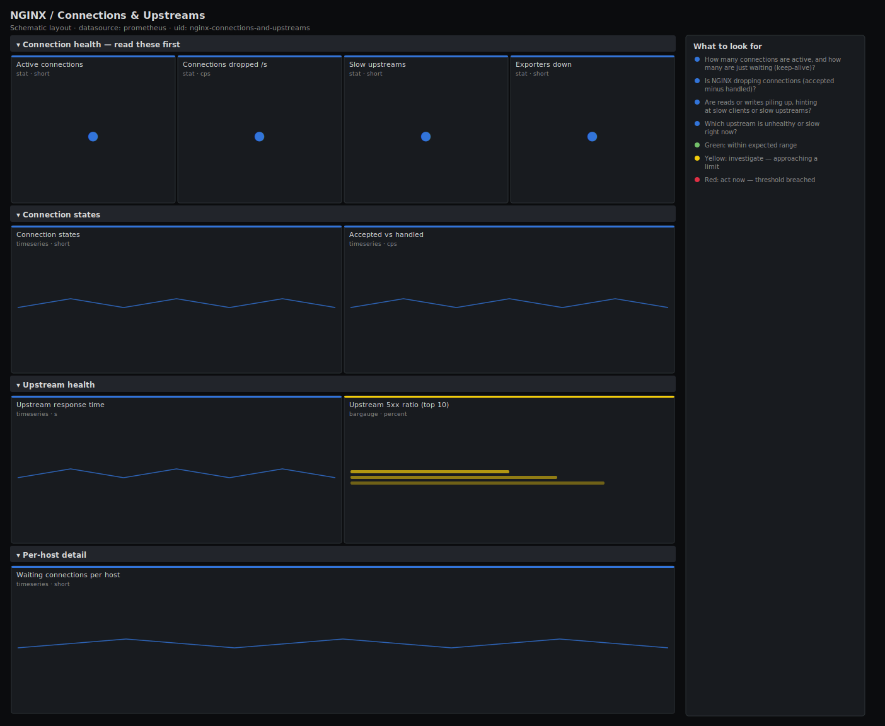

# NGINX / Connections & Upstreams

> Active connection states, accept-vs-handle (dropped) connections and per-upstream health for NGINX. Answers "is NGINX itself refusing or queuing connections, and are the backends behind it healthy?" rather than only graphing the active-connection gauge.

**Primary search phrase:** NGINX connections and upstreams Grafana dashboard  
**Category:** `nginx` · **UID:** `nginx-connections-and-upstreams` · **Datasource:** Prometheus



## Questions this dashboard answers

- How many connections are active, and how many are just waiting (keep-alive)?
- Is NGINX dropping connections (accepted minus handled)?
- Are reads or writes piling up, hinting at slow clients or slow upstreams?
- Which upstream is unhealthy or slow right now?
- Is the exporter — and therefore NGINX — up?

## Production lessons — why this dashboard exists

When NGINX "feels slow" the cause is usually one of two things the active- connection number can't show you: connections being **dropped** before they are served (worker_connections or file-descriptor exhaustion), or a **waiting** pile-up from slow upstreams holding workers open. This dashboard leads with dropped connections and the active-vs-waiting split so you can tell a saturation problem from a backend problem in seconds, then drills into per-upstream health. `accepted` and `handled` are counters — if their rates diverge, NGINX is hitting a connection limit and silently dropping clients.

## Data source requirements

- **Prometheus** datasource (selected at import time via `${DS_PROMETHEUS}`).
- `nginx-prometheus-exporter` against stub_status (`nginx_connections_active`, `nginx_connections_reading`, `nginx_connections_writing`, `nginx_connections_waiting`, `nginx_connections_accepted`, `nginx_connections_handled`, `nginx_up`).
- Per-upstream panels need the **VTS** module exporter (`nginx_vts_upstream_responses_total{code}`, `nginx_vts_upstream_response_seconds`). Without VTS the upstream row is empty but the connection rows still work on plain stub_status.

## Template variables

| Variable | Label | Type | Purpose |
|----------|-------|------|---------|
| `${job}` | Job | query | Prometheus scrape job for your NGINX exporter targets. |
| `${instance}` | Instance | query | NGINX host(s) to display; supports multi-select. |

## Panels

### Connection health — read these first

- **Active connections** (stat, `short`) — Current open connections across the selected NGINX hosts.
- **Connections dropped /s** (stat, `cps`) — Accepted minus handled — connections NGINX refused. Should be flat zero.
- **Slow upstreams** (stat, `short`) — Count of upstreams whose response time exceeds 1s right now.
- **Exporters down** (stat, `short`) — NGINX targets reporting nginx_up == 0 (exporter or NGINX unreachable).

### Connection states

- **Connection states** (timeseries, `short`) — Active connections split into reading, writing and waiting (idle keep-alive).
- **Accepted vs handled** (timeseries, `cps`) — When the handled rate falls below accepted, NGINX is dropping connections at a limit.

### Upstream health

- **Upstream response time** (timeseries, `s`) — Per-upstream response time from VTS — spot the backend pulling away from its peers.
- **Upstream 5xx ratio (top 10)** (bargauge, `percent`) — Share of each upstream's responses that are server errors — ranks the failing backends.

### Per-host detail

- **Waiting connections per host** (timeseries, `short`) — Idle keep-alive connections per host — a steady climb can exhaust worker_connections.

## Import

**Grafana UI** — *Dashboards → New → Import*, upload `dashboards/nginx/connections-and-upstreams.json`, then pick your datasource when prompted.

**API:**

```bash
scripts/import-dashboard.sh dashboards/nginx/connections-and-upstreams.json
```

**Provisioning** — drop the JSON into a provisioned folder (see [provisioning guide](../../provisioning.md)).

## Recommended alerts

Ready-to-use rules ship in `alerts/nginx.rules.yml`.

### NginxConnectionsDropped (`critical`)

```promql
sum by (job, instance) (
  rate(nginx_connections_accepted[5m]) - rate(nginx_connections_handled[5m])
) > 0
```

- **Fires after:** `5m`
- **Why it matters:** Dropped connections mean clients are refused before being served — a hard capacity limit, usually worker_connections or file descriptors.
- **Investigate:** Open NGINX / Connections & Upstreams, check active vs waiting; inspect `worker_connections`, `worker_rlimit_nofile` and the OS fd limit.
- **Recovery:** Clears when accepted and handled rates match again for 5m.
- **False positives:** Counter resets during a reload can momentarily skew the rate; the 5m `for` filters most of these.

### NginxExporterDown (`critical`)

```promql
nginx_up == 0
```

- **Fires after:** `5m`
- **Why it matters:** The exporter can't reach stub_status — NGINX is down, unreachable, or stub_status is misconfigured. You are blind to the proxy.
- **Investigate:** Check the NGINX service and the `/stub_status` location; confirm the exporter container/process is running.
- **Recovery:** Clears when nginx_up returns to 1.
- **False positives:** Brief blips during a planned restart — the 5m `for` covers normal reloads.

### NginxUpstreamErrorRatio (`warning`)

```promql
100 * sum by (job, upstream) (rate(nginx_vts_upstream_responses_total{code="5xx"}[5m])) / clamp_min(sum by (job, upstream) (rate(nginx_vts_upstream_responses_total[5m])), 1) > 5
```

- **Fires after:** `10m`
- **Why it matters:** A backend behind NGINX is failing a meaningful share of requests, which surfaces to users as errors or retries.
- **Investigate:** Compare the failing upstream's members; check the backend service's own health and recent deploys.
- **Recovery:** Clears when the upstream 5xx ratio falls below 5% for 5m.
- **False positives:** Backends where some 5xx is expected under load testing — scope by upstream name.

## Troubleshooting

| Symptom | Likely cause | First action |
|---------|--------------|--------------|
| Dropped connections panel is red but NGINX looks fine | A counter reset during reload produced a one-off negative-then-positive rate. | Widen the panel range; if it self-clears within minutes it was a reload artifact. |
| Waiting climbs without bound | Slow upstreams holding workers, or keep-alive timeouts too long. | Check upstream response time; tune `keepalive_timeout` and upstream `keepalive`. |
| Upstream panels empty | stub_status only — no per-upstream stats. | Install the VTS module exporter for the upstream rows. |

## Performance considerations

Connection gauges are read instantly; rates use a 5m window so accepted/handled counters survive reloads. Series are bounded with `sum by (instance|upstream)`. On large proxy fleets, pre-compute the per-upstream error ratio with a recording rule to keep the bargauge cheap.

## Customization

Set the dropped-connection threshold to exactly 0 in your environment — any sustained drop is actionable. Scope `$instance` to an edge tier to separate public proxies from internal ones, and adjust the 1s slow-upstream threshold to match your latency budget.

## Related resources

- [Advanced observability guides](https://devopsaitoolkit.com/guides/)
- [Grafana & Prometheus tutorials](https://devopsaitoolkit.com/blog/)
- [AI Incident Response Assistant](https://devopsaitoolkit.com/dashboard/incident-response)
- [PromQL cookbook](../../../promql/README.md) · [Alerting guide](../../alerting.md) · [Dashboard catalog](../../catalog.md)
