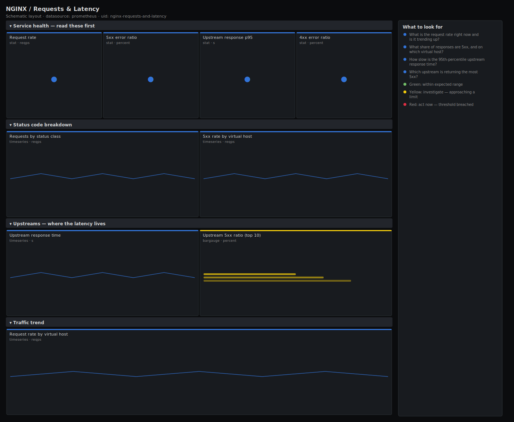

# NGINX / Requests & Latency

> Request rate, HTTP status-code mix, 5xx error ratio and upstream response time for NGINX scraped via the VTS exporter. Answers "are we serving errors or serving them slowly, and which upstream is to blame?" rather than just drawing a connection counter.

**Primary search phrase:** NGINX requests and latency Grafana dashboard  
**Category:** `nginx` · **UID:** `nginx-requests-and-latency` · **Datasource:** Prometheus



## Questions this dashboard answers

- What is the request rate right now and is it trending up?
- What share of responses are 5xx, and on which virtual host?
- How slow is the 95th-percentile upstream response time?
- Which upstream is returning the most 5xx?
- Are 4xx spikes a client problem or a broken release?

## Production lessons — why this dashboard exists

A flat request-rate graph tells you nothing about whether users are happy. The signal that pages you is the **5xx ratio** and the **tail latency** of the upstreams behind NGINX, so this dashboard leads with both. The most common incident pattern is a single upstream going slow or unhealthy while overall request rate looks normal — averages hide it, which is why we surface the p95 of upstream response time and break errors down by `code` and `upstream`. The stub_status exporter cannot see status codes or upstreams; this dashboard assumes the VTS module exporter, and degrades gracefully to a total rate if you only run stub_status.

## Data source requirements

- **Prometheus** datasource (selected at import time via `${DS_PROMETHEUS}`).
- `nginx-prometheus-exporter` with the **VTS** module enabled (the `nginx_vts_server_requests_total{code}`, `nginx_vts_upstream_responses_total` and `nginx_vts_upstream_response_seconds` series). Plain stub_status only exposes `nginx_http_requests_total` / `nginx_up` and cannot break down by status code or upstream — install the VTS module for this dashboard.
- VTS exposes a synthetic `code="total"` series; the per-class codes are `1xx`/`2xx`/`3xx`/`4xx`/`5xx`.

## Template variables

| Variable | Label | Type | Purpose |
|----------|-------|------|---------|
| `${job}` | Job | query | Prometheus scrape job for your NGINX VTS exporter targets. |
| `${host}` | Virtual host | query | NGINX server-block host(s) to display; supports multi-select. |

## Panels

### Service health — read these first

- **Request rate** (stat, `reqps`) — Total requests per second across the selected virtual hosts.
- **5xx error ratio** (stat, `percent`) — Share of responses that are server errors. The number that decides whether to page.
- **Upstream response p95** (stat, `s`) — 95th percentile of sampled upstream response time. VTS reports an average, so we take the tail with quantile_over_time.
- **4xx error ratio** (stat, `percent`) — Share of client-error responses — a spike often means a broken release or a bad client, not a server fault.

### Status code breakdown

- **Requests by status class** (timeseries, `reqps`) — Request rate split by HTTP status class. A growing red band is a server-side regression.
- **5xx rate by virtual host** (timeseries, `reqps`) — Per-host server-error rate — isolates which server block is failing.

### Upstreams — where the latency lives

- **Upstream response time** (timeseries, `s`) — Per-upstream response time reported by VTS. Watch for one backend pulling away from the pack.
- **Upstream 5xx ratio (top 10)** (bargauge, `percent`) — Share of each upstream's responses that are 5xx — ranks the unhealthy backends.

### Traffic trend

- **Request rate by virtual host** (timeseries, `reqps`) — Per-host throughput — capacity-planning and noisy-neighbour context for the headline rate.

## Import

**Grafana UI** — *Dashboards → New → Import*, upload `dashboards/nginx/requests-and-latency.json`, then pick your datasource when prompted.

**API:**

```bash
scripts/import-dashboard.sh dashboards/nginx/requests-and-latency.json
```

**Provisioning** — drop the JSON into a provisioned folder (see [provisioning guide](../../provisioning.md)).

## Recommended alerts

Ready-to-use rules ship in `alerts/nginx.rules.yml`.

### NginxHigh5xxRatio (`critical`)

```promql
100 * sum by (job, host) (rate(nginx_vts_server_requests_total{code="5xx"}[5m])) / clamp_min(sum by (job, host) (rate(nginx_vts_server_requests_total{code="total"}[5m])), 1) > 5
```

- **Fires after:** `5m`
- **Why it matters:** A sustained server-error ratio means users are getting failures — this is a customer-facing outage signal.
- **Investigate:** Open NGINX / Requests & Latency, scope to the host, then check the upstream 5xx ratio and response-time panels to find the failing backend.
- **Recovery:** Clears when the 5xx ratio falls below 5% for 5m.
- **False positives:** Synthetic load tests that intentionally hit error paths — scope the rule by host or raise the threshold.

### NginxUpstreamSlow (`warning`)

```promql
max by (job, upstream) (quantile_over_time(0.95, nginx_vts_upstream_response_seconds[5m])) > 1
```

- **Fires after:** `10m`
- **Why it matters:** Slow upstream responses inflate user-facing latency even when error rate looks fine.
- **Investigate:** Compare the slow upstream against its peers; check the backend service's own latency and saturation dashboards.
- **Recovery:** Clears when upstream p95 drops below 1s for 5m.
- **False positives:** Endpoints that are legitimately slow (reports, exports) — give them a dedicated upstream and threshold.

### NginxHigh4xxRatio (`warning`)

```promql
100 * sum by (job, host) (rate(nginx_vts_server_requests_total{code="4xx"}[5m])) / clamp_min(sum by (job, host) (rate(nginx_vts_server_requests_total{code="total"}[5m])), 1) > 20
```

- **Fires after:** `10m`
- **Why it matters:** A jump in client errors often signals a broken release (wrong routes), an auth outage, or an abusive client.
- **Investigate:** Break 4xx down by URI in your access logs; correlate the spike with the last deploy time.
- **Recovery:** Clears when the 4xx ratio falls below 20% for 5m.
- **False positives:** APIs where 401/404 are part of normal flow (probes, cache validation) run a higher baseline.

## Troubleshooting

| Symptom | Likely cause | First action |
|---------|--------------|--------------|
| All panels show "No data" | VTS module not enabled, or wrong `$job`. | Confirm `nginx_vts_server_requests_total` exists in Explore; if only `nginx_http_requests_total` is present, install the VTS module. |
| 5xx ratio is empty but traffic is flowing | The `code="total"` series is missing from your VTS build. | Replace the denominator with `sum(rate(...{code=~"[1-5]xx"}[5m]))` to sum the per-class counters instead. |
| Upstream panels are blank | No upstream blocks defined, or upstream stats disabled in the VTS config. | Enable `vhost_traffic_status_zone` on the upstream blocks and reload NGINX. |

## Performance considerations

All rates use a 5m window (≥4× a typical 15s scrape) so counters survive a reload. Aggregations use `sum/max by (host|upstream)` to keep series bounded. The p95 uses `quantile_over_time` over the gauge VTS exports; on very large fleets pre-aggregate the upstream series with a recording rule.

## Customization

Tune the 5%/20% error thresholds to your SLOs. To track a single application, scope `$host` to its server-block names. If you run a true histogram exporter, swap the `quantile_over_time` p95 for `histogram_quantile(0.95, ...)` on the bucket series for a more accurate tail.

## Related resources

- [Advanced observability guides](https://devopsaitoolkit.com/guides/)
- [Grafana & Prometheus tutorials](https://devopsaitoolkit.com/blog/)
- [AI Incident Response Assistant](https://devopsaitoolkit.com/dashboard/incident-response)
- [PromQL cookbook](../../../promql/README.md) · [Alerting guide](../../alerting.md) · [Dashboard catalog](../../catalog.md)
