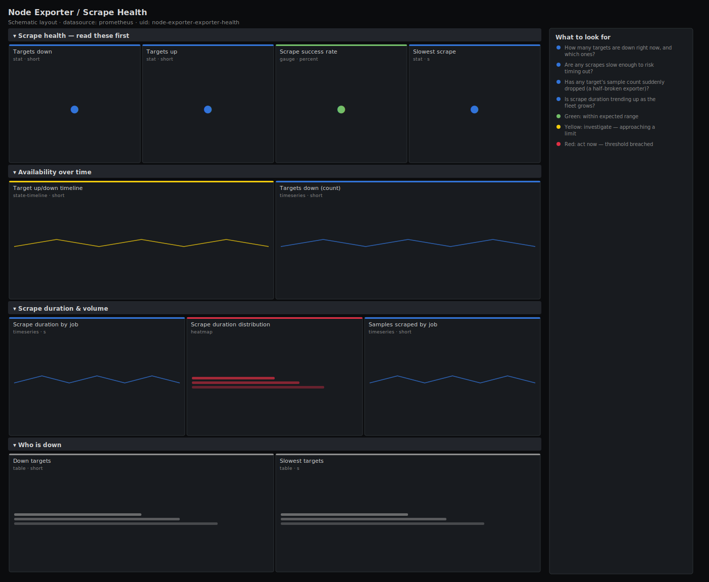

# Node Exporter / Scrape Health

> Meta-monitoring for your Prometheus scrape pipeline: which targets are down, how long scrapes take, and how many samples each target returns. When a dashboard shows "No data", this is the board that tells you whether the exporter died, the scrape timed out, or the target simply stopped being discovered.

**Primary search phrase:** Prometheus scrape health Grafana dashboard  
**Category:** `node-exporter` · **UID:** `node-exporter-exporter-health` · **Datasource:** Prometheus



## Questions this dashboard answers

- How many targets are down right now, and which ones?
- Are any scrapes slow enough to risk timing out?
- Has any target's sample count suddenly dropped (a half-broken exporter)?
- Is scrape duration trending up as the fleet grows?

## Production lessons — why this dashboard exists

Most "the dashboard is broken" pages are really "the scrape is broken" pages. A target that disappears from service discovery, an exporter that hangs past the scrape timeout, or a relabel rule that silently drops samples all look identical on a business dashboard — they show "No data". We lead with the **down count** because a missing target is invisible everywhere else, then watch **scrape duration** (a scrape slower than its timeout is effectively down) and **samples scraped** (a sudden drop means an exporter is half-alive, the worst kind of failure to debug blind).

## Data source requirements

- **Prometheus** datasource (selected at import time via `${DS_PROMETHEUS}`).
- Prometheus itself: the per-target `up`, `scrape_duration_seconds` and `scrape_samples_scraped` series it records for every scrape. No exporter config is needed beyond having targets in a scrape job.

## Template variables

| Variable | Label | Type | Purpose |
|----------|-------|------|---------|
| `${job}` | Job | query | Scrape job(s) to inspect. Select All to watch every job. |

## Panels

### Scrape health — read these first

- **Targets down** (stat, `short`) — Targets whose most recent scrape failed. Anything above zero is the priority.
- **Targets up** (stat, `short`) — Targets scraping successfully.
- **Scrape success rate** (gauge, `percent`) — Share of selected targets currently up.
- **Slowest scrape** (stat, `s`) — Longest scrape duration across selected targets — compare to your scrape timeout.

### Availability over time

- **Target up/down timeline** (state-timeline, `short`) — Per-target reachability. Red bands are scrape failures you can correlate to deploys.
- **Targets down (count)** (timeseries, `short`) — Fleet-wide failure count over time — a spike means a correlated outage.

### Scrape duration & volume

- **Scrape duration by job** (timeseries, `s`) — How long scrapes take per job. A line approaching your timeout will start dropping samples.
- **Scrape duration distribution** (heatmap, `s`) — Distribution of scrape latencies — a fattening tail is your early warning.
- **Samples scraped by job** (timeseries, `short`) — Series returned per scrape. A sudden drop means an exporter is returning a partial response.

### Who is down

- **Down targets** (table, `short`) — The exact instances failing to scrape right now, with their job.
- **Slowest targets** (table, `s`) — Targets with the highest scrape duration — tune their timeout or fix the exporter.

## Import

**Grafana UI** — *Dashboards → New → Import*, upload `dashboards/node-exporter/exporter-health.json`, then pick your datasource when prompted.

**API:**

```bash
scripts/import-dashboard.sh dashboards/node-exporter/exporter-health.json
```

**Provisioning** — drop the JSON into a provisioned folder (see [provisioning guide](../../provisioning.md)).

## Recommended alerts

Ready-to-use rules ship in `alerts/node-exporter.rules.yml`.

### ScrapeTargetDown (`critical`)

```promql
up == 0
```

- **Fires after:** `5m`
- **Why it matters:** A down target means Prometheus has no data for it — every dashboard and alert that depends on it is silently blind.
- **Investigate:** Open Node Exporter / Scrape Health, find the instance in the down-targets table, and check the exporter process and network path.
- **Recovery:** Clears as soon as one scrape succeeds.
- **False positives:** Planned maintenance — silence the instance for the window.

### ScrapeDurationHigh (`warning`)

```promql
scrape_duration_seconds > 5
```

- **Fires after:** `10m`
- **Why it matters:** A scrape that approaches the scrape timeout will start failing intermittently and dropping samples — flaky data that is hard to diagnose later.
- **Investigate:** Check whether the exporter is overloaded or exposing far more series than expected (cardinality blowup).
- **Recovery:** Clears when duration falls below 5s for 5m.
- **False positives:** Large exporters (kube-state-metrics, cAdvisor on dense hosts) can legitimately take seconds — raise the threshold per job.

### ScrapeReturnsNoSamples (`warning`)

```promql
scrape_samples_scraped == 0
```

- **Fires after:** `10m`
- **Why it matters:** A target that responds but returns nothing is a half-broken exporter — `up` is 1, so it looks healthy while delivering no data.
- **Investigate:** curl the target's /metrics endpoint directly; check for a crashed collector or an over-aggressive metric_relabel_configs.
- **Recovery:** Clears when samples are returned again.
- **False positives:** A target intentionally exposing no series after a relabel drop — exclude it.

## Troubleshooting

| Symptom | Likely cause | First action |
|---------|--------------|--------------|
| Success rate gauge shows red at 100% | The threshold steps are ordered so only an exact 100% is green by design. | This is intentional — anything below 100% means at least one target is down. |
| Heatmap is empty | Only one scrape interval of data is in range, so there is no distribution yet. | Widen the time range to several hours. |
| Down-targets table is empty during an outage | The targets were removed from service discovery, so `up` no longer exists for them. | Compare against `count(up)` history; a falling target count points at SD, not the exporter. |

## Performance considerations

These queries touch only Prometheus-internal series (`up`, `scrape_*`), which are tiny and cheap. The heatmap is the heaviest panel; narrow the time range or scope `$job` if it lags on very large target counts.

## Customization

Set the scrape-duration thresholds to match each job's actual scrape timeout. Add a `instance` template variable to drill into one noisy target. Pair this board with a Prometheus-self dashboard (TSDB head series, WAL) for full pipeline visibility.

## Related resources

- [Advanced observability guides](https://devopsaitoolkit.com/guides/)
- [Grafana & Prometheus tutorials](https://devopsaitoolkit.com/blog/)
- [AI Incident Response Assistant](https://devopsaitoolkit.com/dashboard/incident-response)
- [PromQL cookbook](../../../promql/README.md) · [Alerting guide](../../alerting.md) · [Dashboard catalog](../../catalog.md)
