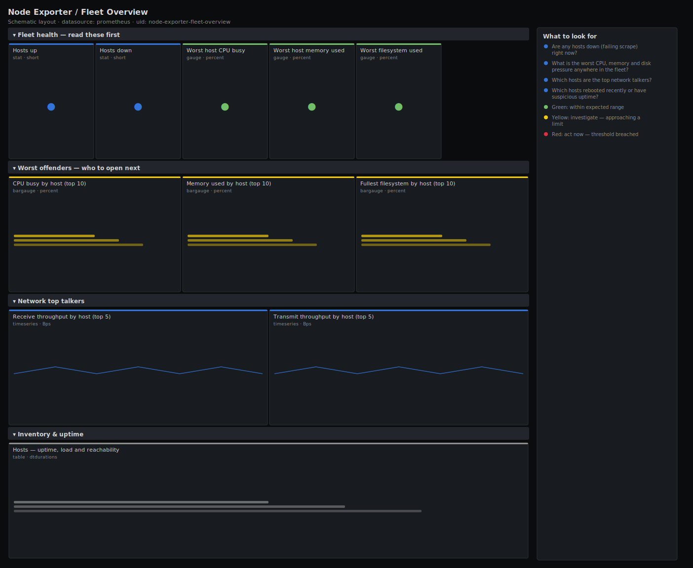

# Node Exporter / Fleet Overview

> Single-pane health of an entire Linux fleet scraped by node_exporter: who is up, who is down, and the worst CPU, memory and disk pressure anywhere in the fleet — so on-call can triage hundreds of hosts in one glance instead of opening per-host dashboards one by one.

**Primary search phrase:** Node Exporter fleet overview Grafana dashboard  
**Category:** `node-exporter` · **UID:** `node-exporter-fleet-overview` · **Datasource:** Prometheus



## Questions this dashboard answers

- Are any hosts down (failing scrape) right now?
- What is the worst CPU, memory and disk pressure anywhere in the fleet?
- Which hosts are the top network talkers?
- Which hosts rebooted recently or have suspicious uptime?

## Production lessons — why this dashboard exists

A fleet dashboard's job is to answer "is anything on fire?" in five seconds, not to draw every metric. The two numbers that matter first are **hosts down** (a missing scrape is worse than any busy host) and the **single worst resource** across the fleet — one box at 98% disk will page you long before the fleet average moves. We lead with those, then rank hosts so the outlier is obvious, and keep a boot-time table because an unexplained uptime reset is often the real root cause of the incident you were called about.

## Data source requirements

- **Prometheus** datasource (selected at import time via `${DS_PROMETHEUS}`).
- `node_exporter` on every host (the `up`, `node_cpu_seconds_total`, `node_memory_*`, `node_filesystem_*`, `node_network_*` and `node_boot_time_seconds` series). The `up` metric is synthesised by Prometheus per scrape target.

## Template variables

| Variable | Label | Type | Purpose |
|----------|-------|------|---------|
| `${job}` | Job | query | Prometheus scrape job that collects your node_exporter targets. |

## Panels

### Fleet health — read these first

- **Hosts up** (stat, `short`) — Targets in this job whose last scrape succeeded.
- **Hosts down** (stat, `short`) — Targets failing to scrape — investigate before anything else.
- **Worst host CPU busy** (gauge, `percent`) — Highest non-idle CPU utilisation across the fleet.
- **Worst host memory used** (gauge, `percent`) — Highest memory utilisation across the fleet (used / total).
- **Worst filesystem used** (gauge, `percent`) — Fullest real filesystem anywhere in the fleet (pseudo FS excluded).

### Worst offenders — who to open next

- **CPU busy by host (top 10)** (bargauge, `percent`) — Non-idle CPU per host, ranked. The outlier is your first click.
- **Memory used by host (top 10)** (bargauge, `percent`) — Memory utilisation per host, ranked highest first.
- **Fullest filesystem by host (top 10)** (bargauge, `percent`) — Worst mount per host, ranked — catches the disk that pages you.

### Network top talkers

- **Receive throughput by host (top 5)** (timeseries, `Bps`) — Inbound bandwidth per host, physical interfaces only.
- **Transmit throughput by host (top 5)** (timeseries, `Bps`) — Outbound bandwidth per host, physical interfaces only.

### Inventory & uptime

- **Hosts — uptime, load and reachability** (table, `dtdurations`) — Per-host roster. Sort by uptime to spot a host that just rebooted.

## Import

**Grafana UI** — *Dashboards → New → Import*, upload `dashboards/node-exporter/fleet-overview.json`, then pick your datasource when prompted.

**API:**

```bash
scripts/import-dashboard.sh dashboards/node-exporter/fleet-overview.json
```

**Provisioning** — drop the JSON into a provisioned folder (see [provisioning guide](../../provisioning.md)).

## Recommended alerts

Ready-to-use rules ship in `alerts/node-exporter.rules.yml`.

### FleetHostDown (`critical`)

```promql
up{job=~".*node.*"} == 0
```

- **Fires after:** `3m`
- **Why it matters:** A node_exporter that stops responding usually means the host is down, the network is partitioned, or the exporter crashed — and you are now blind to that host.
- **Investigate:** Open Node Exporter / Fleet Overview, find the host in the inventory table, then ping/SSH it and check the node_exporter service.
- **Recovery:** Clears as soon as a scrape succeeds again.
- **False positives:** Planned maintenance and reboots — silence the instance for the maintenance window. Tighten the job regex to match only node_exporter jobs.

### FleetFilesystemAlmostFull (`warning`)

```promql
100 * (1 - node_filesystem_avail_bytes{fstype!~"tmpfs|overlay|squashfs|ramfs|fuse.*"} / node_filesystem_size_bytes{fstype!~"tmpfs|overlay|squashfs|ramfs|fuse.*"}) > 90
```

- **Fires after:** `10m`
- **Why it matters:** A full root or data filesystem causes writes to fail, which corrupts databases and crashes services with no warning.
- **Investigate:** Scope the fleet board to the host, then find the largest directories (du -xh / | sort -h).
- **Recovery:** Clears when free space rises above 10% for 5m.
- **False positives:** Hosts that intentionally run filesystems near full (caches) — exclude their mountpoints.

### FleetHostMemoryExhausted (`warning`)

```promql
100 * (1 - node_memory_MemAvailable_bytes / node_memory_MemTotal_bytes) > 92
```

- **Fires after:** `10m`
- **Why it matters:** Low available memory pushes the host into swap or triggers the OOM killer, which terminates processes unpredictably.
- **Investigate:** Identify the top RSS consumers on the host; check for a leak versus legitimate growth.
- **Recovery:** Clears when available memory recovers for 5m.
- **False positives:** Hosts using most RAM as page cache report high "used" but reclaim on demand — MemAvailable already accounts for this, so a sustained breach is real.

## Troubleshooting

| Symptom | Likely cause | First action |
|---------|--------------|--------------|
| All panels show "No data" | The `$job` value does not match your node_exporter scrape job. | Run `up{job="$job"}` in Explore and confirm the job label in your scrape config. |
| Worst filesystem stuck near 100% | A read-only or pseudo filesystem (snap, overlay) is being counted. | Extend the `fstype!~` exclusion list to drop the offending filesystem type. |
| Hosts up count looks too high | The job also scrapes non-node targets that export `up`. | Use a job name that selects only node_exporter, or add a metric guard to the count. |

## Performance considerations

Every panel aggregates with `max`/`topk` or `by (instance)` so series count stays near one per host regardless of fleet size. Rates use a 5m window (≥4× a 15s scrape). Above ~1000 hosts, back the per-host CPU and memory panels with recording rules so the single-stat reductions don't re-evaluate raw counters on every refresh.

## Customization

Tune the 80/95 CPU and 85/95 disk thresholds to your SLOs. Add a `region`/`role` template variable and selector to split the fleet into tiers. Swap `topk(10)` for a larger N on big fleets, or pin the network panels to specific interface names.

## Related resources

- [Advanced observability guides](https://devopsaitoolkit.com/guides/)
- [Grafana & Prometheus tutorials](https://devopsaitoolkit.com/blog/)
- [AI Incident Response Assistant](https://devopsaitoolkit.com/dashboard/incident-response)
- [PromQL cookbook](../../../promql/README.md) · [Alerting guide](../../alerting.md) · [Dashboard catalog](../../catalog.md)
