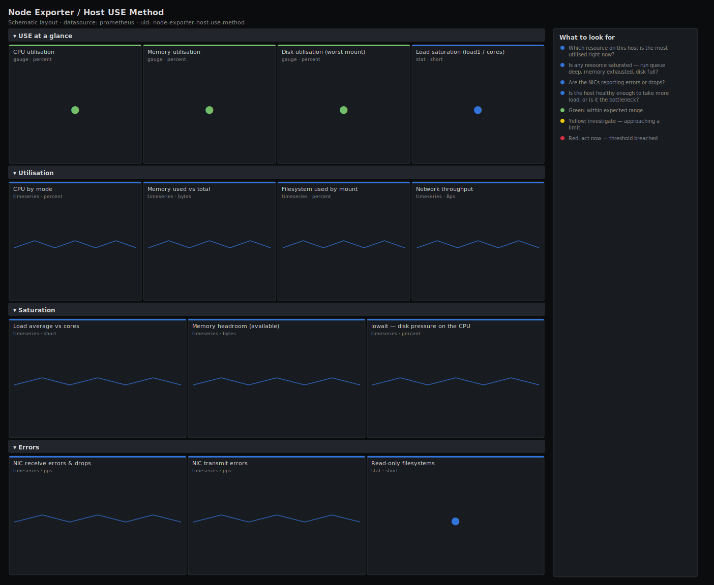

# Node Exporter / Host USE Method

> Brendan Gregg's USE method (Utilisation, Saturation, Errors) for a single Linux host across CPU, memory, disk and network. The canonical one-host deep dive: pick an instance and read down the three columns to find which resource is exhausted and whether it is saturating or erroring.

**Primary search phrase:** Linux USE method Grafana dashboard  
**Category:** `node-exporter` · **UID:** `node-exporter-host-use-method` · **Datasource:** Prometheus



## Questions this dashboard answers

- Which resource on this host is the most utilised right now?
- Is any resource saturated — run queue deep, memory exhausted, disk full?
- Are the NICs reporting errors or drops?
- Is the host healthy enough to take more load, or is it the bottleneck?

## Production lessons — why this dashboard exists

Utilisation alone lies: a host at 60% CPU with a run queue twice the core count is already dropping latency, while a host at 95% CPU with an empty run queue is just busy and fine. The USE method exists because **saturation and errors page you, not utilisation** — so this dashboard always shows the saturation signal next to the utilisation it explains. The single most common "mystery slowness" root cause we catch here is silent NIC errors/drops climbing while every utilisation gauge looks green.

## Data source requirements

- **Prometheus** datasource (selected at import time via `${DS_PROMETHEUS}`).
- `node_exporter` on the selected host. Utilisation/saturation use `node_cpu_seconds_total`, `node_memory_*`, `node_filesystem_*`, `node_load1` and `node_network_*_bytes_total`.
- Errors use the standard node_exporter NIC counters `node_network_receive_errs_total`, `node_network_transmit_errs_total` and `node_network_receive_drop_total`, plus the `node_filesystem_readonly` flag (all shipped by default).

## Template variables

| Variable | Label | Type | Purpose |
|----------|-------|------|---------|
| `${job}` | Job | query | Prometheus scrape job for your node_exporter targets. |
| `${instance}` | Host | query | The single host to inspect. |

## Panels

### USE at a glance

- **CPU utilisation** (gauge, `percent`) — Non-idle CPU across all cores on this host.
- **Memory utilisation** (gauge, `percent`) — Used memory as a share of total (MemAvailable accounts for cache).
- **Disk utilisation (worst mount)** (gauge, `percent`) — Fullest real filesystem on the host.
- **Load saturation (load1 / cores)** (stat, `short`) — Run-queue depth relative to cores. Above 1 means tasks are waiting.

### Utilisation

- **CPU by mode** (timeseries, `percent`) — How the CPU time is spent — user, system, iowait, steal.
- **Memory used vs total** (timeseries, `bytes`) — Working memory against installed RAM.
- **Filesystem used by mount** (timeseries, `percent`) — Per-mount fill level; spot the volume filling fastest.
- **Network throughput** (timeseries, `Bps`) — Per-interface receive and transmit bandwidth.

### Saturation

- **Load average vs cores** (timeseries, `short`) — 1m load against the core count. Sustained excess is a backlog.
- **Memory headroom (available)** (timeseries, `bytes`) — Bytes available before the OOM killer wakes up. Falling = saturating.
- **iowait — disk pressure on the CPU** (timeseries, `percent`) — CPU time blocked on storage. Rising iowait means the disks are the bottleneck.

### Errors

- **NIC receive errors & drops** (timeseries, `pps`) — Inbound packet errors and drops — silent killers behind "random" latency.
- **NIC transmit errors** (timeseries, `pps`) — Outbound packet errors per interface.
- **Read-only filesystems** (stat, `short`) — Mounts the kernel remounted read-only — almost always a failing disk.

## Import

**Grafana UI** — *Dashboards → New → Import*, upload `dashboards/node-exporter/host-use-method.json`, then pick your datasource when prompted.

**API:**

```bash
scripts/import-dashboard.sh dashboards/node-exporter/host-use-method.json
```

**Provisioning** — drop the JSON into a provisioned folder (see [provisioning guide](../../provisioning.md)).

## Recommended alerts

Ready-to-use rules ship in `alerts/node-exporter.rules.yml`.

### HostRunQueueSaturated (`warning`)

```promql
node_load1 / count without (cpu, mode) (node_cpu_seconds_total{mode="idle"}) > 2
```

- **Fires after:** `15m`
- **Why it matters:** A run queue sustained above 2× the core count means tasks spend more time waiting than running — latency climbs even though CPU may not read 100%.
- **Investigate:** Open Host USE Method for the instance; check whether iowait is high (storage bound) or CPU modes are saturated (compute bound).
- **Recovery:** Clears when the ratio falls below 2 for 5m.
- **False positives:** Brief bursts during batch jobs or boot — the 15m window absorbs spikes.

### HostMemoryExhausted (`warning`)

```promql
100 * (1 - node_memory_MemAvailable_bytes / node_memory_MemTotal_bytes) > 92
```

- **Fires after:** `10m`
- **Why it matters:** Available memory near zero forces swapping or OOM kills, which terminate processes without warning.
- **Investigate:** Check the memory headroom panel for a leak (steady decline) versus a legitimate spike.
- **Recovery:** Clears when available memory recovers for 5m.
- **False positives:** Page cache is already excluded by MemAvailable, so a sustained breach is genuine pressure.

### HostNICErrors (`warning`)

```promql
rate(node_network_receive_errs_total{device!~"lo"}[5m]) > 1
```

- **Fires after:** `10m`
- **Why it matters:** NIC errors cause retransmits and tail-latency that no utilisation gauge reveals — a classic "everything looks green but the app is slow" cause.
- **Investigate:** Correlate with the NIC errors panel; check cabling, the switch port, and driver/ring-buffer settings.
- **Recovery:** Clears when the error rate returns to zero for 5m.
- **False positives:** A one-off burst during link renegotiation; the 10m window filters transients.

## Troubleshooting

| Symptom | Likely cause | First action |
|---------|--------------|--------------|
| Load saturation gauge reads 0 or N/A | The core count collapsed because a recording rule dropped the `cpu` label. | Point the dashboard at raw node_exporter series, not a downsampled copy. |
| Memory utilisation seems high but the host is fine | Confusing "used" with "not cached". | This panel uses MemAvailable, which already excludes reclaimable cache — trust it. |
| Error panels are always empty | NIC error counters exist but the device filter excludes the active interface. | Remove or adjust the `device!~"lo"` selector to match your interface naming. |

## Performance considerations

Scoping to a single `$instance` keeps every query to a handful of series, so this board is cheap even on huge fleets. Rates use a 5m window (≥4× a 15s scrape). The only multi-series panels (per-mount, per-device) are naturally bounded by the host's hardware.

## Customization

Adjust the 80/95 utilisation and 2× saturation thresholds to your SLOs. Add disk I/O saturation if you scrape `node_disk_*`. To compare two hosts side by side, duplicate the row and pin a second instance, or switch `$instance` to multi-select.

## Related resources

- [Advanced observability guides](https://devopsaitoolkit.com/guides/)
- [Grafana & Prometheus tutorials](https://devopsaitoolkit.com/blog/)
- [AI Incident Response Assistant](https://devopsaitoolkit.com/dashboard/incident-response)
- [PromQL cookbook](../../../promql/README.md) · [Alerting guide](../../alerting.md) · [Dashboard catalog](../../catalog.md)
