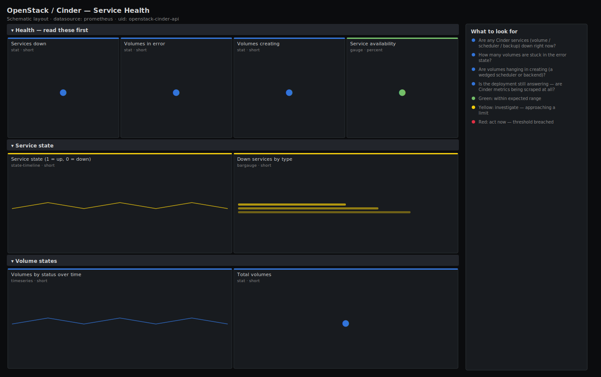

# OpenStack / Cinder — Service Health

> Block-storage control-plane health for an OpenStack deployment scraped by openstack-exporter: are the cinder-volume, cinder-scheduler and cinder-backup services up, and are any volumes stuck in error or creating? Leads with services down and volumes in error — the two signals that mean tenants can't get storage.

**Primary search phrase:** OpenStack Cinder Grafana dashboard  
**Category:** `openstack/cinder` · **UID:** `openstack-cinder-api` · **Datasource:** Prometheus



## Questions this dashboard answers

- Are any Cinder services (volume / scheduler / backup) down right now?
- How many volumes are stuck in the error state?
- Are volumes hanging in creating (a wedged scheduler or backend)?
- Is the deployment still answering — are Cinder metrics being scraped at all?
- Which storage host owns the failing service?

## Production lessons — why this dashboard exists

Cinder fails in two distinct ways and they need different responders. A **cinder-scheduler** outage means new volumes never get placed — they pile up in `creating` and every `volume-create` eventually times out. A **cinder-volume** backend outage means existing volumes can't be attached, extended or deleted, and new ones land in `error`. This dashboard leads with services-down and volumes-in- error precisely so you can tell those apart in five seconds. The most common false alarm is a single backend reporting down because its driver lost the storage array; the fix is on the array, not in OpenStack — which is why the per-service, per-host state timeline matters more than a global "Cinder is unhealthy" light.

## Data source requirements

- **Prometheus** datasource (selected at import time via `${DS_PROMETHEUS}`).
- `openstack-exporter` with Cinder enabled and admin credentials — exposes `openstack_cinder_service_state` (labels `service`, `hostname`; 1 = up), `openstack_cinder_volume_status` (label `status`), and `openstack_cinder_volumes`.

## Template variables

| Variable | Label | Type | Purpose |
|----------|-------|------|---------|
| `${job}` | Job | query | Prometheus scrape job for your openstack-exporter target(s). |
| `${service}` | Service | query | Cinder service (cinder-volume, cinder-scheduler, cinder-backup). |

## Panels

### Health — read these first

- **Services down** (stat, `short`) — Cinder services reporting down across selected types.
- **Volumes in error** (stat, `short`) — Volumes in the error state — failed create, attach, extend or delete.
- **Volumes creating** (stat, `short`) — Volumes currently in creating — should clear in seconds; a growing count means a wedged scheduler or backend.
- **Service availability** (gauge, `percent`) — Share of selected Cinder services currently up.

### Service state

- **Service state (1 = up, 0 = down)** (state-timeline, `short`) — Up/down history per service and storage host — pinpoint which backend lost which service.
- **Down services by type** (bargauge, `short`) — Which service is failing — scheduler vs volume vs backup demand different responders.

### Volume states

- **Volumes by status over time** (timeseries, `short`) — Status mix through time — a rising error or creating line is the leading edge of an incident.
- **Total volumes** (stat, `short`) — All Cinder volumes in the deployment.

## Import

**Grafana UI** — *Dashboards → New → Import*, upload `dashboards/openstack/cinder/api.json`, then pick your datasource when prompted.

**API:**

```bash
scripts/import-dashboard.sh dashboards/openstack/cinder/api.json
```

**Provisioning** — drop the JSON into a provisioned folder (see [provisioning guide](../../../provisioning.md)).

## Recommended alerts

Ready-to-use rules ship in `alerts/openstack.rules.yml`.

### CinderServiceDown (`critical`)

```promql
openstack_cinder_service_state == 0
```

- **Fires after:** `5m`
- **Why it matters:** A down cinder-volume backend blocks attach/extend/delete; a down cinder-scheduler blocks all new volume placement.
- **Investigate:** Open OpenStack / Cinder — Service Health, identify the service and host on the state timeline, then check the service log and storage backend.
- **Recovery:** Clears when the service reports up for 5m.
- **False positives:** A backend drained for maintenance reports down — disable it in Cinder or silence the host first.

### CinderVolumesInError (`warning`)

```promql
sum(openstack_cinder_volume_status{status="error"}) > 5
```

- **Fires after:** `15m`
- **Why it matters:** Volumes in error mean failed create/attach/delete operations — tenant-visible storage failures that won't self-heal.
- **Investigate:** Cross-check cinder-volume backend state; read the cinder-volume log for the driver error behind the failures.
- **Recovery:** Clears when the error count falls back to 5 or fewer.
- **False positives:** A batch of intentionally aborted test volumes inflates this — clean them up or scope the alert by project.

### CinderExporterDown (`critical`)

```promql
absent(openstack_cinder_service_state)
```

- **Fires after:** `5m`
- **Why it matters:** With no service metrics you can't distinguish a healthy block-storage plane from a dead one.
- **Investigate:** Check the openstack-exporter target in Prometheus and the exporter logs for Keystone/Cinder endpoint errors.
- **Recovery:** Clears once the series returns.
- **False positives:** A planned exporter redeploy briefly trips this — 5m `for` absorbs restarts.

## Troubleshooting

| Symptom | Likely cause | First action |
|---------|--------------|--------------|
| Volumes pile up in creating | cinder-scheduler is down or no backend has capacity for the request. | Check scheduler state and per-pool free capacity on the Storage Capacity dashboard. |
| Service shows down but the process runs | Heartbeats are late due to a slow message bus or clock skew. | Sync NTP across storage hosts and check RabbitMQ queue depth. |
| Error count never drops | Volumes left in error after a past incident were never reset. | Reset state with `cinder reset-state --state available <id>` once the backend is healthy. |

## Performance considerations

Service and status panels aggregate with `count`/`sum by`, so cardinality is one series per service type or status regardless of volume count. Only the state timeline is per-host; scope it with `$service` on large multi-backend clouds.

## Customization

Tune the error/creating thresholds to your provisioning rate. To watch a single backend, add a `hostname` selector. Update the alert constants if you operate at a scale where 5 errors is normal background noise.

## Related resources

- [Advanced observability guides](https://devopsaitoolkit.com/guides/)
- [Grafana & Prometheus tutorials](https://devopsaitoolkit.com/blog/)
- [AI Incident Response Assistant](https://devopsaitoolkit.com/dashboard/incident-response)
- [PromQL cookbook](../../../../promql/README.md) · [Alerting guide](../../../alerting.md) · [Dashboard catalog](../../../catalog.md)
