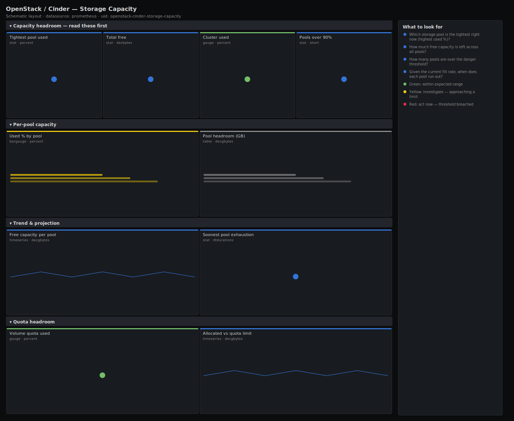

# OpenStack / Cinder — Storage Capacity

> Block-storage capacity planning for an OpenStack deployment: per-pool free vs total GB, used percentage, the tightest pool, quota headroom against limits, and a linear projection of when each pool runs out. Leads with the tightest pool and total free headroom so you act on the pool about to fill, not the average.

**Primary search phrase:** OpenStack Cinder storage capacity Grafana dashboard  
**Category:** `openstack/cinder` · **UID:** `openstack-cinder-storage-capacity` · **Datasource:** Prometheus



## Questions this dashboard answers

- Which storage pool is the tightest right now (highest used %)?
- How much free capacity is left across all pools?
- How many pools are over the danger threshold?
- Given the current fill rate, when does each pool run out?
- Is tenant volume usage approaching the configured quota limit?

## Production lessons — why this dashboard exists

Capacity averages lie. A deployment can sit at 60% used overall while one pool is at 96% and about to reject every new volume scheduled to it — so this dashboard leads with the **tightest pool**, not the mean. The second lesson is that Cinder has two different ceilings that both cause "no space" errors: the **physical pool capacity** (free vs total GB reported by the backend) and the **quota limit** (allocated vs max GB Cinder will let a tenant use). Hitting either one fails provisioning, and they fail for different reasons with different fixes, so both get first-class panels here. The `predict_linear` projection turns a slow leak into a dated deadline, which is the difference between a planned expansion and a 2am page.

## Data source requirements

- **Prometheus** datasource (selected at import time via `${DS_PROMETHEUS}`).
- `openstack-exporter` with Cinder enabled — exposes `openstack_cinder_pool_capacity_free_gb` and `openstack_cinder_pool_capacity_total_gb` (per backend pool), plus `openstack_cinder_limits_volume_used_gb` and `openstack_cinder_limits_volume_max_gb` for quota headroom.

## Template variables

| Variable | Label | Type | Purpose |
|----------|-------|------|---------|
| `${job}` | Job | query | Prometheus scrape job for your openstack-exporter target(s). |
| `${pool}` | Pool | query | Backend storage pool(s) to display. |

## Panels

### Capacity headroom — read these first

- **Tightest pool used** (stat, `percent`) — Highest used percentage across selected pools — the one that fills first.
- **Total free** (stat, `decbytes`) — Aggregate free block-storage capacity across selected pools.
- **Cluster used** (gauge, `percent`) — Used capacity as a share of total across all selected pools.
- **Pools over 90%** (stat, `short`) — Pools past the act-now threshold — each one is about to reject new volumes.

### Per-pool capacity

- **Used % by pool** (bargauge, `percent`) — Every pool ranked by fill — the bars at the top are where to add capacity next.
- **Pool headroom (GB)** (table, `decgbytes`) — Free and total capacity per pool — the raw numbers behind the percentages.

### Trend & projection

- **Free capacity per pool** (timeseries, `decgbytes`) — Free GB per pool over a week — the slope is the fill rate; a steady decline is a dated deadline.
- **Soonest pool exhaustion** (stat, `dtdurations`) — Days until the fastest-filling pool reaches zero free, from the last 24h trend.

### Quota headroom

- **Volume quota used** (gauge, `percent`) — Allocated volume GB as a share of the configured Cinder quota limit.
- **Allocated vs quota limit** (timeseries, `decgbytes`) — Used GB against the quota ceiling — the gap is how much more tenants can provision before quota errors.

## Import

**Grafana UI** — *Dashboards → New → Import*, upload `dashboards/openstack/cinder/storage-capacity.json`, then pick your datasource when prompted.

**API:**

```bash
scripts/import-dashboard.sh dashboards/openstack/cinder/storage-capacity.json
```

**Provisioning** — drop the JSON into a provisioned folder (see [provisioning guide](../../../provisioning.md)).

## Recommended alerts

Ready-to-use rules ship in `alerts/openstack.rules.yml`.

### CinderPoolNearFull (`warning`)

```promql
100 * (1 - openstack_cinder_pool_capacity_free_gb / clamp_min(openstack_cinder_pool_capacity_total_gb, 1)) > 85
```

- **Fires after:** `15m`
- **Why it matters:** Once a pool fills, every volume the scheduler places there fails; thin-provisioned backends can also start refusing writes to existing volumes.
- **Investigate:** Open OpenStack / Cinder — Storage Capacity; check the per-pool trend to see how fast it is climbing.
- **Recovery:** Clears when used drops below 85%.
- **False positives:** Backends that are intentionally run hot — raise the threshold for those pools with a label selector.

### CinderPoolPredictedExhaustion (`critical`)

```promql
predict_linear(openstack_cinder_pool_capacity_free_gb[24h], 7 * 86400) < 0
```

- **Fires after:** `1h`
- **Why it matters:** A dated deadline turns a slow capacity leak into a planned expansion instead of a midnight outage.
- **Investigate:** Confirm the fill rate is organic demand versus a runaway snapshot or clone job.
- **Recovery:** Clears when the projection no longer crosses zero within the window.
- **False positives:** A one-off bulk import skews the linear fit — the 24h window and 1h `for` damp transient slopes.

### CinderVolumeQuotaNearLimit (`warning`)

```promql
100 * sum(openstack_cinder_limits_volume_used_gb) / clamp_min(sum(openstack_cinder_limits_volume_max_gb), 1) > 90
```

- **Fires after:** `15m`
- **Why it matters:** Hitting the quota limit fails provisioning with a quota error even when the backend has free space — a different fix from physical exhaustion.
- **Investigate:** Identify which project is consuming the quota; decide whether to raise the limit or reclaim volumes.
- **Recovery:** Clears when quota usage falls below 90%.
- **False positives:** A project deliberately run at its quota ceiling — scope the alert per project and exclude those.

## Troubleshooting

| Symptom | Likely cause | First action |
|---------|--------------|--------------|
| Used % is negative or above 100 | A pool reports free greater than total (thin provisioning over-commit) or stale capacity stats. | Confirm the backend's reported capacity; thin pools may legitimately over-commit — interpret used % accordingly. |
| Exhaustion projection shows huge or negative durations | Free capacity is flat or growing, so the fill rate is near zero. | This is healthy — the `clamp_min` guard keeps the math defined; ignore very large values. |
| Quota panels empty | `openstack_cinder_limits_*` not exported or exporter lacks the limits scope. | Confirm the exporter version and that its credentials can read project limits. |

## Performance considerations

Per-pool panels emit one series per pool; aggregate (cluster used, total free, quota) panels collapse to a single series with `sum`. `predict_linear`/`deriv` run over a 24h window — on deployments with hundreds of pools, back the per-pool used-% expression with a recording rule and widen the refresh to 1m+.

## Customization

Tune the 75/85/90% thresholds to your provisioning lead time and backend type (thin pools tolerate higher fill). Adjust the `decbytes` thresholds on Total free to your fleet size. For multi-region clouds, add a `region` variable so each region gets its own tightest-pool reading.

## Related resources

- [Advanced observability guides](https://devopsaitoolkit.com/guides/)
- [Grafana & Prometheus tutorials](https://devopsaitoolkit.com/blog/)
- [AI Incident Response Assistant](https://devopsaitoolkit.com/dashboard/incident-response)
- [PromQL cookbook](../../../../promql/README.md) · [Alerting guide](../../../alerting.md) · [Dashboard catalog](../../../catalog.md)
