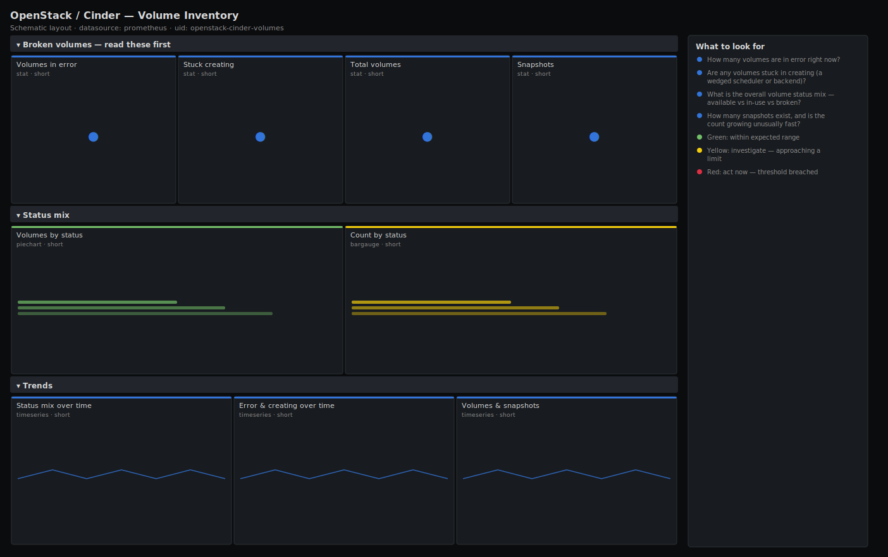

# OpenStack / Cinder — Volume Inventory

> Block-storage volume inventory and lifecycle states for an OpenStack deployment: the status mix (available / in-use / error / creating), volumes stuck in error or creating, and snapshot footprint. Leads with error and stuck-creating counts so failed and wedged volumes surface before tenants open a ticket.

**Primary search phrase:** OpenStack Cinder volumes Grafana dashboard  
**Category:** `openstack/cinder` · **UID:** `openstack-cinder-volumes` · **Datasource:** Prometheus



## Questions this dashboard answers

- How many volumes are in error right now?
- Are any volumes stuck in creating (a wedged scheduler or backend)?
- What is the overall volume status mix — available vs in-use vs broken?
- How many snapshots exist, and is the count growing unusually fast?
- Is any single status trending up in a way that signals an incident?

## Production lessons — why this dashboard exists

The status mix is the fastest lifecycle health check Cinder offers. A healthy deployment sits almost entirely in `available` and `in-use`, with `creating` and `deleting` flickering near zero. When `creating` climbs and stays up, the scheduler or a backend is wedged and every new request is queuing behind it; when `error` accumulates, past operations failed and left volumes that won't self-heal and still consume quota. This dashboard separates those two failure shapes and trends each status so you can see which way an incident is moving. Snapshots get their own panel because a runaway snapshot job is a classic way to silently consume backend capacity that the volume count alone never reveals.

## Data source requirements

- **Prometheus** datasource (selected at import time via `${DS_PROMETHEUS}`).
- `openstack-exporter` with Cinder enabled — exposes `openstack_cinder_volume_status` (label `status`), `openstack_cinder_volumes` (total) and `openstack_cinder_snapshots`.

## Template variables

| Variable | Label | Type | Purpose |
|----------|-------|------|---------|
| `${job}` | Job | query | Prometheus scrape job for your openstack-exporter target(s). |

## Panels

### Broken volumes — read these first

- **Volumes in error** (stat, `short`) — Volumes in the error state — failed operations that won't self-heal and still hold quota.
- **Stuck creating** (stat, `short`) — Volumes in creating — normally clears in seconds; a sustained count means a wedged scheduler or backend.
- **Total volumes** (stat, `short`) — All Cinder volumes in the deployment.
- **Snapshots** (stat, `short`) — Total Cinder snapshots — watch for runaway growth eating backend capacity.

### Status mix

- **Volumes by status** (piechart, `short`) — Share of volumes in each lifecycle state — a healthy cloud is almost all available/in-use.
- **Count by status** (bargauge, `short`) — Absolute volume count per status, ranked.

### Trends

- **Status mix over time** (timeseries, `short`) — Stacked status counts — a rising error or creating band shows an incident building.
- **Error & creating over time** (timeseries, `short`) — The two failure states isolated, so a slow climb is obvious against an otherwise quiet baseline.
- **Volumes & snapshots** (timeseries, `short`) — Total volume and snapshot counts over time — a diverging snapshot line flags a runaway job.

## Import

**Grafana UI** — *Dashboards → New → Import*, upload `dashboards/openstack/cinder/volumes.json`, then pick your datasource when prompted.

**API:**

```bash
scripts/import-dashboard.sh dashboards/openstack/cinder/volumes.json
```

**Provisioning** — drop the JSON into a provisioned folder (see [provisioning guide](../../../provisioning.md)).

## Recommended alerts

Ready-to-use rules ship in `alerts/openstack.rules.yml`.

### CinderVolumesInError (`warning`)

```promql
sum(openstack_cinder_volume_status{status="error"}) > 5
```

- **Fires after:** `15m`
- **Why it matters:** Error volumes are failed operations that hold quota and never recover on their own — tenant-visible storage failures.
- **Investigate:** Open OpenStack / Cinder — Volume Inventory; read the cinder-volume log for the backend/driver error behind the failures.
- **Recovery:** Clears when the error count drops to 5 or fewer.
- **False positives:** Leftover test volumes from a past incident inflate this — clean them up or scope by project.

### CinderVolumesStuckCreating (`warning`)

```promql
sum(openstack_cinder_volume_status{status="creating"}) > 5
```

- **Fires after:** `30m`
- **Why it matters:** Volumes should leave creating in seconds; a sustained backlog means the scheduler can't place them or a backend is wedged.
- **Investigate:** Check cinder-scheduler state and per-pool free capacity; new requests are queuing behind the stuck ones.
- **Recovery:** Clears when creating drains below 5 for the window.
- **False positives:** A large legitimate provisioning burst transiently exceeds 5 — the 30m `for` filters normal bursts.

### CinderSnapshotRunaway (`info`)

```promql
increase(sum(openstack_cinder_snapshots)[1h:]) > 200
```

- **Fires after:** `30m`
- **Why it matters:** A runaway snapshot job can silently consume backend capacity far faster than volume growth suggests, leading to a surprise out-of-space event.
- **Investigate:** Identify the project/automation creating snapshots; check backend free capacity on the Storage Capacity dashboard.
- **Recovery:** Clears when hourly snapshot growth returns to normal.
- **False positives:** A planned bulk-backup window legitimately spikes snapshot creation — silence during those.

## Troubleshooting

| Symptom | Likely cause | First action |
|---------|--------------|--------------|
| Status pie is mostly "error" or "creating" | A backend or the scheduler is unhealthy. | Check service state on the Cinder Service Health dashboard. |
| Snapshot count climbs but volumes are flat | An automation is creating snapshots without pruning. | Find and rate-limit the job; prune old snapshots to reclaim backend space. |
| Counts look too low | Exporter scoped to a single project. | Re-scope the exporter to admin to enumerate all volumes. |

## Performance considerations

Every panel uses `sum by (status)` or `sum`, collapsing to one series per status, so cost is independent of volume count. The status mix series is shared across the pie, bargauge and trend panels for a consistent picture.

## Customization

Tune the error/creating thresholds and the snapshot-growth alert to your provisioning velocity. To break the status mix down per backend, add a `hostname`/`pool` selector if your exporter labels volumes with it.

## Related resources

- [Advanced observability guides](https://devopsaitoolkit.com/guides/)
- [Grafana & Prometheus tutorials](https://devopsaitoolkit.com/blog/)
- [AI Incident Response Assistant](https://devopsaitoolkit.com/dashboard/incident-response)
- [PromQL cookbook](../../../../promql/README.md) · [Alerting guide](../../../alerting.md) · [Dashboard catalog](../../../catalog.md)
