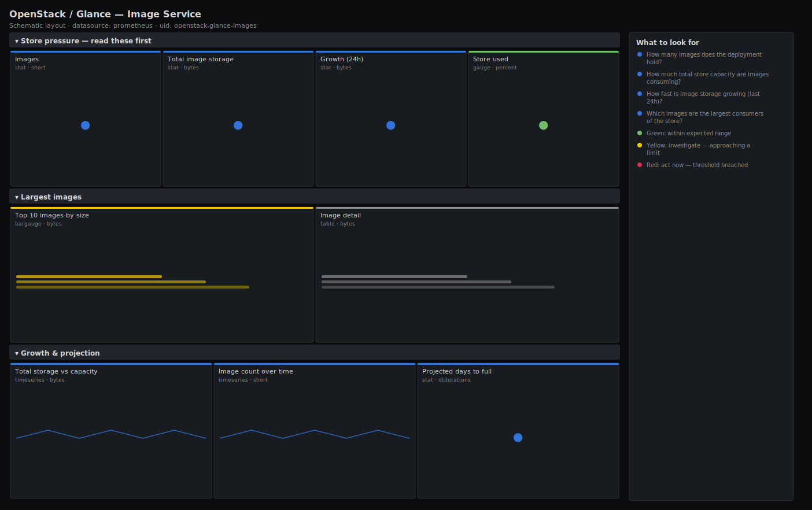

# OpenStack / Glance — Image Service

> Image-service inventory and storage for an OpenStack deployment: how many images exist, how much store space they consume, which images are largest, and how fast the store is growing toward its capacity. Leads with image count, total storage and growth so you see store pressure before an upload starts failing.

**Primary search phrase:** OpenStack Glance Grafana dashboard  
**Category:** `openstack/glance` · **UID:** `openstack-glance-images` · **Datasource:** Prometheus



## Questions this dashboard answers

- How many images does the deployment hold?
- How much total store capacity are images consuming?
- How fast is image storage growing (last 24h)?
- Which images are the largest consumers of the store?
- Given the trend, when will the image store fill up?

## Production lessons — why this dashboard exists

Glance is the OpenStack service operators forget about until an upload fails — the store fills quietly because images are large, long-lived and rarely pruned. A handful of forgotten snapshots-turned-images or a CI pipeline that registers a new image on every build can consume terabytes that nobody is watching. This dashboard leads with total storage and 24h growth so a runaway producer is obvious, and it ranks the largest images because reclaiming space is almost always a matter of deleting the top few rather than chasing thousands of small ones. The exporter reports per-image bytes but not the store's total size, so the store ceiling is a template variable used to compute used-% and a projected fill date.

## Data source requirements

- **Prometheus** datasource (selected at import time via `${DS_PROMETHEUS}`).
- `openstack-exporter` with Glance enabled — exposes `openstack_glance_images` (image count) and `openstack_glance_image_bytes` (per-image size, labels `name` and `id`). Set `$store_capacity_gb` to your image store's usable size.

## Template variables

| Variable | Label | Type | Purpose |
|----------|-------|------|---------|
| `${job}` | Job | query | Prometheus scrape job for your openstack-exporter target(s). |
| `${store_capacity_gb}` | Store capacity (GB) | textbox | Usable size of the Glance image store in GB, used for used-% and the fill projection. |

## Panels

### Store pressure — read these first

- **Images** (stat, `short`) — Total images registered in Glance.
- **Total image storage** (stat, `bytes`) — Sum of all image sizes — what the store is actually holding.
- **Growth (24h)** (stat, `bytes`) — Change in total image storage over the last day — a large positive jump flags a runaway producer.
- **Store used** (gauge, `percent`) — Image storage as a share of the configured store capacity.

### Largest images

- **Top 10 images by size** (bargauge, `bytes`) — The biggest store consumers — reclaiming space usually starts here.
- **Image detail** (table, `bytes`) — Per-image size with name and id — sort to find candidates for deletion.

### Growth & projection

- **Total storage vs capacity** (timeseries, `bytes`) — Image storage against the store ceiling — the gap is your remaining headroom.
- **Image count over time** (timeseries, `short`) — Registered image count — a steady climb with no pruning is the slow road to a full store.
- **Projected days to full** (stat, `dtdurations`) — Days until the store fills, from the last 24h growth rate.

## Import

**Grafana UI** — *Dashboards → New → Import*, upload `dashboards/openstack/glance/images.json`, then pick your datasource when prompted.

**API:**

```bash
scripts/import-dashboard.sh dashboards/openstack/glance/images.json
```

**Provisioning** — drop the JSON into a provisioned folder (see [provisioning guide](../../../provisioning.md)).

## Recommended alerts

Ready-to-use rules ship in `alerts/openstack.rules.yml`.

### GlanceStoreNearFull (`warning`)

```promql
100 * sum(openstack_glance_image_bytes) / (2048 * 1073741824) > 85
```

- **Fires after:** `30m`
- **Why it matters:** When the image store fills, new image uploads and instance snapshots fail, blocking deploys and backups.
- **Investigate:** Open OpenStack / Glance — Image Service; check the largest-images panel for reclaim candidates.
- **Recovery:** Clears when store usage drops below 85%.
- **False positives:** The hardcoded 2048 GB must match your real store size — update it (and the `$store_capacity_gb` variable) to your deployment.

### GlanceStoragePredictedExhaustion (`critical`)

```promql
predict_linear(sum(openstack_glance_image_bytes)[24h:], 7 * 86400) > 2048 * 1073741824
```

- **Fires after:** `1h`
- **Why it matters:** A dated deadline lets you prune or expand on schedule rather than during a failed deploy.
- **Investigate:** Confirm whether a CI pipeline or snapshot job is registering images faster than they are pruned.
- **Recovery:** Clears when the projection no longer crosses capacity.
- **False positives:** A one-off bulk image import skews the linear fit — the 24h window and 1h `for` damp transient slopes.

### GlanceImageCountDrop (`warning`)

```promql
sum(openstack_glance_images) < sum(openstack_glance_images offset 1h) * 0.8
```

- **Fires after:** `10m`
- **Why it matters:** A sudden drop usually means a bulk deletion — accidental, malicious, or a misfired cleanup job that removed images still in use.
- **Investigate:** Check audit logs for who/what deleted images; confirm no in-use base image was removed.
- **Recovery:** Clears when the count stabilises above the threshold.
- **False positives:** A planned image-retention sweep legitimately removes many images — silence during scheduled cleanups.

## Troubleshooting

| Symptom | Likely cause | First action |
|---------|--------------|--------------|
| Used % stuck at zero or wrong | `$store_capacity_gb` not set to the real store size. | Set the Store capacity variable (and the alert constants) to your image store's usable GB. |
| Largest-images panel shows duplicate names | Multiple image versions share a name; the `id` label disambiguates them. | Use the Image detail table and sort by id to find the exact image to delete. |
| Days-to-full shows a huge value | Storage is flat, so the growth rate is near zero — this is healthy. | Ignore very large projections; the `clamp_min` guard keeps the division defined. |

## Performance considerations

Aggregate panels use a single `sum`; the per-image bargauge and table are bounded with `topk(10)`/`topk(20)` so they never render more than a handful of series even with thousands of images. The 24h `offset`/`deriv` math is evaluated once per refresh.

## Customization

The key knob is `$store_capacity_gb` — set it to your image store's usable size and mirror it in the alert constants (alerts can't read dashboard variables). Tune the growth and largest-image byte thresholds to your image sizes; raise `topk` if you routinely audit more than the top 20.

## Related resources

- [Advanced observability guides](https://devopsaitoolkit.com/guides/)
- [Grafana & Prometheus tutorials](https://devopsaitoolkit.com/blog/)
- [AI Incident Response Assistant](https://devopsaitoolkit.com/dashboard/incident-response)
- [PromQL cookbook](../../../../promql/README.md) · [Alerting guide](../../../alerting.md) · [Dashboard catalog](../../../catalog.md)
