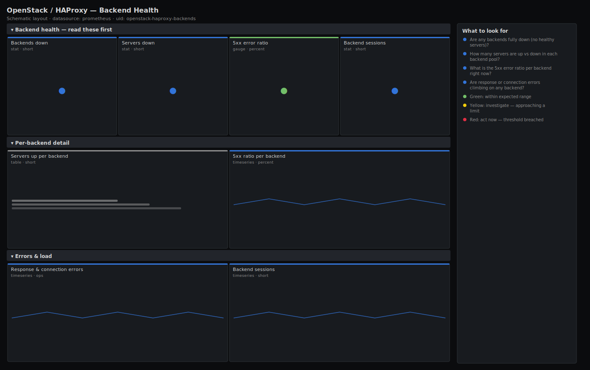

# OpenStack / HAProxy — Backend Health

> HAProxy backend and server health in front of the OpenStack APIs: which backends are down, how many servers are up per pool, the 5xx error ratio, and response and connection errors. Answers "is the load balancer hiding a dead control-plane service, and are clients getting 5xx?" — the layer most OpenStack outages route through.

**Primary search phrase:** HAProxy backend Grafana dashboard  
**Category:** `openstack/haproxy` · **UID:** `openstack-haproxy-backends` · **Datasource:** Prometheus



## Questions this dashboard answers

- Are any backends fully down (no healthy servers)?
- How many servers are up vs down in each backend pool?
- What is the 5xx error ratio per backend right now?
- Are response or connection errors climbing on any backend?

## Production lessons — why this dashboard exists

HAProxy is where OpenStack high availability lives and where it quietly fails: a backend can lose two of its three API servers and still serve traffic, so the cluster looks healthy while it is one failure from an outage. The first thing to check in an incident is therefore "backends fully down" and "servers up per backend", not aggregate request rate. The 5xx ratio is the client-visible truth: it rises the moment a control service starts erroring even if HAProxy still marks the server up, which is exactly the gap between "the LB is fine" and "users are getting errors".

## Data source requirements

- **Prometheus** datasource (selected at import time via `${DS_PROMETHEUS}`).
- `haproxy_exporter` or HAProxy's native Prometheus endpoint exposing `haproxy_backend_up`, `haproxy_server_up`, `haproxy_backend_http_responses_total` (with a `code` label of 2xx/5xx), `haproxy_backend_response_errors_total` and `haproxy_backend_connection_errors_total`.
- Series carry a `backend` (proxy) label and, for server metrics, a `server` label. The 5xx ratio assumes the `code` label is exported on `haproxy_backend_http_responses_total`.

## Template variables

| Variable | Label | Type | Purpose |
|----------|-------|------|---------|
| `${job}` | Job | query | Prometheus scrape job for your HAProxy exporter/endpoint. |
| `${backend}` | Backend | query | HAProxy backend pool(s) — usually one per OpenStack API service. |

## Panels

### Backend health — read these first

- **Backends down** (stat, `short`) — Backend pools with no healthy server (haproxy_backend_up = 0). Any value >0 is a service outage behind the LB.
- **Servers down** (stat, `short`) — Individual backend servers currently failing health checks. Non-zero erodes redundancy even when the backend is still up.
- **5xx error ratio** (gauge, `percent`) — Share of backend HTTP responses that are 5xx across selected backends — the client-visible error rate.
- **Backend sessions** (stat, `short`) — Total current sessions across selected backends — a quick load baseline.

### Per-backend detail

- **Servers up per backend** (table, `short`) — Healthy server count in each backend pool. Compare to the pool's expected size to spot eroded redundancy.
- **5xx ratio per backend** (timeseries, `percent`) — Per-backend 5xx percentage over time — isolate which OpenStack service is erroring.

### Errors & load

- **Response & connection errors** (timeseries, `ops`) — Backend response errors and connection errors per second. Connection errors point at a dead/refusing server; response errors at app-level failures.
- **Backend sessions** (timeseries, `short`) — Current sessions per backend over time — find the pool absorbing a load spike.

## Import

**Grafana UI** — *Dashboards → New → Import*, upload `dashboards/openstack/haproxy/backends.json`, then pick your datasource when prompted.

**API:**

```bash
scripts/import-dashboard.sh dashboards/openstack/haproxy/backends.json
```

**Provisioning** — drop the JSON into a provisioned folder (see [provisioning guide](../../../provisioning.md)).

## Recommended alerts

Ready-to-use rules ship in `alerts/openstack.rules.yml`.

### HAProxyBackendDown (`critical`)

```promql
haproxy_backend_up == 0
```

- **Fires after:** `1m`
- **Why it matters:** A backend with zero healthy servers means the OpenStack API behind it is unreachable through the load balancer — a hard outage for that service.
- **Investigate:** Open OpenStack / HAProxy — Backend Health, read servers-up-per-backend, then check the API service and its health-check endpoint on each member.
- **Recovery:** Clears when at least one server in the backend passes health checks.
- **False positives:** A backend intentionally drained for maintenance; silence it during planned work.

### HAProxyBackend5xxHigh (`warning`)

```promql
100 * sum by (backend, job) (rate(haproxy_backend_http_responses_total{code="5xx"}[5m])) / clamp_min(sum by (backend, job) (rate(haproxy_backend_http_responses_total[5m])), 1) > 5
```

- **Fires after:** `5m`
- **Why it matters:** A sustained 5xx ratio is a client-visible error even though HAProxy may still mark servers up — the application behind the backend is failing requests.
- **Investigate:** Correlate the per-backend 5xx panel with the API service logs and the database/RabbitMQ dashboards; control-plane 5xx often traces to a stalled dependency.
- **Recovery:** Clears when the 5xx ratio falls below 5%.
- **False positives:** A short error blip during a rolling deploy; the 5m window filters brief spikes.

### HAProxyServerRedundancyLow (`warning`)

```promql
sum by (backend, job) (haproxy_server_up) < 2
```

- **Fires after:** `5m`
- **Why it matters:** A backend running on a single server has no redundancy left; the next failure is an outage, so this is the early warning before HAProxyBackendDown.
- **Investigate:** Check which servers are failing health checks and why (host down, service crashed, check path wrong).
- **Recovery:** Clears when the backend has 2 or more healthy servers again.
- **False positives:** Single-server backends by design; exclude those backends from this rule.

## Troubleshooting

| Symptom | Likely cause | First action |
|---------|--------------|--------------|
| All panels show "No data" | The HAProxy Prometheus endpoint/exporter is not scraped, or stats are disabled. | Enable HAProxy's native Prometheus endpoint (or run haproxy_exporter) and add the target; confirm `haproxy_backend_up` appears in Explore. |
| 5xx ratio is blank | The `code` label is not exported on `haproxy_backend_http_responses_total`. | Use HAProxy's native Prometheus output (which emits per-code counters) or upgrade the exporter. |
| Servers-up table shows fewer servers than configured | Some servers are in maintenance/drain and excluded, or the exporter only sees active servers. | Cross-check `haproxy_server_check_status` and the HAProxy stats page for the full server list and states. |

## Performance considerations

Backend/server series are bounded by your number of pools and members, so this is light at 30s refresh. Ratios use a 5m rate window and `clamp_min` guards against divide-by-zero on idle backends. For very large server fleets, drive the per-server panels from a recording rule that pre-aggregates `by (backend)`.

## Customization

Adjust the 5xx thresholds to your SLO and the redundancy alert to each pool's real size (exclude single-server backends). Add a `server` template variable to drill into one pool, and pair with the HAProxy Frontends dashboard to see client-side load alongside backend health.

## Related resources

- [Advanced observability guides](https://devopsaitoolkit.com/guides/)
- [Grafana & Prometheus tutorials](https://devopsaitoolkit.com/blog/)
- [AI Incident Response Assistant](https://devopsaitoolkit.com/dashboard/incident-response)
- [PromQL cookbook](../../../../promql/README.md) · [Alerting guide](../../../alerting.md) · [Dashboard catalog](../../../catalog.md)
