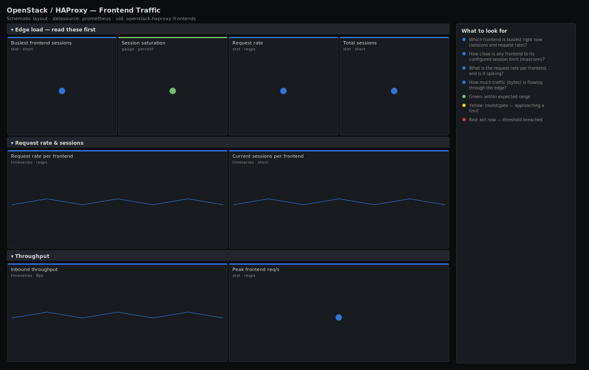

# OpenStack / HAProxy — Frontend Traffic

> HAProxy frontend traffic for the OpenStack API edge: request rate per frontend, current sessions against a configured limit, and throughput. Answers "where is the load arriving, and is any frontend close to its session limit?" so you size the edge before clients see connection refusals.

**Primary search phrase:** HAProxy frontend Grafana dashboard  
**Category:** `openstack/haproxy` · **UID:** `openstack-haproxy-frontends` · **Datasource:** Prometheus



## Questions this dashboard answers

- Which frontend is busiest right now (sessions and request rate)?
- How close is any frontend to its configured session limit (maxconn)?
- What is the request rate per frontend, and is it spiking?
- How much traffic (bytes) is flowing through the edge?

## Production lessons — why this dashboard exists

Frontend session exhaustion is the OpenStack edge failure that looks like a network problem: once a frontend hits its `maxconn`, HAProxy quietly queues or refuses new connections and clients see timeouts, while backends and CPU all look healthy. Because HAProxy does not export the configured limit as a metric, this dashboard takes the limit as a dashboard variable and shows live sessions as a percent of it — the single number that tells you whether to raise `maxconn` or add an edge node. Request rate per frontend is the companion signal that tells you which API (and which client) is driving the load.

## Data source requirements

- **Prometheus** datasource (selected at import time via `${DS_PROMETHEUS}`).
- `haproxy_exporter` or HAProxy's native Prometheus endpoint exposing `haproxy_frontend_current_sessions`, `haproxy_frontend_http_requests_total` and `haproxy_backend_bytes_in_total`.
- HAProxy does not export the configured `maxconn` as a metric, so the session saturation panel divides live sessions by the `maxconn` dashboard variable — set it to your frontend's configured limit.

## Template variables

| Variable | Label | Type | Purpose |
|----------|-------|------|---------|
| `${job}` | Job | query | Prometheus scrape job for your HAProxy exporter/endpoint. |
| `${frontend}` | Frontend | query | HAProxy frontend(s) — the public API listeners. |
| `${maxconn}` | Frontend maxconn | constant | Configured maxconn per frontend, used for the session-saturation gauge (HAProxy does not export this). |

## Panels

### Edge load — read these first

- **Busiest frontend sessions** (stat, `short`) — Highest current session count on any single frontend — where the edge load is concentrated.
- **Session saturation** (gauge, `percent`) — Busiest frontend's current sessions as a percent of the configured maxconn variable. Near 100% the frontend refuses new connections.
- **Request rate** (stat, `reqps`) — Total HTTP requests per second arriving across selected frontends.
- **Total sessions** (stat, `short`) — Current sessions summed across selected frontends — the edge concurrency baseline.

### Request rate & sessions

- **Request rate per frontend** (timeseries, `reqps`) — Per-frontend HTTP request rate. Spot which API listener (Keystone, Nova, Neutron…) is taking the load.
- **Current sessions per frontend** (timeseries, `short`) — Per-frontend live sessions with the maxconn line for reference — watch any frontend approaching the limit.

### Throughput

- **Inbound throughput** (timeseries, `Bps`) — Bytes per second received by backends behind these frontends — overall edge ingress traffic.
- **Peak frontend req/s** (stat, `reqps`) — Highest single-frontend request rate in the window — the busiest individual listener.

## Import

**Grafana UI** — *Dashboards → New → Import*, upload `dashboards/openstack/haproxy/frontends.json`, then pick your datasource when prompted.

**API:**

```bash
scripts/import-dashboard.sh dashboards/openstack/haproxy/frontends.json
```

**Provisioning** — drop the JSON into a provisioned folder (see [provisioning guide](../../../provisioning.md)).

## Recommended alerts

Ready-to-use rules ship in `alerts/openstack.rules.yml`.

### HAProxyFrontendSessionSaturation (`warning`)

```promql
haproxy_frontend_current_sessions / 2000 > 0.9
```

- **Fires after:** `5m`
- **Why it matters:** Near maxconn the frontend queues or refuses new connections, so OpenStack clients see timeouts while backends and CPU still look healthy.
- **Investigate:** Open OpenStack / HAProxy — Frontend Traffic, check sessions per frontend and request rate to see whether it is real load or a client connection leak.
- **Recovery:** Clears when sessions fall back below 90% of the limit.
- **False positives:** The hardcoded 2000 here must match your real `maxconn`; adjust the expression to your configured limit to avoid false alerts.

### HAProxyFrontendTrafficSpike (`info`)

```promql
sum by (frontend, job) (rate(haproxy_frontend_http_requests_total[5m])) > 3 * sum by (frontend, job) (rate(haproxy_frontend_http_requests_total[5m] offset 1h))
```

- **Fires after:** `10m`
- **Why it matters:** A sudden 3x jump in request rate is worth a look — a client retry storm, a runaway script, or a real traffic event that may need capacity.
- **Investigate:** Identify the source by correlating the frontend with client IPs/logs; check whether backends are keeping up on the backend dashboard.
- **Recovery:** Clears when the request rate returns to its normal range.
- **False positives:** Normal diurnal ramp-up from a low overnight baseline; tune the multiplier or compare to the same time yesterday.

## Troubleshooting

| Symptom | Likely cause | First action |
|---------|--------------|--------------|
| All panels show "No data" | The HAProxy Prometheus endpoint/exporter is not scraped or frontend stats are disabled. | Enable HAProxy's native Prometheus endpoint (or haproxy_exporter) and add the target; confirm `haproxy_frontend_current_sessions` appears in Explore. |
| Saturation gauge looks wrong | The `maxconn` variable does not match the frontend's configured limit. | Set the `Frontend maxconn` variable to your real per-frontend `maxconn`. |
| Throughput panel is flat at zero | The `haproxy_backend_bytes_in_total` series is not exported by your exporter version. | Use HAProxy's native Prometheus output, which exports byte counters, or remove the throughput panel. |

## Performance considerations

Frontend series are bounded by your number of listeners, so this dashboard is light at 30s refresh. Rates use a 5m window. Because HAProxy does not export `maxconn`, the saturation math uses a dashboard constant — keep it in sync with your config (or template it per environment) so the gauge stays meaningful.

## Customization

Set the `Frontend maxconn` variable and the session thresholds to your configured limits, and update the alert's hardcoded divisor to match. Pair this with the HAProxy Backends dashboard to see arriving load and backend health together, and add a `bytes_out` panel if your exporter version exposes it.

## Related resources

- [Advanced observability guides](https://devopsaitoolkit.com/guides/)
- [Grafana & Prometheus tutorials](https://devopsaitoolkit.com/blog/)
- [AI Incident Response Assistant](https://devopsaitoolkit.com/dashboard/incident-response)
- [PromQL cookbook](../../../../promql/README.md) · [Alerting guide](../../../alerting.md) · [Dashboard catalog](../../../catalog.md)
