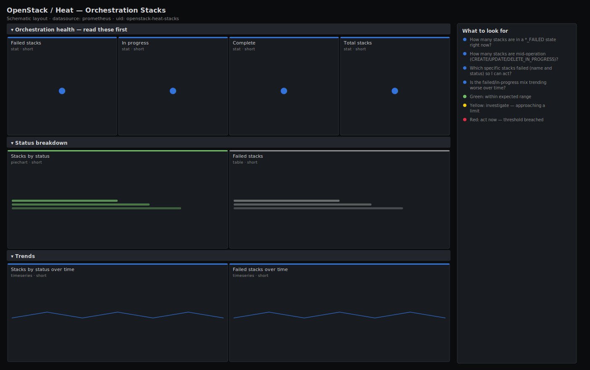

# OpenStack / Heat — Orchestration Stacks

> Heat orchestration health by stack status: how many stacks are complete, failed or in a transitional state, a table of the failed stacks to act on, and the status mix over time. Answers "did orchestration break, and which stacks are stuck or failed?" so failed deployments do not sit unnoticed.

**Primary search phrase:** OpenStack Heat stacks Grafana dashboard  
**Category:** `openstack/heat` · **UID:** `openstack-heat-stacks` · **Datasource:** Prometheus



## Questions this dashboard answers

- How many stacks are in a *_FAILED state right now?
- How many stacks are mid-operation (CREATE/UPDATE/DELETE_IN_PROGRESS)?
- Which specific stacks failed (name and status) so I can act?
- Is the failed/in-progress mix trending worse over time?

## Production lessons — why this dashboard exists

Heat failures are silent: a `CREATE_FAILED` or `UPDATE_FAILED` stack just sits there, so unless someone watches the status mix a broken template or an exhausted quota can fail every new deployment for hours before anyone notices. The single most useful signal is a simple count of `*_FAILED` stacks, backed by a table that names them — that turns "orchestration seems flaky" into a concrete list to fix. Tracking stacks stuck `*_IN_PROGRESS` for a long time catches the other failure mode, where an operation hangs waiting on a dependency (Nova capacity, Neutron quota) rather than failing outright.

## Data source requirements

- **Prometheus** datasource (selected at import time via `${DS_PROMETHEUS}`).
- `openstack-exporter` with the `orchestration` (heat) collector enabled, exposing `openstack_heat_stack_status` — one series per stack, labelled with the stack `id`/`name` and a `status` label such as CREATE_COMPLETE, CREATE_FAILED or UPDATE_FAILED.
- Counts use `count by (status)` over `openstack_heat_stack_status`; the failed table groups by stack name and status. Available stack labels depend on your exporter version.

## Template variables

| Variable | Label | Type | Purpose |
|----------|-------|------|---------|
| `${job}` | Job | query | Prometheus scrape job for your openstack-exporter target(s). |
| `${instance}` | Exporter | query | openstack-exporter instance(s) — one per cloud/region. |

## Panels

### Orchestration health — read these first

- **Failed stacks** (stat, `short`) — Stacks in any *_FAILED state (CREATE/UPDATE/DELETE). Each one is a broken deployment waiting on a human.
- **In progress** (stat, `short`) — Stacks currently mid-operation (*_IN_PROGRESS). A few are normal; many or long-lived ones suggest a stuck dependency.
- **Complete** (stat, `short`) — Stacks in a *_COMPLETE state — the healthy baseline.
- **Total stacks** (stat, `short`) — All stacks known to Heat across the selected exporters.

### Status breakdown

- **Stacks by status** (piechart, `short`) — Share of stacks in each status. A growing failed/in-progress slice is the at-a-glance health of orchestration.
- **Failed stacks** (table, `short`) — Every stack in a failed state, by name and exact status — the worklist for fixing broken deployments.

### Trends

- **Stacks by status over time** (timeseries, `short`) — How the status mix evolves. A rising FAILED or IN_PROGRESS line flags a template or capacity problem before it spreads.
- **Failed stacks over time** (timeseries, `short`) — Just the failed count, isolated so a slow climb is obvious — the single line to alert on.

## Import

**Grafana UI** — *Dashboards → New → Import*, upload `dashboards/openstack/heat/stacks.json`, then pick your datasource when prompted.

**API:**

```bash
scripts/import-dashboard.sh dashboards/openstack/heat/stacks.json
```

**Provisioning** — drop the JSON into a provisioned folder (see [provisioning guide](../../../provisioning.md)).

## Recommended alerts

Ready-to-use rules ship in `alerts/openstack.rules.yml`.

### HeatStacksFailed (`warning`)

```promql
count(openstack_heat_stack_status{status=~".*FAILED"}) > 0
```

- **Fires after:** `10m`
- **Why it matters:** A failed stack is a broken deployment that will not self-heal; if a template or quota issue is the cause, every new stack of that kind keeps failing until it is fixed.
- **Investigate:** Open OpenStack / Heat — Orchestration Stacks, read the failed-stacks table for the names, then `openstack stack failures list <stack>` to get the resource and reason.
- **Recovery:** Clears when no stacks remain in a *_FAILED state.
- **False positives:** Old failed stacks left around deliberately for forensics; clean them up or scope the rule to recent stacks.

### HeatStackStuckInProgress (`warning`)

```promql
count(openstack_heat_stack_status{status=~".*IN_PROGRESS"}) > 20
```

- **Fires after:** `30m`
- **Why it matters:** A pile-up of long-running in-progress stacks usually means heat-engine is wedged or a dependency (Nova capacity, Neutron quota) is blocking, stalling all orchestration.
- **Investigate:** Check heat-engine health and logs, and the Nova/Neutron capacity and quota dashboards for the dependency that operations are waiting on.
- **Recovery:** Clears when in-progress stacks drain below the threshold.
- **False positives:** A legitimate bulk deployment in flight; raise the threshold or silence during planned mass provisioning.

## Troubleshooting

| Symptom | Likely cause | First action |
|---------|--------------|--------------|
| All panels show "No data" | The orchestration (heat) collector is disabled or the exporter account cannot list stacks. | Enable the heat collector in openstack-exporter and grant the account stack-list rights; confirm `openstack_heat_stack_status` in Explore. |
| Counts look low vs the dashboard/CLI | The exporter account is scoped to one project, so only that project's stacks are listed. | Use an admin-scoped account so the exporter sees stacks across all projects. |
| The failed table is empty during an incident | Stacks failed and were auto-deleted (rollback on failure), so they no longer appear. | Check the failed-over-time panel and heat-engine logs; enable retention of failed stacks for forensics. |

## Performance considerations

One series per stack means cardinality scales with stack count; on clouds with thousands of stacks prefer `count by (status)` aggregates (as used here) over per-stack panels, and keep the failed table scoped to `*_FAILED` so it stays small. A 1m refresh is plenty — stack status changes on the order of minutes.

## Customization

Tune the in-progress thresholds to your normal concurrency and add a `project` template variable if your exporter labels stacks by project. To catch stacks that have been failing for a while specifically, combine the failed count with a time filter in your alerting layer.

## Related resources

- [Advanced observability guides](https://devopsaitoolkit.com/guides/)
- [Grafana & Prometheus tutorials](https://devopsaitoolkit.com/blog/)
- [AI Incident Response Assistant](https://devopsaitoolkit.com/dashboard/incident-response)
- [PromQL cookbook](../../../../promql/README.md) · [Alerting guide](../../../alerting.md) · [Dashboard catalog](../../../catalog.md)
