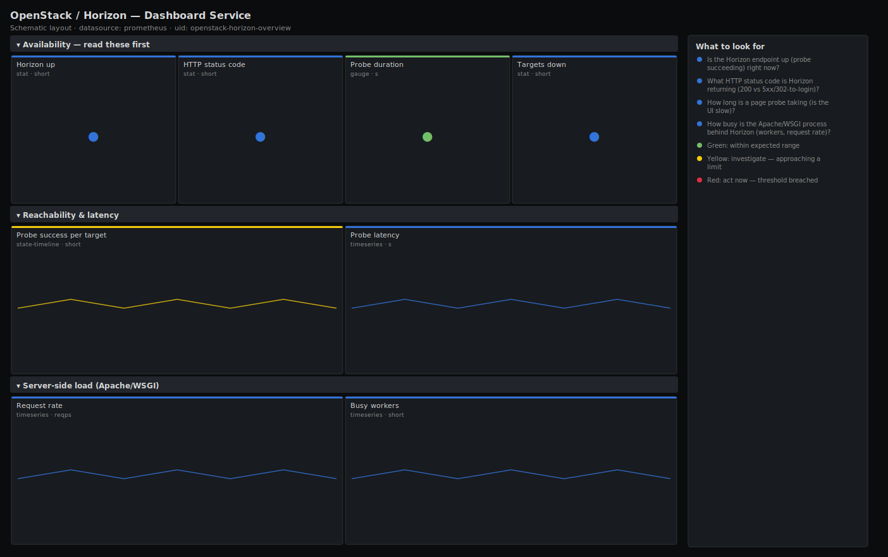

# OpenStack / Horizon — Dashboard Service

> Availability and responsiveness of the Horizon web dashboard: is the endpoint up (blackbox probe), what HTTP status is it returning, how long do probes take, and how busy is the Apache/WSGI process serving it. Answers "is the OpenStack UI up and responsive for operators and tenants?" using honest, exporter-backed signals.

**Primary search phrase:** OpenStack Horizon Grafana dashboard  
**Category:** `openstack/horizon` · **UID:** `openstack-horizon-overview` · **Datasource:** Prometheus



## Questions this dashboard answers

- Is the Horizon endpoint up (probe succeeding) right now?
- What HTTP status code is Horizon returning (200 vs 5xx/302-to-login)?
- How long is a page probe taking (is the UI slow)?
- How busy is the Apache/WSGI process behind Horizon (workers, request rate)?

## Production lessons — why this dashboard exists

Horizon has no native Prometheus exporter, so the honest way to monitor it is from the outside in: a blackbox probe of the login URL tells you what a user actually experiences — up/down, status code and full request latency — without pretending to see internals the service does not expose. Where the Apache exporter is available on the Horizon host, it adds the supply side: busy workers and request rate, which is what saturates first when a tenant leaves a heavy dashboard open or a crawler hits the UI. Keeping these two honest signals side by side is enough to tell "Horizon is down" from "Horizon is slow under load".

## Data source requirements

- **Prometheus** datasource (selected at import time via `${DS_PROMETHEUS}`).
- `blackbox_exporter` probing the Horizon login URL (`probe_success`, `probe_http_status_code`, `probe_http_duration_seconds`, `probe_duration_seconds`). The `instance` label is the probed target URL.
- Optional: `apache_exporter` on the Horizon host (`apache_up`, `apache_accesses_total`, `apache_workers`) for server-side load. If you run Horizon under nginx/uwsgi instead, swap these for the equivalent exporter and note it here. Panels degrade gracefully to the probe signals if Apache metrics are absent.

## Template variables

| Variable | Label | Type | Purpose |
|----------|-------|------|---------|
| `${job}` | Probe job | query | Prometheus blackbox job probing Horizon. |
| `${instance}` | Target | query | Probed Horizon URL(s); supports multi-select. |

## Panels

### Availability — read these first

- **Horizon up** (stat, `short`) — 1 when the blackbox probe of Horizon succeeded on the last scrape. This is the user-facing up/down.
- **HTTP status code** (stat, `short`) — Status code returned by the probe. 200 is healthy; 5xx is an error, and a redirect to login (302) is expected for an unauthenticated probe.
- **Probe duration** (gauge, `s`) — Total time for the probe (DNS, connect, TLS, response). The slowest selected target — the user-perceived page latency.
- **Targets down** (stat, `short`) — Number of probed Horizon endpoints currently failing. Non-zero is a UI outage for at least one site.

### Reachability & latency

- **Probe success per target** (state-timeline, `short`) — Up/down history of each Horizon endpoint as seen by the probe — pinpoint when the UI went down.
- **Probe latency** (timeseries, `s`) — HTTP response time over time per target. A climbing line is Horizon getting slow before it goes down.

### Server-side load (Apache/WSGI)

- **Request rate** (timeseries, `reqps`) — Requests per second served by the Apache/WSGI process behind Horizon (if the Apache exporter is present).
- **Busy workers** (timeseries, `short`) — Apache busy workers behind Horizon. Approaching MaxRequestWorkers means the UI queues requests and feels slow.

## Import

**Grafana UI** — *Dashboards → New → Import*, upload `dashboards/openstack/horizon/overview.json`, then pick your datasource when prompted.

**API:**

```bash
scripts/import-dashboard.sh dashboards/openstack/horizon/overview.json
```

**Provisioning** — drop the JSON into a provisioned folder (see [provisioning guide](../../../provisioning.md)).

## Recommended alerts

Ready-to-use rules ship in `alerts/openstack.rules.yml`.

### HorizonDown (`critical`)

```promql
probe_success == 0
```

- **Fires after:** `2m`
- **Why it matters:** A failing probe means operators and tenants cannot reach the OpenStack web UI — self-service and operator visibility are down even if the APIs still work.
- **Investigate:** Open OpenStack / Horizon — Dashboard Service, check the probe status code and per-target timeline; then check the Apache/WSGI process and the Horizon host.
- **Recovery:** Clears when the probe succeeds again for 1m.
- **False positives:** A probe misconfiguration (wrong URL, expected-code mismatch) reports down without a real outage — validate the probe target and expected status.

### HorizonHTTPError (`warning`)

```promql
probe_http_status_code >= 500
```

- **Fires after:** `5m`
- **Why it matters:** A 5xx from the dashboard means the web tier is erroring — usually Horizon cannot reach Keystone or a backing API, so the UI loads but actions fail.
- **Investigate:** Check the Horizon Apache/WSGI error log and whether Keystone and the other OpenStack APIs are healthy on their dashboards.
- **Recovery:** Clears when the probe sees a non-5xx status for several minutes.
- **False positives:** A brief 5xx during a Horizon restart/redeploy; the 5m window filters short blips.

### HorizonSlow (`warning`)

```promql
probe_http_duration_seconds > 3
```

- **Fires after:** `10m`
- **Why it matters:** A slow dashboard frustrates operators during incidents and tenants during normal use; sustained slowness usually means worker saturation or a slow Keystone/session backend.
- **Investigate:** Compare probe latency with Apache busy workers and Keystone health; a saturated worker pool or slow auth backend is the usual cause.
- **Recovery:** Clears when response time falls back under 3s.
- **False positives:** A one-off slow probe over a congested network path; the 10m window filters single spikes.

## Troubleshooting

| Symptom | Likely cause | First action |
|---------|--------------|--------------|
| All availability panels show "No data" | No blackbox probe is configured for Horizon, or the probe job/target labels differ. | Add a blackbox `http_2xx`/`http_3xx` module probing the Horizon login URL and set `$job`/`$instance` to match; confirm `probe_success` in Explore. |
| Status code is 302 and flagged yellow but Horizon is fine | An unauthenticated probe is redirected to the login page (302), which is normal. | Use a blackbox module whose `valid_status_codes` includes 302, or probe an endpoint that returns 200. |
| Server-side panels are empty | No Apache exporter on the Horizon host, or it uses a different job-name pattern. | Deploy apache_exporter (or your web server's exporter) and adjust the `job=~".*apache.*"` selector; the probe panels work without it. |

## Performance considerations

Probe and Apache series are tiny, so this dashboard is very cheap at 30s refresh. Rates use a 5m window. The Apache panels use a permissive `job=~".*apache.*"` selector so they light up wherever the exporter runs; tighten it to your real job name to avoid blending unrelated Apache instances.

## Customization

Point the blackbox module at the exact Horizon URL and expected status codes for your deployment, and tune the latency thresholds to your UX target. If Horizon runs under nginx/uwsgi, replace the Apache panels with the matching exporter's request-rate and worker metrics. Add a second probe for the TLS certificate expiry (`probe_ssl_earliest_cert_expiry`) to catch cert lapses early.

## Related resources

- [Advanced observability guides](https://devopsaitoolkit.com/guides/)
- [Grafana & Prometheus tutorials](https://devopsaitoolkit.com/blog/)
- [AI Incident Response Assistant](https://devopsaitoolkit.com/dashboard/incident-response)
- [PromQL cookbook](../../../../promql/README.md) · [Alerting guide](../../../alerting.md) · [Dashboard catalog](../../../catalog.md)
