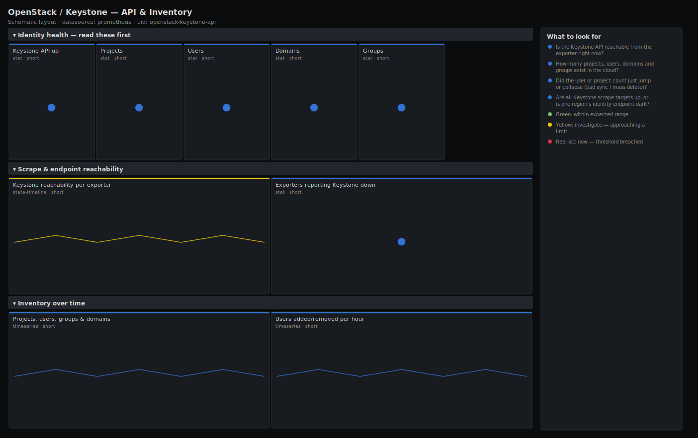

# OpenStack / Keystone — API & Inventory

> Keystone identity service availability and the size of your identity estate: is the API answering, and how many projects, users, domains and groups exist? Answers "can tenants authenticate right now, and is the directory the size I expect?" rather than dumping raw counters.

**Primary search phrase:** OpenStack Keystone Grafana dashboard  
**Category:** `openstack/keystone` · **UID:** `openstack-keystone-api` · **Datasource:** Prometheus



## Questions this dashboard answers

- Is the Keystone API reachable from the exporter right now?
- How many projects, users, domains and groups exist in the cloud?
- Did the user or project count just jump or collapse (bad sync / mass delete)?
- Are all Keystone scrape targets up, or is one region's identity endpoint dark?

## Production lessons — why this dashboard exists

Keystone is the single point every other OpenStack service authenticates against, so when it is slow or down the whole control plane looks broken at once — Nova, Neutron and Cinder all start returning 401/503. The standard openstack-exporter does not expose token-issuance latency, so the honest health signal is the per-service scrape success (`openstack_identity_up`) plus the inventory gauges: a sudden drop in user or project count almost always means a failed LDAP/Keystone sync or an accidental bulk delete, not real churn. Lead with up/down and totals so on-call can tell an outage from a data problem in five seconds.

## Data source requirements

- **Prometheus** datasource (selected at import time via `${DS_PROMETHEUS}`).
- `openstack-exporter` (the OpenStack Cloud Exporter) configured with the `identity` collector enabled and a service account that can list projects, users, domains and groups.
- Health here is the exporter's `openstack_identity_up` (1 when the Keystone API answered the last scrape). The standard exporter exposes **no** token issuance latency metric; if you need real auth latency, add a blackbox/probe against the v3 token endpoint and graph `probe_duration_seconds` alongside.

## Template variables

| Variable | Label | Type | Purpose |
|----------|-------|------|---------|
| `${job}` | Job | query | Prometheus scrape job for your openstack-exporter target(s). |
| `${instance}` | Exporter | query | openstack-exporter instance(s) — one per cloud/region. |

## Panels

### Identity health — read these first

- **Keystone API up** (stat, `short`) — 1 when the exporter successfully queried the Keystone identity API on the last scrape.
- **Projects** (stat, `short`) — Total Keystone projects (tenants) in the cloud.
- **Users** (stat, `short`) — Total Keystone user accounts (local plus federated/LDAP-mapped).
- **Domains** (stat, `short`) — Total Keystone domains — top-level isolation boundaries for projects and users.
- **Groups** (stat, `short`) — Total Keystone groups used for role assignment at scale.

### Scrape & endpoint reachability

- **Keystone reachability per exporter** (state-timeline, `short`) — Up/down history of the identity API as seen by each exporter — find the exact minute a region went dark.
- **Exporters reporting Keystone down** (stat, `short`) — Count of exporter instances whose last identity scrape failed. Non-zero means an auth outage somewhere.

### Inventory over time

- **Projects, users, groups & domains** (timeseries, `short`) — Identity inventory trended together. Flat lines are normal; cliffs or spikes mean a sync or bulk operation.
- **Users added/removed per hour** (timeseries, `short`) — Hourly change in user count. Large negative swings are the early warning for a broken directory sync.

## Import

**Grafana UI** — *Dashboards → New → Import*, upload `dashboards/openstack/keystone/api.json`, then pick your datasource when prompted.

**API:**

```bash
scripts/import-dashboard.sh dashboards/openstack/keystone/api.json
```

**Provisioning** — drop the JSON into a provisioned folder (see [provisioning guide](../../../provisioning.md)).

## Recommended alerts

Ready-to-use rules ship in `alerts/openstack.rules.yml`.

### KeystoneAPIDown (`critical`)

```promql
openstack_identity_up == 0
```

- **Fires after:** `2m`
- **Why it matters:** Every OpenStack service authenticates against Keystone; while it is down, Nova/Neutron/Cinder calls fail with 401/503 and the whole control plane is effectively offline.
- **Investigate:** Open OpenStack / Keystone — API & Inventory and check reachability per exporter; then curl the v3 endpoint and check the keystone/apache (wsgi) logs and the backing database connection.
- **Recovery:** Clears when the exporter scrapes the identity API successfully for 1m.
- **False positives:** A restart of openstack-exporter or its service account losing list permissions reports down without a real Keystone outage — verify with a direct token request.

### KeystoneUserCountCollapsed (`warning`)

```promql
sum(openstack_identity_users) < 0.5 * sum(openstack_identity_users offset 1h)
```

- **Fires after:** `10m`
- **Why it matters:** A sudden collapse in the user (or project) inventory almost always means a failed LDAP/identity sync or an accidental bulk delete rather than real attrition.
- **Investigate:** Compare the projects/users/groups trend panel against change tickets; check the identity backend sync job and recent admin API audit logs.
- **Recovery:** Clears once the inventory returns to within 50% of the prior hour.
- **False positives:** Legitimate large cleanups of stale accounts; raise the threshold or add a maintenance silence window.

## Troubleshooting

| Symptom | Likely cause | First action |
|---------|--------------|--------------|
| All panels show "No data" | The `identity` collector is disabled or the exporter service account lacks list rights. | Enable the identity collector in the exporter config and grant the account `reader`/`admin` on the `identity` API; confirm with `openstack_identity_up` in Explore. |
| Up is green but counts are zero | The exporter authenticated but the account cannot list across all domains. | Use a domain-scoped admin or the `cloud_admin` role so list calls return every domain's objects. |
| User/project counts look doubled | Two exporters scraping the same cloud are both summed by the `sum(...)`. | Scope `$instance` to a single exporter per cloud, or filter the job to one collector. |

## Performance considerations

Inventory gauges are cheap (a handful of series per exporter) so this dashboard is light even at 1m refresh. The user-delta panel uses a 1h subquery; widen its step on very large clouds if the panel renders slowly. Keep one exporter per cloud to avoid double-counting when you `sum`.

## Customization

Add a `cloud`/`region` template variable if your exporter labels series that way, and split the inventory panel per region. If you run the enhanced exporter build that exposes token issuance, add a stat for issuance rate and a blackbox probe panel for v3 token latency to turn this into a true SLO dashboard.

## Related resources

- [Advanced observability guides](https://devopsaitoolkit.com/guides/)
- [Grafana & Prometheus tutorials](https://devopsaitoolkit.com/blog/)
- [AI Incident Response Assistant](https://devopsaitoolkit.com/dashboard/incident-response)
- [PromQL cookbook](../../../../promql/README.md) · [Alerting guide](../../../alerting.md) · [Dashboard catalog](../../../catalog.md)
