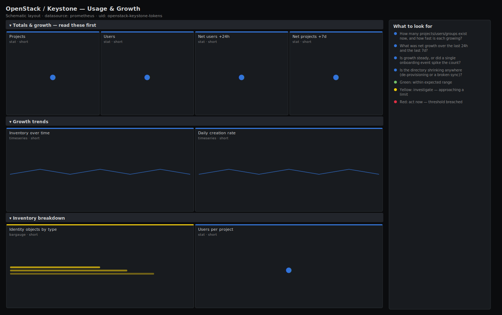

# OpenStack / Keystone — Usage & Growth

> How fast the identity estate is growing: projects, users and groups over time, hour-over-hour and week-over-week growth, and an inventory breakdown table. Answers "are we onboarding (or leaking) tenants faster than capacity planning assumed?" for capacity and audit, not just a point-in-time count.

**Primary search phrase:** OpenStack Keystone usage growth Grafana dashboard  
**Category:** `openstack/keystone` · **UID:** `openstack-keystone-tokens` · **Datasource:** Prometheus



## Questions this dashboard answers

- How many projects/users/groups exist now, and how fast is each growing?
- What was net growth over the last 24h and the last 7d?
- Is growth steady, or did a single onboarding event spike the count?
- Is the directory shrinking anywhere (de-provisioning or a broken sync)?

## Production lessons — why this dashboard exists

Identity inventory grows quietly until a capacity assumption breaks — Fernet key rotation cost, role-assignment table size, and per-project quota accounting all scale with the directory, not with traffic. Tracking the *rate* of project and user creation is what lets capacity planning stay ahead of the curve, and it is also the cheapest tripwire for a runaway automation that creates projects in a loop. Lead with current totals plus 24h/7d growth so a human can see at a glance whether the slope is healthy.

## Data source requirements

- **Prometheus** datasource (selected at import time via `${DS_PROMETHEUS}`).
- `openstack-exporter` with the `identity` collector — the gauges `openstack_identity_projects`, `openstack_identity_users`, `openstack_identity_groups` and `openstack_identity_domains`.
- Growth panels use `delta()`/`offset` over the gauge values, so they need Prometheus retention at least as long as the comparison window (≥7d for the weekly panels). The standard exporter exposes totals only, not per-domain segmentation; the breakdown table below is by resource type.

## Template variables

| Variable | Label | Type | Purpose |
|----------|-------|------|---------|
| `${job}` | Job | query | Prometheus scrape job for your openstack-exporter target(s). |
| `${instance}` | Exporter | query | openstack-exporter instance(s) — one per cloud/region. |

## Panels

### Totals & growth — read these first

- **Projects** (stat, `short`) — Current total Keystone projects.
- **Users** (stat, `short`) — Current total Keystone users.
- **Net users +24h** (stat, `short`) — Net change in user count over the last 24 hours. Negative means more de-provisioned than created.
- **Net projects +7d** (stat, `short`) — Net change in project count over the last 7 days — the capacity-planning number.

### Growth trends

- **Inventory over time** (timeseries, `short`) — Projects, users and groups trended together over the selected range. Watch the slope, not the absolute value.
- **Daily creation rate** (timeseries, `short`) — New projects and users per day (positive bars) — sustained spikes are onboarding events or runaway automation.

### Inventory breakdown

- **Identity objects by type** (bargauge, `short`) — Relative size of each identity object class — a quick sense of where the directory's weight sits.
- **Users per project** (stat, `short`) — Average users per project — a rough density metric for role-assignment and quota sizing.

## Import

**Grafana UI** — *Dashboards → New → Import*, upload `dashboards/openstack/keystone/tokens.json`, then pick your datasource when prompted.

**API:**

```bash
scripts/import-dashboard.sh dashboards/openstack/keystone/tokens.json
```

**Provisioning** — drop the JSON into a provisioned folder (see [provisioning guide](../../../provisioning.md)).

## Recommended alerts

Ready-to-use rules ship in `alerts/openstack.rules.yml`.

### KeystoneProjectGrowthSpike (`warning`)

```promql
(sum(openstack_identity_projects) - sum(openstack_identity_projects offset 1h)) > 50
```

- **Fires after:** `5m`
- **Why it matters:** A burst of project creation is either a large planned onboarding or a runaway automation loop; both can exhaust quota-accounting and role-assignment capacity if unnoticed.
- **Investigate:** Open OpenStack / Keystone — Usage & Growth, check the daily-creation panel, and correlate with the automation/onboarding pipeline that calls the projects API.
- **Recovery:** Clears once hourly project creation falls back below 50.
- **False positives:** Genuine bulk onboarding events — silence the rule during scheduled migrations or raise the threshold to your largest expected batch.

### KeystoneInventoryStale (`info`)

```promql
delta(sum(openstack_identity_users)[6h:1h]) == 0 and sum(openstack_identity_users) > 0
```

- **Fires after:** `6h`
- **Why it matters:** On an active cloud some churn is expected; a perfectly flat count for hours can mean the exporter is serving a cached/stale value or the sync stopped.
- **Investigate:** Check exporter scrape freshness and the identity sync job's last successful run.
- **Recovery:** Clears as soon as the inventory changes again.
- **False positives:** Genuinely quiet clouds (lab/staging) with no onboarding — disable this informational rule there.

## Troubleshooting

| Symptom | Likely cause | First action |
|---------|--------------|--------------|
| Growth panels show "No data" beyond a few days | Prometheus retention is shorter than the offset window (e.g. 7d offset on 3d retention). | Increase retention or shorten the comparison windows to fit your retention. |
| Net deltas look jagged or negative briefly | A scrape gap makes `offset`/`delta` straddle a missing sample. | Use a slightly longer step on the daily panels; ensure the exporter is scraped reliably. |
| Users-per-project is enormous | Projects scraped as zero (permissions) while users are non-zero, so the ratio divides by the `clamp_min` floor. | Grant the exporter account list rights on projects across all domains. |

## Performance considerations

Gauges are low-cardinality, so even a 30-day default range is cheap. The `offset`/`delta` panels are the only expensive part; they require retention to cover the window. Prefer a 5m refresh — inventory does not change second to second and slower refresh keeps subquery cost down.

## Customization

Adjust the 50-projects/hour alert to your largest legitimate onboarding batch. If you run a per-domain-aware exporter build, add `by (domain_id)` to the inventory queries and turn the breakdown into a true per-domain table. Switch the default range to `now-90d` for quarterly capacity reviews.

## Related resources

- [Advanced observability guides](https://devopsaitoolkit.com/guides/)
- [Grafana & Prometheus tutorials](https://devopsaitoolkit.com/blog/)
- [AI Incident Response Assistant](https://devopsaitoolkit.com/dashboard/incident-response)
- [PromQL cookbook](../../../../promql/README.md) · [Alerting guide](../../../alerting.md) · [Dashboard catalog](../../../catalog.md)
