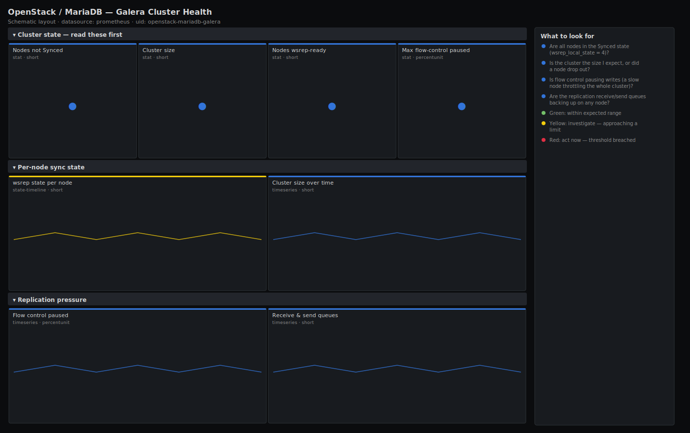

# OpenStack / MariaDB — Galera Cluster Health

> Galera (wsrep) cluster health behind the OpenStack databases: which nodes are Synced, the cluster size versus expected, flow-control pause time and the replication receive/send queues. Answers "is the cluster healthy and writable, or is one node desynced and dragging replication?" before the control plane sees write errors.

**Primary search phrase:** MariaDB Galera cluster Grafana dashboard  
**Category:** `openstack/mariadb` · **UID:** `openstack-mariadb-galera` · **Datasource:** Prometheus



## Questions this dashboard answers

- Are all nodes in the Synced state (wsrep_local_state = 4)?
- Is the cluster the size I expect, or did a node drop out?
- Is flow control pausing writes (a slow node throttling the whole cluster)?
- Are the replication receive/send queues backing up on any node?

## Production lessons — why this dashboard exists

Galera fails in a way that average dashboards miss: the cluster stays "up" while one node silently leaves the Synced state, and from then on writes either skip that node or — worse — the whole cluster throttles itself via flow control to let the laggard catch up, so every OpenStack write slows down at once. The two signals that matter are `wsrep_local_state == 4` (Synced) per node and `wsrep_flow_control_paused`: a node Donor/Joiner during SST, or a non-zero flow-control pause, explains control-plane write latency that CPU and connection graphs never will. Cluster size dropping below the expected odd number is the split-brain tripwire.

## Data source requirements

- **Prometheus** datasource (selected at import time via `${DS_PROMETHEUS}`).
- `mysqld_exporter` on each MariaDB/Galera node with the global-status collector enabled, exposing `mysql_global_status_wsrep_*` and `mysql_up`.
- `wsrep_local_state` values: 1=Joining, 2=Donor/Desynced, 3=Joined, 4=Synced. `wsrep_flow_control_paused` is the fraction of time (0-1) replication was paused since the last status read.

## Template variables

| Variable | Label | Type | Purpose |
|----------|-------|------|---------|
| `${job}` | Job | query | Prometheus scrape job for your mysqld_exporter targets. |
| `${instance}` | Node | query | Galera node(s); supports multi-select. |
| `${expected}` | Expected nodes | constant | Expected Galera cluster size used by the size alert/threshold. |

## Panels

### Cluster state — read these first

- **Nodes not Synced** (stat, `short`) — Count of nodes whose wsrep_local_state is not 4 (Synced). Any value >0 means degraded replication.
- **Cluster size** (stat, `short`) — Number of nodes the cluster believes are members. Should equal your expected odd node count.
- **Nodes wsrep-ready** (stat, `short`) — Count of nodes reporting wsrep_ready = 1 (able to accept queries via the cluster).
- **Max flow-control paused** (stat, `percentunit`) — Highest fraction of time replication was paused by flow control. Above zero, a slow node is throttling cluster writes.

### Per-node sync state

- **wsrep state per node** (state-timeline, `short`) — Replication state history per node. Anything other than Synced (4) during steady state needs investigation.
- **Cluster size over time** (timeseries, `short`) — Membership over time. A dip is a node leaving (planned drain or partition); a drop to an even number risks split-brain.

### Replication pressure

- **Flow control paused** (timeseries, `percentunit`) — Per-node fraction of time replication is paused. Sustained non-zero values directly slow every OpenStack write.
- **Receive & send queues** (timeseries, `short`) — Replication apply (recv) and replicate (send) queue depth per node. A deep recv queue is a node that cannot apply writesets fast enough.

## Import

**Grafana UI** — *Dashboards → New → Import*, upload `dashboards/openstack/mariadb/galera.json`, then pick your datasource when prompted.

**API:**

```bash
scripts/import-dashboard.sh dashboards/openstack/mariadb/galera.json
```

**Provisioning** — drop the JSON into a provisioned folder (see [provisioning guide](../../../provisioning.md)).

## Recommended alerts

Ready-to-use rules ship in `alerts/openstack.rules.yml`.

### GaleraNodeNotSynced (`critical`)

```promql
mysql_global_status_wsrep_local_state != 4
```

- **Fires after:** `2m`
- **Why it matters:** A node out of the Synced state is not reliably part of replication; OpenStack writes routed there can fail or the cluster may exclude it, reducing redundancy.
- **Investigate:** Open OpenStack / MariaDB — Galera Cluster Health, check the per-node state timeline and whether the node is doing an SST (Donor/Joiner) or genuinely stuck.
- **Recovery:** Clears when the node returns to state 4 (Synced).
- **False positives:** Planned SST after a node restart shows Donor/Joiner briefly; the 2m `for` filters short transitions.

### GaleraClusterSizeDegraded (`critical`)

```promql
max(mysql_global_status_wsrep_cluster_size) < 3
```

- **Fires after:** `3m`
- **Why it matters:** Below the expected odd member count the cluster loses redundancy and is one failure away from losing quorum and going read-only, which freezes the OpenStack control plane.
- **Investigate:** Identify the missing node and check its mysqld service, network partition status and Galera error log.
- **Recovery:** Clears when membership returns to the expected size.
- **False positives:** Rolling maintenance; silence during planned node drains or set the threshold to your real cluster size.

### GaleraFlowControlPausing (`warning`)

```promql
mysql_global_status_wsrep_flow_control_paused > 0.1
```

- **Fires after:** `5m`
- **Why it matters:** Flow control pauses the whole cluster's writes to let a slow node catch up, so a single lagging node adds latency to every OpenStack database write.
- **Investigate:** Check the receive-queue panel for the lagging node and its disk/CPU; a slow disk or saturated node is the usual cause.
- **Recovery:** Clears when flow-control pause falls back near zero.
- **False positives:** Brief pauses during an SST or a large batch write; the 5m window filters short spikes.

## Troubleshooting

| Symptom | Likely cause | First action |
|---------|--------------|--------------|
| All panels show "No data" | mysqld_exporter cannot read global status, or wsrep is not enabled (not a Galera build). | Grant the exporter user `PROCESS`/`REPLICATION CLIENT`; confirm `SHOW STATUS LIKE 'wsrep_%'` returns rows on the node. |
| Cluster size differs between nodes | A network partition split the cluster; nodes disagree on membership. | Run `wsrep_cluster_status`/`SHOW STATUS LIKE 'wsrep_cluster_status'`; resolve the partition before any write proceeds. |
| Flow-control paused stuck at a high value | A chronically slow node (disk or CPU bound) keeps the cluster throttled. | Move that node to faster storage or remove it from the write path until fixed. |

## Performance considerations

All wsrep status series are one per node and cheap, so 30s refresh is fine. The `expected` constant variable feeds the size threshold without hardcoding it in PromQL. If you scrape many clusters from one Prometheus, scope `$job`/`$instance` tightly so the `max`/`count` aggregates stay within a single cluster.

## Customization

Set the `Expected nodes` variable and the size thresholds to your cluster size (3, 5, …). Tighten the flow-control thresholds for latency-sensitive control planes. Pair this with the MariaDB Performance dashboard to see whether a desync is caused by connection saturation or slow queries on the lagging node.

## Related resources

- [Advanced observability guides](https://devopsaitoolkit.com/guides/)
- [Grafana & Prometheus tutorials](https://devopsaitoolkit.com/blog/)
- [AI Incident Response Assistant](https://devopsaitoolkit.com/dashboard/incident-response)
- [PromQL cookbook](../../../../promql/README.md) · [Alerting guide](../../../alerting.md) · [Dashboard catalog](../../../catalog.md)
