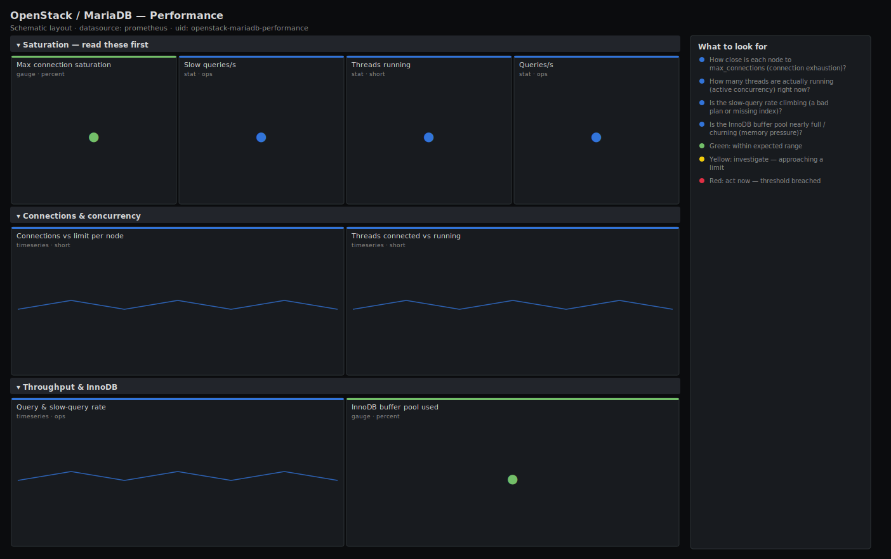

# OpenStack / MariaDB — Performance

> MariaDB throughput and saturation behind the OpenStack control plane: connection pool headroom, running threads, query and slow-query rates, and InnoDB buffer pool pressure. Answers "is the database the bottleneck — out of connections, drowning in slow queries, or starved of buffer pool?" before API calls time out.

**Primary search phrase:** MariaDB performance Grafana dashboard  
**Category:** `openstack/mariadb` · **UID:** `openstack-mariadb-performance` · **Datasource:** Prometheus



## Questions this dashboard answers

- How close is each node to max_connections (connection exhaustion)?
- How many threads are actually running (active concurrency) right now?
- Is the slow-query rate climbing (a bad plan or missing index)?
- Is the InnoDB buffer pool nearly full / churning (memory pressure)?

## Production lessons — why this dashboard exists

The classic OpenStack database outage is connection exhaustion, not CPU: every control service holds a SQLAlchemy pool, and when an agent storms reconnects (or someone forgets to size `max_connections` for the fleet) the database starts rejecting connections and every API returns 500 at once. So this dashboard leads with connection saturation as a percent of `max_connections`, then running threads (real concurrency, which `threads_connected` overstates). Slow queries are the second story: a single missing index after a schema migration can quietly multiply latency long before connections fill.

## Data source requirements

- **Prometheus** datasource (selected at import time via `${DS_PROMETHEUS}`).
- `mysqld_exporter` with the global status and global variables collectors, exposing `mysql_global_status_*` and `mysql_global_variables_max_connections`.
- InnoDB buffer-pool pressure is read from `innodb_buffer_pool_pages_total` and `innodb_buffer_pool_pages_free`; a true hit ratio needs the read-request counters which are not assumed here, so this focuses on fill and free pages.

## Template variables

| Variable | Label | Type | Purpose |
|----------|-------|------|---------|
| `${job}` | Job | query | Prometheus scrape job for your mysqld_exporter targets. |
| `${instance}` | Node | query | MariaDB node(s); supports multi-select. |

## Panels

### Saturation — read these first

- **Max connection saturation** (gauge, `percent`) — Highest threads_connected as a percent of max_connections across nodes. Near 100% the database starts refusing connections.
- **Slow queries/s** (stat, `ops`) — Cluster-wide slow-query rate. A rising value points at a bad plan or a missing index.
- **Threads running** (stat, `short`) — Threads actively executing a query right now (real concurrency). Spikes mean queries are queueing.
- **Queries/s** (stat, `ops`) — Cluster-wide query throughput. Useful as a baseline to spot sudden drops (stall) or spikes (storm).

### Connections & concurrency

- **Connections vs limit per node** (timeseries, `short`) — threads_connected against max_connections per node. The gap is your headroom before the database refuses logins.
- **Threads connected vs running** (timeseries, `short`) — Pooled connections (connected) versus active queries (running). A wide gap is idle pooled connections; a high running count is real load.

### Throughput & InnoDB

- **Query & slow-query rate** (timeseries, `ops`) — Overall query rate with slow queries overlaid. A flat QPS with rising slow queries means plans degraded, not load.
- **InnoDB buffer pool used** (gauge, `percent`) — Percent of InnoDB buffer pool pages in use (total minus free). Persistently ~100% means the working set exceeds RAM and pages are churning.

## Import

**Grafana UI** — *Dashboards → New → Import*, upload `dashboards/openstack/mariadb/performance.json`, then pick your datasource when prompted.

**API:**

```bash
scripts/import-dashboard.sh dashboards/openstack/mariadb/performance.json
```

**Provisioning** — drop the JSON into a provisioned folder (see [provisioning guide](../../../provisioning.md)).

## Recommended alerts

Ready-to-use rules ship in `alerts/openstack.rules.yml`.

### MariaDBConnectionSaturation (`critical`)

```promql
100 * mysql_global_status_threads_connected / mysql_global_variables_max_connections > 90
```

- **Fires after:** `5m`
- **Why it matters:** Near the limit MariaDB starts rejecting new connections, and every OpenStack control service that cannot get a connection returns 500 — a full control-plane outage.
- **Investigate:** Open OpenStack / MariaDB — Performance, check connections vs limit per node and which service opened a flood of connections (look at the API/agent logs).
- **Recovery:** Clears when utilisation drops below 90% for several minutes.
- **False positives:** A brief reconnect storm right after a control-plane restart; the 5m `for` filters transients.

### MariaDBSlowQuerySpike (`warning`)

```promql
sum(rate(mysql_global_status_slow_queries[5m])) > 10
```

- **Fires after:** `10m`
- **Why it matters:** A sustained slow-query rate usually follows a schema change or data growth that invalidated an index, multiplying control-plane latency well before connections fill.
- **Investigate:** Enable/inspect the slow-query log, identify the offending statement, and check for a missing index after the last migration.
- **Recovery:** Clears when the slow-query rate falls back below 10/s.
- **False positives:** Scheduled heavy reports or backups; silence during known maintenance windows.

### MariaDBBufferPoolExhausted (`warning`)

```promql
100 * (1 - mysql_global_status_innodb_buffer_pool_pages_free / mysql_global_status_innodb_buffer_pool_pages_total) > 98
```

- **Fires after:** `15m`
- **Why it matters:** A buffer pool pinned near full means the working set no longer fits in RAM, so reads hit disk and query latency climbs across the board.
- **Investigate:** Check whether data growth or a large scan filled the pool; review query/slow-query rate alongside.
- **Recovery:** Clears when free pages recover below the threshold.
- **False positives:** A fully warmed pool on a right-sized server can legitimately sit near 100%; correlate with disk read latency before acting.

## Troubleshooting

| Symptom | Likely cause | First action |
|---------|--------------|--------------|
| All panels show "No data" | The global-status/variables collectors are off, or the exporter user lacks privileges. | Grant the exporter user `PROCESS`/`SELECT` on the status tables and enable the collectors; confirm `mysql_up == 1`. |
| Saturation gauge reads 0 or absurdly high | max_connections is missing (variables collector disabled), so the ratio divides by the `clamp_min` floor. | Enable the `global_variables` collector so `max_connections` is exported. |
| Slow-query rate is always zero | The `long_query_time` threshold is high or the slow-query counter is disabled. | Tune `long_query_time` to a meaningful value (e.g. 1s) so genuinely slow statements are counted. |

## Performance considerations

Status counters are low cardinality; rates use a 5m window for smooth lines across counter resets. Aggregations are `sum`/`max` by node, so series count is one per node. On a large multi-cluster Prometheus, scope `$job` per cluster so the cluster-wide `sum`s do not blend unrelated databases.

## Customization

Set the saturation thresholds to match your pool sizing and the slow-query alert to your latency budget. If you export the InnoDB read-request counters, add a true buffer-pool hit-ratio panel. Pair with the Galera dashboard so you can tell a connection problem from a replication problem on the same node.

## Related resources

- [Advanced observability guides](https://devopsaitoolkit.com/guides/)
- [Grafana & Prometheus tutorials](https://devopsaitoolkit.com/blog/)
- [AI Incident Response Assistant](https://devopsaitoolkit.com/dashboard/incident-response)
- [PromQL cookbook](../../../../promql/README.md) · [Alerting guide](../../../alerting.md) · [Dashboard catalog](../../../catalog.md)
