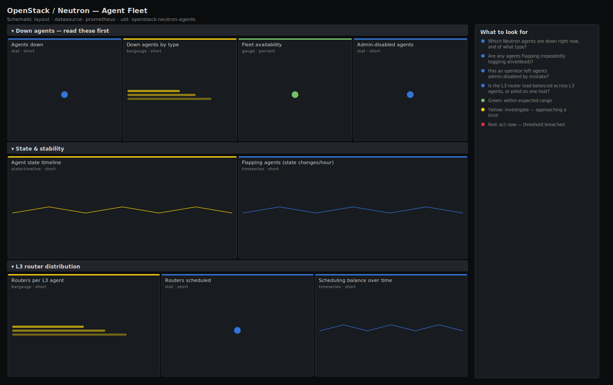

# OpenStack / Neutron — Agent Fleet

> Per-agent up/down state, flapping detection and L3-agent-to-router distribution for a Neutron deployment scraped by openstack-exporter. Answers "which agents are dead, which are unstable, and is any one network node carrying too many routers?" — the three failure modes that take tenant networking down.

**Primary search phrase:** OpenStack Neutron agents Grafana dashboard  
**Category:** `openstack/neutron` · **UID:** `openstack-neutron-agents` · **Datasource:** Prometheus



## Questions this dashboard answers

- Which Neutron agents are down right now, and of what type?
- Are any agents flapping (repeatedly toggling alive/dead)?
- Has an operator left agents admin-disabled by mistake?
- Is the L3 router load balanced across L3 agents, or piled on one host?
- Did a whole agent type just go dark (control-plane or messaging fault)?

## Production lessons — why this dashboard exists

A single dead agent is an incident; a *flapping* agent is worse, because Neutron keeps rescheduling resources onto and off it and tenant traffic blackholes during each transition. This dashboard separates the two: a hard-down panel for the obvious failures and a `changes()` panel that surfaces the agents toggling state. The L3 distribution panel exists because of one recurring outage shape — after a network node reboots, every router it used to host gets rescheduled onto the remaining agents, and the survivors quietly become the next bottleneck. Watching routers-per-agent lets you rebalance before the overloaded node falls over too.

## Data source requirements

- **Prometheus** datasource (selected at import time via `${DS_PROMETHEUS}`).
- `openstack-exporter` with Neutron enabled — exposes `openstack_neutron_agent_state` (labels `agent`, `adminState`, `hostname`; 1 = alive) and `openstack_neutron_l3_agent_of_router` (one series per router scheduled to an L3 agent host).

## Template variables

| Variable | Label | Type | Purpose |
|----------|-------|------|---------|
| `${job}` | Job | query | Prometheus scrape job for your openstack-exporter target(s). |
| `${agent}` | Agent type | query | Filter to one or more Neutron agent types. |

## Panels

### Down agents — read these first

- **Agents down** (stat, `short`) — Total agents reporting dead across selected types.
- **Down agents by type** (bargauge, `short`) — Which agent type is failing — a whole type down points at messaging or the Neutron server.
- **Fleet availability** (gauge, `percent`) — Share of selected agents alive.
- **Admin-disabled agents** (stat, `short`) — Agents with admin state down — usually drained on purpose, but easy to forget to re-enable.

### State & stability

- **Agent state timeline** (state-timeline, `short`) — Per-agent up/down over time — pinpoint the exact host and minute of each failure.
- **Flapping agents (state changes/hour)** (timeseries, `short`) — Counts alive/dead transitions per agent in the last hour — anything above zero is unstable.

### L3 router distribution

- **Routers per L3 agent** (bargauge, `short`) — How many routers each L3 agent host carries — flag the overloaded survivors after a node loss.
- **Routers scheduled** (stat, `short`) — Total router-to-L3-agent bindings (HA routers count once per agent).
- **Scheduling balance over time** (timeseries, `short`) — Routers per L3 agent host through time — a diverging line means an unbalanced fleet after a reschedule.

## Import

**Grafana UI** — *Dashboards → New → Import*, upload `dashboards/openstack/neutron/agents.json`, then pick your datasource when prompted.

**API:**

```bash
scripts/import-dashboard.sh dashboards/openstack/neutron/agents.json
```

**Provisioning** — drop the JSON into a provisioned folder (see [provisioning guide](../../../provisioning.md)).

## Recommended alerts

Ready-to-use rules ship in `alerts/openstack.rules.yml`.

### NeutronAgentDown (`critical`)

```promql
openstack_neutron_agent_state == 0
```

- **Fires after:** `5m`
- **Why it matters:** A dead agent stops serving DHCP, routing, metadata or OVS programming for every port it owns.
- **Investigate:** Open OpenStack / Neutron — Agent Fleet, locate the host on the state timeline, then check the agent service and message bus.
- **Recovery:** Clears when the agent reports alive for 5m.
- **False positives:** Hosts drained for maintenance — set the agent admin-state down or silence the host.

### NeutronAgentFlapping (`warning`)

```promql
changes(openstack_neutron_agent_state[1h]) > 3
```

- **Fires after:** `10m`
- **Why it matters:** A flapping agent triggers repeated rescheduling; tenant traffic blackholes on every transition, which is harder to debug than a clean outage.
- **Investigate:** Check messaging latency and the agent's heartbeat interval; look for an overloaded or memory-starved network node.
- **Recovery:** Clears when transitions drop to zero for the window.
- **False positives:** A one-off restart shows as a couple of changes — the `>3` threshold and 10m `for` filter those out.

### NeutronL3AgentOverloaded (`warning`)

```promql
count by (l3_agent_host, job) (openstack_neutron_l3_agent_of_router) > 100
```

- **Fires after:** `15m`
- **Why it matters:** An L3 agent carrying too many routers becomes a single point of failure and a latency bottleneck; losing it reschedules a huge blast radius.
- **Investigate:** Compare routers-per-agent across hosts; check whether a recent node loss piled routers onto the survivors.
- **Recovery:** Clears when the per-agent router count falls below 100.
- **False positives:** Deliberately dense small-router deployments — raise the threshold to match your sizing.

## Troubleshooting

| Symptom | Likely cause | First action |
|---------|--------------|--------------|
| Routers-per-agent panels are empty | `openstack_neutron_l3_agent_of_router` not exported (older exporter) or no routers scheduled. | Confirm the exporter version exposes the series and that L3 agents have routers bound. |
| An agent shows dead but the process is running | Heartbeats are arriving late due to clock skew or a slow message bus. | Sync NTP across network nodes and check RabbitMQ queue depth. |
| Admin-disabled count is non-zero unexpectedly | An agent left admin-state down after maintenance. | Re-enable it with `neutron agent-update --admin-state-up`. |

## Performance considerations

The hard-down and balance panels aggregate with `count by`, keeping cardinality to one series per agent type or host. Only the state timeline and flapping panels are per-agent — scope them with `$agent` on very large fleets. `changes(...[1h])` is evaluated once per agent and is cheap.

## Customization

Adjust the routers-per-agent thresholds (50/100) to your L3 sizing. If you run L3 HA, expect each router to appear under multiple agents — divide the thresholds accordingly. Add a `region` template variable for multi-region exporters.

## Related resources

- [Advanced observability guides](https://devopsaitoolkit.com/guides/)
- [Grafana & Prometheus tutorials](https://devopsaitoolkit.com/blog/)
- [AI Incident Response Assistant](https://devopsaitoolkit.com/dashboard/incident-response)
- [PromQL cookbook](../../../../promql/README.md) · [Alerting guide](../../../alerting.md) · [Dashboard catalog](../../../catalog.md)
