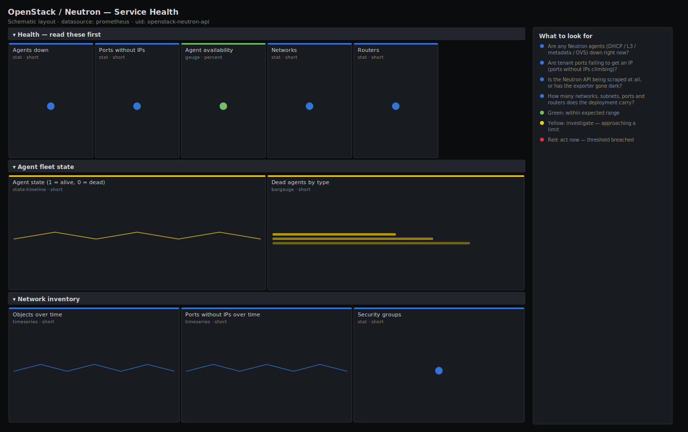

# OpenStack / Neutron — Service Health

> Neutron control-plane health for an OpenStack deployment scraped by openstack-exporter: are the DHCP, L3, metadata and Open vSwitch agents alive, is the API answering, and are tenant ports actually getting addresses? Leads with the two signals that page you — agents down and ports stuck without IPs.

**Primary search phrase:** OpenStack Neutron Grafana dashboard  
**Category:** `openstack/neutron` · **UID:** `openstack-neutron-api` · **Datasource:** Prometheus



## Questions this dashboard answers

- Are any Neutron agents (DHCP / L3 / metadata / OVS) down right now?
- Are tenant ports failing to get an IP (ports without IPs climbing)?
- Is the Neutron API being scraped at all, or has the exporter gone dark?
- How many networks, subnets, ports and routers does the deployment carry?
- Is one agent type or one host disproportionately unhealthy?

## Production lessons — why this dashboard exists

Neutron outages rarely announce themselves as "the API is down" — they show up as new instances that boot but never get networking. That is why this dashboard leads with **agents down** and **ports without IPs** rather than raw object counts: a dead DHCP agent on one network host leaves every new port on that segment addressless while the API keeps returning 200s. The inventory counters (networks/subnets/ports/routers) matter as a *trend* — a sudden drop usually means a region or a tenant was deleted, or the exporter lost its admin scope and is only seeing one project. Always confirm the exporter is scraping with full admin credentials before trusting a low count as real.

## Data source requirements

- **Prometheus** datasource (selected at import time via `${DS_PROMETHEUS}`).
- `openstack-exporter` (the `golang` or `prometheus-openstack-exporter`) with Neutron enabled and admin-scoped credentials — exposes `openstack_neutron_agent_state`, `openstack_neutron_ports_no_ips`, `openstack_neutron_networks`, `openstack_neutron_subnets`, `openstack_neutron_ports` and `openstack_neutron_routers`.

## Template variables

| Variable | Label | Type | Purpose |
|----------|-------|------|---------|
| `${job}` | Job | query | Prometheus scrape job for your openstack-exporter target(s). |
| `${agent}` | Agent type | query | Neutron agent type (DHCP agent, L3 agent, Metadata agent, Open vSwitch agent). |

## Panels

### Health — read these first

- **Agents down** (stat, `short`) — Count of Neutron agents reporting dead (state 0) across selected types.
- **Ports without IPs** (stat, `short`) — Tenant ports that exist but have no fixed IP — instances that can't reach the network.
- **Agent availability** (gauge, `percent`) — Share of selected Neutron agents currently alive.
- **Networks** (stat, `short`) — Total Neutron networks visible to the exporter.
- **Routers** (stat, `short`) — Total Neutron routers.

### Agent fleet state

- **Agent state (1 = alive, 0 = dead)** (state-timeline, `short`) — Up/down history per agent type and host — spot the exact agent and moment of failure.
- **Dead agents by type** (bargauge, `short`) — Where the failures cluster — a whole type dead usually means a control-plane or exporter scope problem.

### Network inventory

- **Objects over time** (timeseries, `short`) — Networks, subnets, ports and routers — watch for sudden cliffs (deletions or lost admin scope).
- **Ports without IPs over time** (timeseries, `short`) — A rising line means new ports are failing allocation — correlate with DHCP agent state.
- **Security groups** (stat, `short`) — Total Neutron security groups — a proxy for tenant/workload growth.

## Import

**Grafana UI** — *Dashboards → New → Import*, upload `dashboards/openstack/neutron/api.json`, then pick your datasource when prompted.

**API:**

```bash
scripts/import-dashboard.sh dashboards/openstack/neutron/api.json
```

**Provisioning** — drop the JSON into a provisioned folder (see [provisioning guide](../../../provisioning.md)).

## Recommended alerts

Ready-to-use rules ship in `alerts/openstack.rules.yml`.

### NeutronAgentDown (`critical`)

```promql
openstack_neutron_agent_state == 0
```

- **Fires after:** `5m`
- **Why it matters:** A dead DHCP/L3/metadata/OVS agent breaks address allocation, routing or metadata for every port it serves, even though the API still answers.
- **Investigate:** Open OpenStack / Neutron — Service Health, find the host, then check the agent process and `neutron agent-list` on the controller.
- **Recovery:** Clears when the agent reports alive (state 1) for 5m.
- **False positives:** A host drained for maintenance reports its agents dead — silence the host or set the agent admin-state down first.

### NeutronPortsWithoutIPs (`warning`)

```promql
sum(openstack_neutron_ports_no_ips) > 10
```

- **Fires after:** `10m`
- **Why it matters:** Ports without a fixed IP mean instances boot with no usable networking — the classic symptom of a stuck or dead DHCP agent or an exhausted subnet pool.
- **Investigate:** Cross-check DHCP agent state and the affected subnet's allocation pool; identify which network the IP-less ports belong to.
- **Recovery:** Clears when the count falls back below 10 for 5m.
- **False positives:** Ports intentionally created without addresses (e.g. for SR-IOV/direct attach) inflate this count — exclude them with a network selector.

### NeutronExporterDown (`critical`)

```promql
absent(openstack_neutron_agent_state)
```

- **Fires after:** `5m`
- **Why it matters:** With no agent metrics every other panel is blind; you cannot tell a healthy control plane from a dead one.
- **Investigate:** Check the openstack-exporter target in Prometheus and the exporter logs for auth/endpoint errors.
- **Recovery:** Clears once the series reappears.
- **False positives:** A planned exporter redeploy briefly trips this — keep `for` at 5m to ride out restarts.

## Troubleshooting

| Symptom | Likely cause | First action |
|---------|--------------|--------------|
| All panels show "No data" | Wrong `$job`, or openstack-exporter not scraping Neutron. | Check `up{job="$job"}` in Explore and confirm the exporter has Neutron enabled with admin credentials. |
| Object counts look far too low | Exporter authenticated with a single-project (non-admin) scope. | Re-scope the exporter credentials to an admin role so it enumerates all projects. |
| Agents flap between alive and dead | RabbitMQ/messaging instability between agents and the server. | Check the message bus and the `agent_down_time` setting; the agents may simply be reporting late. |

## Performance considerations

Every panel aggregates with `sum`/`avg`/`count by` to keep the series count at one per agent type or host rather than one per object, so this dashboard stays cheap even on large deployments. The state-timeline is the only per-agent panel; scope it with `$agent` if you run hundreds of network nodes.

## Customization

Tune the "ports without IPs" thresholds to your subnet sizing, and add a `region` selector to the templating if your exporter exposes one for multi-region clouds. To alert per agent type instead of globally, copy `NeutronPortsWithoutIPs` and add a `by (agent)` clause.

## Related resources

- [Advanced observability guides](https://devopsaitoolkit.com/guides/)
- [Grafana & Prometheus tutorials](https://devopsaitoolkit.com/blog/)
- [AI Incident Response Assistant](https://devopsaitoolkit.com/dashboard/incident-response)
- [PromQL cookbook](../../../../promql/README.md) · [Alerting guide](../../../alerting.md) · [Dashboard catalog](../../../catalog.md)
