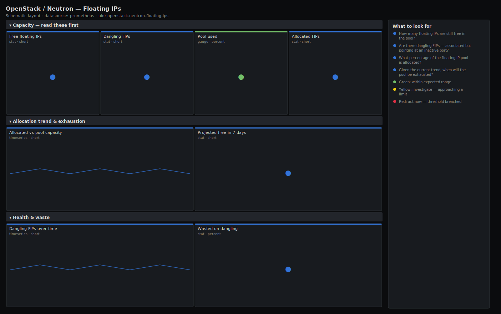

# OpenStack / Neutron — Floating IPs

> Floating IP capacity and health for an OpenStack deployment: how many addresses are still free, how many are dangling (associated to a down port), and when the pool is projected to run out. Leads with free and dangling FIPs so you catch exhaustion before tenants stop being able to expose workloads.

**Primary search phrase:** OpenStack floating IP Grafana dashboard  
**Category:** `openstack/neutron` · **UID:** `openstack-neutron-floating-ips` · **Datasource:** Prometheus



## Questions this dashboard answers

- How many floating IPs are still free in the pool?
- Are there dangling FIPs — associated but pointing at an inactive port?
- What percentage of the floating IP pool is allocated?
- Given the current trend, when will the pool be exhausted?
- Is FIP allocation growing steadily or did it just spike?

## Production lessons — why this dashboard exists

Floating IPs are the OpenStack resource most likely to silently run out: nothing fails until the day a tenant's `floatingip-create` returns a quota/pool error, and by then there is no headroom to give yourself room to react. The exporter reports the *count of allocated* FIPs, not the pool size, so this dashboard takes the allocatable pool size as a template variable and computes free headroom and a `predict_linear` exhaustion estimate from it. The second silent killer is **dangling** FIPs — addresses billed and counted as in-use but associated with a port that is down, so they neither work nor free up. They inflate utilisation and are pure waste until someone reclaims them.

## Data source requirements

- **Prometheus** datasource (selected at import time via `${DS_PROMETHEUS}`).
- `openstack-exporter` with Neutron enabled — exposes `openstack_neutron_floating_ips` (total allocated) and `openstack_neutron_floating_ips_associated_not_active` (dangling: associated to a non-active port). Set `$pool_size` to your external network's allocatable address count.

## Template variables

| Variable | Label | Type | Purpose |
|----------|-------|------|---------|
| `${job}` | Job | query | Prometheus scrape job for your openstack-exporter target(s). |
| `${pool_size}` | Pool size | textbox | Total allocatable floating IPs in the external network pool (used to compute free headroom and exhaustion). |

## Panels

### Capacity — read these first

- **Free floating IPs** (stat, `short`) — Allocatable addresses still available, based on the configured pool size.
- **Dangling FIPs** (stat, `short`) — Floating IPs associated to an inactive port — billed and counted but not working.
- **Pool used** (gauge, `percent`) — Allocated floating IPs as a share of the configured pool size.
- **Allocated FIPs** (stat, `short`) — Total floating IPs currently allocated.

### Allocation trend & exhaustion

- **Allocated vs pool capacity** (timeseries, `short`) — Allocated FIPs against the pool ceiling — the gap is your real headroom.
- **Projected free in 7 days** (stat, `short`) — Linear projection of free addresses one week out from the last 6h trend. Negative means exhaustion.

### Health & waste

- **Dangling FIPs over time** (timeseries, `short`) — Associated-but-inactive FIPs — a rising line is accumulating waste to reclaim.
- **Wasted on dangling** (stat, `percent`) — Share of allocated FIPs that are dangling — money and addresses spent on nothing.

## Import

**Grafana UI** — *Dashboards → New → Import*, upload `dashboards/openstack/neutron/floating-ips.json`, then pick your datasource when prompted.

**API:**

```bash
scripts/import-dashboard.sh dashboards/openstack/neutron/floating-ips.json
```

**Provisioning** — drop the JSON into a provisioned folder (see [provisioning guide](../../../provisioning.md)).

## Recommended alerts

Ready-to-use rules ship in `alerts/openstack.rules.yml`.

### FloatingIPPoolNearExhaustion (`warning`)

```promql
100 * sum(openstack_neutron_floating_ips) / 256 > 90
```

- **Fires after:** `10m`
- **Why it matters:** When the external pool fills, new `floatingip-create` calls fail and tenants can no longer expose workloads — a hard, tenant-visible wall.
- **Investigate:** Open OpenStack / Neutron — Floating IPs; check the free count and whether dangling FIPs are inflating usage.
- **Recovery:** Clears when allocation drops below 90% of the pool.
- **False positives:** The hardcoded 256 must match your real pool size — edit the alert (and the `$pool_size` variable) to your external network.

### FloatingIPsDangling (`warning`)

```promql
sum(openstack_neutron_floating_ips_associated_not_active) > 5
```

- **Fires after:** `30m`
- **Why it matters:** Dangling FIPs are associated to inactive ports — billed and counted against the pool but not routing traffic, so they waste capacity and money.
- **Investigate:** List FIPs whose port is down; correlate with deleted/stopped instances that didn't release their address.
- **Recovery:** Clears when dangling FIPs fall to 5 or fewer.
- **False positives:** Brief windows during instance reboot leave a FIP transiently inactive — the 30m `for` rides those out.

### FloatingIPPoolPredictedExhaustion (`critical`)

```promql
predict_linear(sum(openstack_neutron_floating_ips)[6h:], 7 * 86400) > 256
```

- **Fires after:** `1h`
- **Why it matters:** Catching exhaustion a week out leaves time to reclaim addresses or grow the pool instead of fighting an outage.
- **Investigate:** Confirm the growth is organic (real tenant demand) versus a runaway automation creating FIPs.
- **Recovery:** Clears when the projection no longer crosses the pool ceiling.
- **False positives:** A short allocation burst skews the linear fit — the 1h `for` and 6h window damp transient spikes.

## Troubleshooting

| Symptom | Likely cause | First action |
|---------|--------------|--------------|
| Free count is negative | `$pool_size` is set lower than the real allocatable pool. | Set the Pool size variable (and the alert constants) to your external network's true address count. |
| Used % never moves | Exporter scoped to one project, so it only sees that tenant's FIPs. | Re-scope the exporter to an admin role to count the whole deployment. |
| Projection swings wildly | Bursty allocation makes the linear fit unstable. | Widen the `predict_linear` range window or rely on the used-% gauge for steady-state. |

## Performance considerations

All panels aggregate with `sum`, producing a single series each, so the dashboard is trivially cheap regardless of FIP count. `predict_linear` over a 6h subquery is evaluated once and refreshed on the panel interval.

## Customization

The single most important knob is `$pool_size` — set it to your external network's allocatable count, and update the same constant inside the alert expressions (alerts can't read dashboard variables). Tighten the 80/90% gauge thresholds if your FIP turnover is slow and you need more lead time.

## Related resources

- [Advanced observability guides](https://devopsaitoolkit.com/guides/)
- [Grafana & Prometheus tutorials](https://devopsaitoolkit.com/blog/)
- [AI Incident Response Assistant](https://devopsaitoolkit.com/dashboard/incident-response)
- [PromQL cookbook](../../../../promql/README.md) · [Alerting guide](../../../alerting.md) · [Dashboard catalog](../../../catalog.md)
