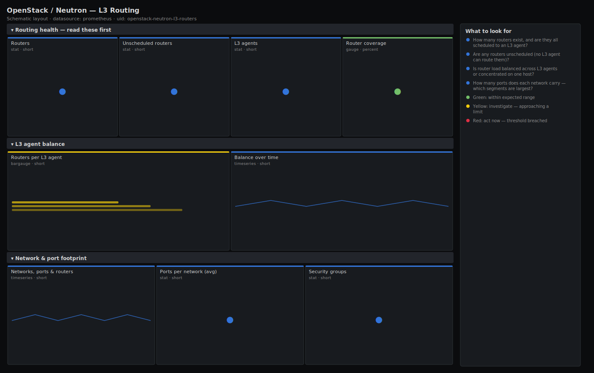

# OpenStack / Neutron — L3 Routing

> Layer-3 routing health for an OpenStack deployment: router inventory, L3 agent coverage and balance, ports per network, and security-group footprint. Leads with router count and L3-agent coverage so you can see at a glance whether every router is actually scheduled to an agent that can route its traffic.

**Primary search phrase:** OpenStack Neutron L3 router Grafana dashboard  
**Category:** `openstack/neutron` · **UID:** `openstack-neutron-l3-routers` · **Datasource:** Prometheus



## Questions this dashboard answers

- How many routers exist, and are they all scheduled to an L3 agent?
- Are any routers unscheduled (no L3 agent can route them)?
- Is router load balanced across L3 agents or concentrated on one host?
- How many ports does each network carry — which segments are largest?
- Is the security-group count growing in a way that hints at sprawl?

## Production lessons — why this dashboard exists

A router that exists in the database but isn't scheduled to a live L3 agent is the quietest networking outage there is: the API shows the router as ACTIVE, but no agent is forwarding its traffic, so the tenant just sees "the internet is down." This dashboard leads with **coverage** — routers minus routers-with-an-agent — so that gap is impossible to miss. The companion lesson is **balance**: L3 agents are not interchangeable in capacity, and after a network node fails its routers pile onto the survivors. Ports-per-network and security-group counts round out the picture because runaway port or SG growth on one network is an early sign of a misbehaving tenant or an automation loop.

## Data source requirements

- **Prometheus** datasource (selected at import time via `${DS_PROMETHEUS}`).
- `openstack-exporter` with Neutron enabled — exposes `openstack_neutron_routers`, `openstack_neutron_l3_agent_of_router` (router-to-agent bindings), `openstack_neutron_ports`, `openstack_neutron_networks` and `openstack_neutron_security_groups`.

## Template variables

| Variable | Label | Type | Purpose |
|----------|-------|------|---------|
| `${job}` | Job | query | Prometheus scrape job for your openstack-exporter target(s). |

## Panels

### Routing health — read these first

- **Routers** (stat, `short`) — Total Neutron routers in the deployment.
- **Unscheduled routers** (stat, `short`) — Routers with no L3 agent binding — they exist but nothing is routing their traffic.
- **L3 agents** (stat, `short`) — Distinct L3 agent hosts currently carrying routers.
- **Router coverage** (gauge, `percent`) — Share of routers that are scheduled to at least one L3 agent.

### L3 agent balance

- **Routers per L3 agent** (bargauge, `short`) — Router load on each L3 agent host — spot the overloaded survivor after a node loss.
- **Balance over time** (timeseries, `short`) — Routers per agent through time — diverging lines mean the fleet drifted out of balance.

### Network & port footprint

- **Networks, ports & routers** (timeseries, `short`) — Inventory trend — watch for a sudden cliff (mass deletion) or a runaway climb.
- **Ports per network (avg)** (stat, `short`) — Mean ports per network — a proxy for segment density.
- **Security groups** (stat, `short`) — Total security groups — sudden growth can signal tenant sprawl or an automation loop.

## Import

**Grafana UI** — *Dashboards → New → Import*, upload `dashboards/openstack/neutron/l3-routers.json`, then pick your datasource when prompted.

**API:**

```bash
scripts/import-dashboard.sh dashboards/openstack/neutron/l3-routers.json
```

**Provisioning** — drop the JSON into a provisioned folder (see [provisioning guide](../../../provisioning.md)).

## Recommended alerts

Ready-to-use rules ship in `alerts/openstack.rules.yml`.

### NeutronRouterUnscheduled (`critical`)

```promql
sum(openstack_neutron_routers) - count(count by (router_id) (openstack_neutron_l3_agent_of_router)) > 0
```

- **Fires after:** `10m`
- **Why it matters:** An unscheduled router is ACTIVE in the API but has no agent forwarding its traffic, so the tenant behind it loses external connectivity with no obvious error.
- **Investigate:** Open OpenStack / Neutron — L3 Routing; cross-reference router IDs against L3 agent bindings to find the orphan.
- **Recovery:** Clears when every router has at least one agent binding.
- **False positives:** A router mid-reschedule is briefly unbound — the 10m `for` filters that transient.

### NeutronNoL3Agents (`critical`)

```promql
count(count by (l3_agent_host) (openstack_neutron_l3_agent_of_router)) < 1
```

- **Fires after:** `5m`
- **Why it matters:** With zero L3 agents scheduling routers, all routed (non-DVR) traffic for the deployment is down.
- **Investigate:** Check L3 agent state on the Agent Fleet dashboard and the Neutron server logs.
- **Recovery:** Clears when at least one L3 agent reports routers again.
- **False positives:** A fully DVR deployment with no centralised routers can legitimately read zero — disable this alert there.

### NeutronL3AgentImbalance (`warning`)

```promql
max(count by (l3_agent_host) (openstack_neutron_l3_agent_of_router)) > 3 * avg(count by (l3_agent_host) (openstack_neutron_l3_agent_of_router))
```

- **Fires after:** `30m`
- **Why it matters:** A single agent carrying far more than its share is a fragile bottleneck whose failure reschedules a large blast radius.
- **Investigate:** Compare routers-per-agent across hosts; look for a recent node loss that piled routers onto survivors.
- **Recovery:** Clears when the busiest agent falls back within 3× the mean.
- **False positives:** Tiny fleets (two or three agents) skew easily — raise the multiplier or disable on small deployments.

## Troubleshooting

| Symptom | Likely cause | First action |
|---------|--------------|--------------|
| Coverage gauge reads above 100% | HA routers bind to multiple agents, so distinct-router count can exceed naive expectations. | The `count by (router_id)` guard already de-duplicates; verify the exporter labels routers with `router_id`. |
| Unscheduled count flickers | Routers are being rescheduled between agents. | Confirm L3 agent stability on the Agent Fleet dashboard; rely on the 10m alert `for` to ignore transients. |
| Balance panels empty | `openstack_neutron_l3_agent_of_router` not exposed or no routers scheduled. | Confirm the exporter version exports the binding series. |

## Performance considerations

Coverage and balance use nested `count by (...)` aggregations that collapse to a handful of series regardless of router count, so the dashboard scales to thousands of routers cheaply. The inventory timeseries are single-series sums.

## Customization

Tune the routers-per-agent thresholds (50/100) and the imbalance multiplier to your L3 sizing and HA model. For DVR deployments, expect low centralised-router counts and relax or disable the no-L3-agents alert. Add a `region` variable for multi-region exporters.

## Related resources

- [Advanced observability guides](https://devopsaitoolkit.com/guides/)
- [Grafana & Prometheus tutorials](https://devopsaitoolkit.com/blog/)
- [AI Incident Response Assistant](https://devopsaitoolkit.com/dashboard/incident-response)
- [PromQL cookbook](../../../../promql/README.md) · [Alerting guide](../../../alerting.md) · [Dashboard catalog](../../../catalog.md)
