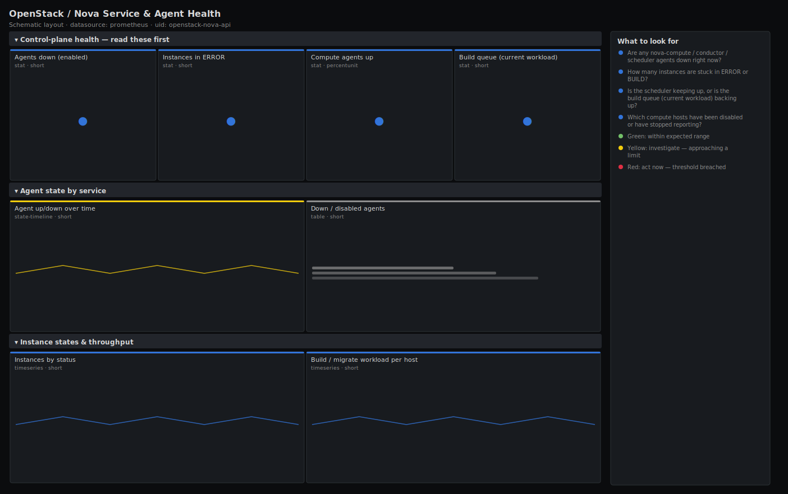

# OpenStack / Nova Service & Agent Health

> Control-plane health for OpenStack Nova as seen by openstack-exporter: which nova-compute, nova-conductor and nova-scheduler agents are up, how many instances are wedged in ERROR or BUILD, and how deep the build queue is. Answers "can the cloud still launch and run instances right now?" rather than drawing raw counters.

**Primary search phrase:** OpenStack Nova Grafana dashboard  
**Category:** `openstack/nova` · **UID:** `openstack-nova-api` · **Datasource:** Prometheus



## Questions this dashboard answers

- Are any nova-compute / conductor / scheduler agents down right now?
- How many instances are stuck in ERROR or BUILD?
- Is the scheduler keeping up, or is the build queue (current workload) backing up?
- Which compute hosts have been disabled or have stopped reporting?
- Is instance state churning (mass reboots, failed migrations)?

## Production lessons — why this dashboard exists

In a Nova outage the question is never "what's the CPU doing" — it is "can the control plane still place and run work". A single down nova-conductor or nova-scheduler stops *all* scheduling cloud-wide while every compute node still looks healthy, so this dashboard leads with **agent state** and **ERROR instances** instead of utilisation. The second hard-won lesson: a growing `current_workload` (the per-host build/resize queue) is the earliest signal that the scheduler is overwhelmed or an image/volume backend is slow — it climbs minutes before users start opening tickets about instances stuck in BUILD.

## Data source requirements

- **Prometheus** datasource (selected at import time via `${DS_PROMETHEUS}`).
- `openstack-exporter` (github.com/openstack-exporter/openstack-exporter) scraping the Nova API. Provides `openstack_nova_agent_state`, `openstack_nova_server_status`, `openstack_nova_current_workload` and the per-hypervisor capacity gauges.
- Run one exporter per cloud (or use `--multi-cloud` and the `cloud` label) and scrape it from Prometheus on a 30–60s interval; the Nova API calls it makes are list-heavy, so do not scrape faster.

## Template variables

| Variable | Label | Type | Purpose |
|----------|-------|------|---------|
| `${job}` | Job | query | Prometheus scrape job for your openstack-exporter target. |
| `${cloud}` | Cloud | query | Cloud/region when running the exporter in multi-cloud mode; All if single-cloud. |
| `${hostname}` | Hypervisor | query | Compute host(s) to scope agent and workload panels to. |

## Panels

### Control-plane health — read these first

- **Agents down (enabled)** (stat, `short`) — Administratively enabled nova-* agents whose state is reporting down. Anything above zero means scheduling or compute is degraded.
- **Instances in ERROR** (stat, `short`) — Servers Nova reports in the ERROR state — failed builds, migrations or reboots.
- **Compute agents up** (stat, `percentunit`) — Fraction of nova-compute agents currently reporting up across the fleet.
- **Build queue (current workload)** (stat, `short`) — Sum of per-host current_workload — instances actively building, resizing or migrating. A rising number means the scheduler/back-end is falling behind.

### Agent state by service

- **Agent up/down over time** (state-timeline, `short`) — Per-service availability. Look for synchronized dips (control-plane) vs single hosts (hardware).
- **Down / disabled agents** (table, `short`) — Agents not up, or administratively disabled (often a host in maintenance).

### Instance states & throughput

- **Instances by status** (timeseries, `short`) — Count of servers in each Nova status. ERROR climbing or BUILD not draining is the alert.
- **Build / migrate workload per host** (timeseries, `short`) — Per-hypervisor current_workload. A single host pinned high points at a slow local back-end.

## Import

**Grafana UI** — *Dashboards → New → Import*, upload `dashboards/openstack/nova/api.json`, then pick your datasource when prompted.

**API:**

```bash
scripts/import-dashboard.sh dashboards/openstack/nova/api.json
```

**Provisioning** — drop the JSON into a provisioned folder (see [provisioning guide](../../../provisioning.md)).

## Recommended alerts

Ready-to-use rules ship in `alerts/openstack.rules.yml`.

### NovaComputeAgentDown (`critical`)

```promql
openstack_nova_agent_state{adminState="enabled"} == 0
```

- **Fires after:** `5m`
- **Why it matters:** An enabled nova-compute/conductor/scheduler agent that stops reporting cannot place or run instances; a down conductor or scheduler degrades the whole cloud.
- **Investigate:** Open Nova Service & Agent Health, scope to the host; check `systemctl status` for the service and the agent logs for AMQP/RabbitMQ disconnects.
- **Recovery:** Clears when the agent reports state up (value 1) again for 5m.
- **False positives:** Planned maintenance — disable the host (adminState=disabled) so it is excluded by this rule.

### NovaInstancesStuckInError (`warning`)

```promql
count(openstack_nova_server_status{status="ERROR"}) > 5
```

- **Fires after:** `15m`
- **Why it matters:** A growing pool of ERROR instances usually means failed scheduling, a full hypervisor, or a sick image/volume back-end — and each one is a customer-visible failure.
- **Investigate:** Sort the instances-by-status table; `openstack server show` a sample to read the fault; correlate with build-queue and capacity dashboards.
- **Recovery:** Clears when fewer than 5 instances are in ERROR for 5m.
- **False positives:** A bulk test that intentionally creates failing instances; raise the threshold or scope by tenant.

### NovaBuildQueueBacklog (`warning`)

```promql
sum(openstack_nova_current_workload) > 30
```

- **Fires after:** `10m`
- **Why it matters:** A sustained high current_workload means new instances sit in BUILD for minutes — the scheduler, image cache or volume back-end cannot keep up.
- **Investigate:** Check which hosts carry the workload (per-host panel); inspect nova-scheduler logs and Glance/Cinder latency.
- **Recovery:** Clears when total in-flight workload falls below 30 for 5m.
- **False positives:** A planned mass-launch or rolling live-migration — expected to drain on its own.

## Troubleshooting

| Symptom | Likely cause | First action |
|---------|--------------|--------------|
| All panels show "No data" | Wrong `$job`, or openstack-exporter cannot reach the Nova API. | Check `up{job="$job"}` and the exporter logs; confirm the keystone/nova endpoints and credentials in the exporter config. |
| Agents-up gauge sits below 100% but no host is actually down | Disabled hosts (maintenance) report state 0 yet are intentionally offline. | Filter on adminState; this dashboard's down-count already excludes adminState=disabled. |
| ERROR count never drops | Abandoned instances left in ERROR are never cleaned up. | Delete or rebuild stale ERROR instances; the metric counts every existing server, healthy or not. |

## Performance considerations

`openstack_nova_server_status` emits one series per instance, so `count by (status)` is the cheap way to chart states — never graph the raw series on large clouds. Agent and workload panels aggregate `by (service)`/`by (hostname)` to keep cardinality at one series per host. Scrape the exporter no faster than 30s: each scrape lists servers and services through the Nova API.

## Customization

Tune the build-queue thresholds (10/30) to your normal provisioning rate, and the ERROR thresholds to your fleet size. To watch one tenant, add a `tenant_id` selector to the server_status expressions. If you run a single cloud, the `cloud` variable collapses to All and adds no filtering — leave it for portability.

## Related resources

- [Advanced observability guides](https://devopsaitoolkit.com/guides/)
- [Grafana & Prometheus tutorials](https://devopsaitoolkit.com/blog/)
- [AI Incident Response Assistant](https://devopsaitoolkit.com/dashboard/incident-response)
- [PromQL cookbook](../../../../promql/README.md) · [Alerting guide](../../../alerting.md) · [Dashboard catalog](../../../catalog.md)
