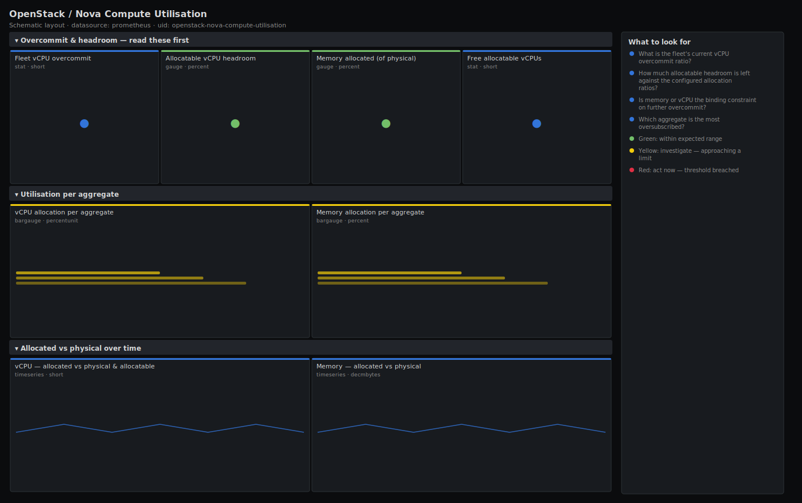

# OpenStack / Nova Compute Utilisation

> Allocated-vs-physical resource utilisation for an OpenStack Nova fleet from openstack-exporter: how far vCPU and memory are committed past physical capacity, the overcommit ratio in use, allocatable headroom against your configured ratios, and utilisation broken out per aggregate. Answers "how oversubscribed are we, and how much more can we safely place?".

**Primary search phrase:** OpenStack Nova overcommit Grafana dashboard  
**Category:** `openstack/nova` · **UID:** `openstack-nova-compute-utilisation` · **Datasource:** Prometheus



## Questions this dashboard answers

- What is the fleet's current vCPU overcommit ratio?
- How much allocatable headroom is left against the configured allocation ratios?
- Is memory or vCPU the binding constraint on further overcommit?
- Which aggregate is the most oversubscribed?
- Are we allocating past physical memory (which has no safe overcommit)?

## Production lessons — why this dashboard exists

vCPU overcommit is a lever you can pull; memory overcommit is a cliff you fall off. This dashboard separates the two on purpose: the fleet can safely run several vCPUs per physical core, but once allocated memory passes physical RAM the host swaps and every instance on it suffers — so the memory panels treat 100% of *physical* as the hard line while vCPU is measured against your chosen ratio. The "allocatable headroom" number is the one capacity reviews actually use: it answers "how many more average instances can we place before the configured ratio is spent", which is far more actionable than a raw utilisation percentage. Watching utilisation per aggregate keeps one overcommitted tier from hiding inside a comfortable fleet average.

## Data source requirements

- **Prometheus** datasource (selected at import time via `${DS_PROMETHEUS}`).
- `openstack-exporter` (github.com/openstack-exporter/openstack-exporter) scraping the Nova hypervisor-stats API: `openstack_nova_vcpus` / `openstack_nova_vcpus_used` and `openstack_nova_memory_mb` / `openstack_nova_memory_used_mb`, labelled by `hostname` and `aggregate`. Physical totals come from the un-suffixed metrics; the `_used` series are Nova's committed allocation, not live OS usage.

## Template variables

| Variable | Label | Type | Purpose |
|----------|-------|------|---------|
| `${job}` | Job | query | Prometheus scrape job for your openstack-exporter target. |
| `${aggregate}` | Aggregate | query | Host aggregate / availability zone to scope to; All for the whole fleet. |
| `${ratio}` | vCPU ratio | custom | Your configured cpu_allocation_ratio, used to compute allocatable vCPU headroom. |

## Panels

### Overcommit & headroom — read these first

- **Fleet vCPU overcommit** (stat, `short`) — Allocated vCPUs ÷ physical cores across the fleet. Compare against your cpu_allocation_ratio.
- **Allocatable vCPU headroom** (gauge, `percent`) — Percent of allocatable vCPU (physical × ratio) still free. Drives "how many more instances can we place".
- **Memory allocated (of physical)** (gauge, `percent`) — Allocated memory as a percent of physical RAM. Past 100% the fleet has no safe overcommit left.
- **Free allocatable vCPUs** (stat, `short`) — Remaining vCPUs you can still commit before the configured ratio is spent.

### Utilisation per aggregate

- **vCPU allocation per aggregate** (bargauge, `percentunit`) — Allocated ÷ physical vCPU by aggregate. The tallest bar is your most oversubscribed tier.
- **Memory allocation per aggregate** (bargauge, `percent`) — Allocated ÷ physical memory by aggregate. Anything near 100% has no overcommit headroom.

### Allocated vs physical over time

- **vCPU — allocated vs physical & allocatable** (timeseries, `short`) — Committed vCPUs against physical cores and the allocatable ceiling (physical × ratio).
- **Memory — allocated vs physical** (timeseries, `decmbytes`) — Committed memory against physical RAM. The allocated line crossing physical is the overcommit cliff.

## Import

**Grafana UI** — *Dashboards → New → Import*, upload `dashboards/openstack/nova/compute-utilisation.json`, then pick your datasource when prompted.

**API:**

```bash
scripts/import-dashboard.sh dashboards/openstack/nova/compute-utilisation.json
```

**Provisioning** — drop the JSON into a provisioned folder (see [provisioning guide](../../../provisioning.md)).

## Recommended alerts

Ready-to-use rules ship in `alerts/openstack.rules.yml`.

### NovaMemoryOvercommitted (`critical`)

```promql
100 * sum(openstack_nova_memory_used_mb) / sum(openstack_nova_memory_mb) > 100
```

- **Fires after:** `10m`
- **Why it matters:** Memory has no safe overcommit — past 100% of physical, hosts swap and every instance on the affected nodes degrades, with no warning in guest metrics.
- **Investigate:** Open Nova Compute Utilisation; find the over-allocated aggregate and the offending hosts on the capacity dashboard.
- **Recovery:** Clears when allocated memory drops back below 100% of physical for 5m.
- **False positives:** Clouds running KSM/memory-ballooning intentionally above 1.0 — raise the threshold to that ratio for the relevant aggregate.

### NovaVcpuAllocatableHeadroomLow (`warning`)

```promql
100 * (1 - sum(openstack_nova_vcpus_used) / (sum(openstack_nova_vcpus) * 4)) < 15
```

- **Fires after:** `30m`
- **Why it matters:** With little allocatable vCPU left, larger flavours start failing to schedule and you cannot drain a host without builds backing up.
- **Investigate:** Check per-aggregate allocation; decide whether to add hosts or, if steal is low, raise the cpu_allocation_ratio.
- **Recovery:** Clears when allocatable vCPU headroom rises above 15% for 10m.
- **False positives:** The hard-coded 4× in this rule may not match your ratio — align it with your configured cpu_allocation_ratio.

## Troubleshooting

| Symptom | Likely cause | First action |
|---------|--------------|--------------|
| Headroom panels change when I pick a different vCPU ratio | Allocatable headroom is physical × the selected ratio; the dropdown deliberately models different overcommit policies. | Set the ratio to your real cpu_allocation_ratio for an accurate number. |
| Memory-of-physical reads above 100% but nothing is on fire | KSM or ballooning lets the cloud allocate slightly past physical; or stale exporter data during a scrape gap. | Confirm your ram_allocation_ratio policy; treat sustained >100% as real risk. |
| Utilisation is high but live CPU usage on hosts is low | These metrics track committed allocation, not OS usage; idle instances still reserve their flavour. | Plan placement against allocation here; use node_exporter dashboards for live load. |

## Performance considerations

All panels are fleet- or aggregate-level `sum()` over one-series-per-host gauges, so cost is independent of instance count. The `$ratio` variable is a constant folded into the query, adding no series. A 24h default window and 1m refresh suit slow-moving allocation; there is nothing here that benefits from sub-minute refresh.

## Customization

Add your real allocation ratios to the `ratio` dropdown options, and align the alert's hard-coded 4× with it. If you run a non-trivial ram_allocation_ratio, raise the memory thresholds accordingly. Scope `$aggregate` to review one tier; switch the memory timeseries unit to `decbytes` if you prefer base-1000 byte scaling on your Grafana.

## Related resources

- [Advanced observability guides](https://devopsaitoolkit.com/guides/)
- [Grafana & Prometheus tutorials](https://devopsaitoolkit.com/blog/)
- [AI Incident Response Assistant](https://devopsaitoolkit.com/dashboard/incident-response)
- [PromQL cookbook](../../../../promql/README.md) · [Alerting guide](../../../alerting.md) · [Dashboard catalog](../../../catalog.md)
