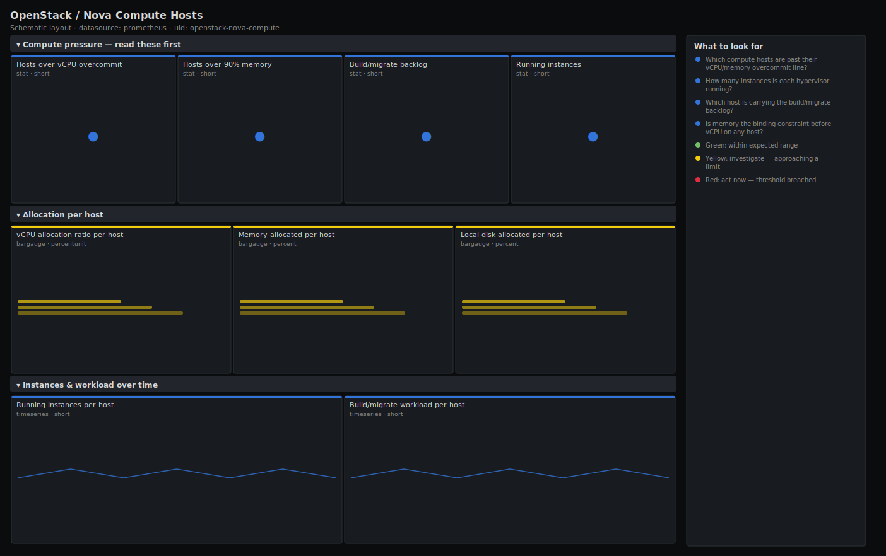

# OpenStack / Nova Compute Hosts

> Per-hypervisor health for OpenStack Nova from openstack-exporter: vCPU, memory and disk allocated vs available on each compute host, running instances and the build/migrate queue. Answers "which compute nodes are over-committed or struggling?" rather than reporting a single fleet average that hides the hot box.

**Primary search phrase:** OpenStack Nova compute Grafana dashboard  
**Category:** `openstack/nova` · **UID:** `openstack-nova-compute` · **Datasource:** Prometheus



## Questions this dashboard answers

- Which compute hosts are past their vCPU/memory overcommit line?
- How many instances is each hypervisor running?
- Which host is carrying the build/migrate backlog?
- Is memory the binding constraint before vCPU on any host?
- Are any hosts effectively empty and ready to drain or decommission?

## Production lessons — why this dashboard exists

Nova schedules against *allocated* resources, not live usage, so a host pages you for "no valid host" long before its CPUs look busy in node_exporter. This dashboard therefore leads with **allocation ratio per host** (vcpus_used / vcpus) and treats memory as a first-class constraint, because on most real clouds RAM — not vCPU — is what fills up first. The trap we learned the hard way: averaging the fleet hides the one hypervisor that is at 100% memory while the cloud-wide gauge reads a comfortable 60%, and that one host is exactly where new builds keep failing.

## Data source requirements

- **Prometheus** datasource (selected at import time via `${DS_PROMETHEUS}`).
- `openstack-exporter` (github.com/openstack-exporter/openstack-exporter) scraping the Nova API: `openstack_nova_vcpus` / `openstack_nova_vcpus_used`, `openstack_nova_memory_mb` / `openstack_nova_memory_used_mb`, `openstack_nova_local_storage_gb` / `..._used_gb`, `openstack_nova_running_vms` and `openstack_nova_current_workload`, all labelled by `hostname` (and `aggregate`).

## Template variables

| Variable | Label | Type | Purpose |
|----------|-------|------|---------|
| `${job}` | Job | query | Prometheus scrape job for your openstack-exporter target. |
| `${aggregate}` | Aggregate | query | Host aggregate / availability zone to scope to; All for the whole fleet. |
| `${hostname}` | Hypervisor | query | Compute host(s) to display; supports multi-select. |

## Panels

### Compute pressure — read these first

- **Hosts over vCPU overcommit** (stat, `short`) — Compute hosts whose allocated vCPUs exceed 4× physical cores — past a typical cpu_allocation_ratio safety line. Tune to your configured ratio.
- **Hosts over 90% memory** (stat, `short`) — Compute hosts with more than 90% of memory allocated — the usual first wall.
- **Build/migrate backlog** (stat, `short`) — Total current_workload across selected hosts — instances actively building, resizing or migrating.
- **Running instances** (stat, `short`) — Total instances running on the selected compute hosts.

### Allocation per host

- **vCPU allocation ratio per host** (bargauge, `percentunit`) — Allocated vCPUs ÷ physical cores. Above your cpu_allocation_ratio means the scheduler will skip the host.
- **Memory allocated per host** (bargauge, `percent`) — Percent of host memory committed to instances. The first constraint on most clouds.
- **Local disk allocated per host** (bargauge, `percent`) — Percent of local ephemeral storage committed. Watch on hosts that do not boot-from-volume.

### Instances & workload over time

- **Running instances per host** (timeseries, `short`) — Instance count per hypervisor — spot the host filling up or suddenly draining.
- **Build/migrate workload per host** (timeseries, `short`) — Per-host current_workload over time. A host pinned high points at a slow local disk or volume back-end.

## Import

**Grafana UI** — *Dashboards → New → Import*, upload `dashboards/openstack/nova/compute.json`, then pick your datasource when prompted.

**API:**

```bash
scripts/import-dashboard.sh dashboards/openstack/nova/compute.json
```

**Provisioning** — drop the JSON into a provisioned folder (see [provisioning guide](../../../provisioning.md)).

## Recommended alerts

Ready-to-use rules ship in `alerts/openstack.rules.yml`.

### NovaComputeMemoryNearlyFull (`warning`)

```promql
100 * openstack_nova_memory_used_mb / openstack_nova_memory_mb > 95
```

- **Fires after:** `15m`
- **Why it matters:** A host above 95% allocated memory will reject new builds with "no valid host" and leaves no room for live-migration targets during maintenance.
- **Investigate:** Open Nova Compute Hosts, find the host in the memory bargauge; check its instance list and flavour mix on the capacity dashboard.
- **Recovery:** Clears when allocated memory drops below 95% for 5m.
- **False positives:** Tightly packed batch hosts run intentionally hot — raise the threshold or scope by aggregate.

### NovaComputeVcpuOvercommitHigh (`warning`)

```promql
openstack_nova_vcpus_used / openstack_nova_vcpus > 4
```

- **Fires after:** `20m`
- **Why it matters:** vCPU allocation well past your cpu_allocation_ratio causes scheduler skips and noisy-neighbour steal for tenants on the host.
- **Investigate:** Compare the per-host vCPU ratio bars; check steal on the host's node_exporter CPU dashboard.
- **Recovery:** Clears when the ratio falls back below 4× for 5m.
- **False positives:** A deliberately high overcommit tier — set the threshold to that tier's ratio.

## Troubleshooting

| Symptom | Likely cause | First action |
|---------|--------------|--------------|
| Allocation ratio reads infinity or "No data" | `openstack_nova_vcpus` is zero or missing for the host (exporter could not read the hypervisor). | Confirm the host appears in `openstack hypervisor list`; check exporter permissions for the os-hypervisors API. |
| A host shows high allocation but low actual CPU on node_exporter | Allocation tracks committed flavours, not live usage; idle instances still reserve vCPU/RAM. | This is expected — schedule against allocation, capacity-plan against both. |
| Disk panel empty | Hosts boot-from-volume, so local_storage is near zero and not the constraint. | Use the placement / Cinder dashboards for volume-backed capacity instead. |

## Performance considerations

Every panel aggregates or selects `by (hostname)`, one series per compute host, so this scales to large fleets cheaply. The over-commit and over-memory counts are instant ratios across hosts — no rates needed because these are gauges. Keep the exporter scrape at 30–60s; the underlying hypervisor-stats API call is not free.

## Customization

Set the vCPU threshold (the `> 4`) to your configured `cpu_allocation_ratio` and the memory threshold to your `ram_allocation_ratio` headroom. Scope to a tier by selecting its `aggregate`. Swap `local_storage` panels out entirely on boot-from-volume clouds.

## Related resources

- [Advanced observability guides](https://devopsaitoolkit.com/guides/)
- [Grafana & Prometheus tutorials](https://devopsaitoolkit.com/blog/)
- [AI Incident Response Assistant](https://devopsaitoolkit.com/dashboard/incident-response)
- [PromQL cookbook](../../../../promql/README.md) · [Alerting guide](../../../alerting.md) · [Dashboard catalog](../../../catalog.md)
