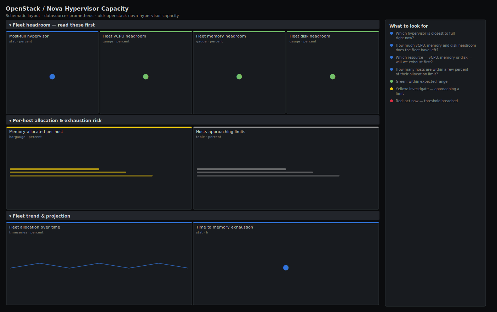

# OpenStack / Nova Hypervisor Capacity

> Capacity planning for an OpenStack Nova fleet from openstack-exporter: vCPU, memory and disk allocation per hypervisor, fleet headroom, hosts approaching their limits, and a simple time-to-exhaustion projection. Answers "how much room is left, where will we run out first, and when?".

**Primary search phrase:** OpenStack Nova capacity Grafana dashboard  
**Category:** `openstack/nova` · **UID:** `openstack-nova-hypervisor-capacity` · **Datasource:** Prometheus



## Questions this dashboard answers

- Which hypervisor is closest to full right now?
- How much vCPU, memory and disk headroom does the fleet have left?
- Which resource — vCPU, memory or disk — will we exhaust first?
- How many hosts are within a few percent of their allocation limit?
- At the current growth rate, how long until memory runs out?

## Production lessons — why this dashboard exists

Capacity is not the fleet average — it is the *tightest* host and the *tightest* resource, because Nova cannot split one instance across machines. This dashboard leads with the single most-full hypervisor and reports headroom separately for vCPU, memory and disk, since they exhaust at wildly different rates: on most clouds memory fills first, on dense-storage clouds it is local disk. The projection panel exists because "we have 20% headroom" is meaningless without a slope — 20% with flat growth is months away, 20% growing 1%/hour is a same-shift page. Always plan to the resource that runs out first, and keep at least one host's worth of slack so you can still live-migrate during maintenance.

## Data source requirements

- **Prometheus** datasource (selected at import time via `${DS_PROMETHEUS}`).
- `openstack-exporter` (github.com/openstack-exporter/openstack-exporter) scraping the Nova hypervisor-stats API: `openstack_nova_vcpus` / `openstack_nova_vcpus_used`, `openstack_nova_memory_mb` / `openstack_nova_memory_used_mb`, `openstack_nova_local_storage_gb` / `openstack_nova_local_storage_used_gb`, all labelled by `hostname` and `aggregate`.
- Projection panels read 6h of history, so keep at least a day of retention in Prometheus for stable slopes.

## Template variables

| Variable | Label | Type | Purpose |
|----------|-------|------|---------|
| `${job}` | Job | query | Prometheus scrape job for your openstack-exporter target. |
| `${aggregate}` | Aggregate | query | Host aggregate / availability zone to plan capacity for; All for the whole fleet. |
| `${hostname}` | Hypervisor | query | Compute host(s) to include; supports multi-select. |

## Panels

### Fleet headroom — read these first

- **Most-full hypervisor** (stat, `percent`) — Highest single-host allocation across vCPU, memory and disk — your real capacity ceiling.
- **Fleet vCPU headroom** (gauge, `percent`) — Percent of physical vCPU capacity still unallocated across the fleet (before overcommit).
- **Fleet memory headroom** (gauge, `percent`) — Percent of fleet memory still unallocated — usually the first resource to run out.
- **Fleet disk headroom** (gauge, `percent`) — Percent of fleet local ephemeral storage still unallocated.

### Per-host allocation & exhaustion risk

- **Memory allocated per host** (bargauge, `percent`) — Percent of each host's memory committed. Hosts near 100% can no longer take builds or migration targets.
- **Hosts approaching limits** (table, `percent`) — Per-host vCPU/memory/disk allocation, sorted to surface the tightest hosts first.

### Fleet trend & projection

- **Fleet allocation over time** (timeseries, `percent`) — vCPU, memory and disk allocated as a percent of capacity. Watch the slope, not just the level.
- **Time to memory exhaustion** (stat, `h`) — Hours until fleet memory is fully allocated at the last 6h growth rate. Reads "infinite" (very large) when allocation is flat or shrinking.

## Import

**Grafana UI** — *Dashboards → New → Import*, upload `dashboards/openstack/nova/hypervisor-capacity.json`, then pick your datasource when prompted.

**API:**

```bash
scripts/import-dashboard.sh dashboards/openstack/nova/hypervisor-capacity.json
```

**Provisioning** — drop the JSON into a provisioned folder (see [provisioning guide](../../../provisioning.md)).

## Recommended alerts

Ready-to-use rules ship in `alerts/openstack.rules.yml`.

### NovaFleetMemoryHeadroomLow (`warning`)

```promql
100 * (1 - sum(openstack_nova_memory_used_mb) / sum(openstack_nova_memory_mb)) < 15
```

- **Fires after:** `30m`
- **Why it matters:** Below ~15% headroom you can no longer evacuate a host during maintenance, and a single large flavour request starts failing with "no valid host".
- **Investigate:** Open Nova Hypervisor Capacity; read the fleet trend slope and the time-to-exhaustion stat to judge urgency.
- **Recovery:** Clears when fleet memory headroom rises back above 15% for 10m.
- **False positives:** A cloud intentionally run near-full on cheap memory tiers — lower the threshold for that aggregate.

### NovaHypervisorNearlyFull (`warning`)

```promql
100 * openstack_nova_memory_used_mb / openstack_nova_memory_mb > 95
```

- **Fires after:** `15m`
- **Why it matters:** A host above 95% allocation is effectively full — no new builds and no room as a live-migration target.
- **Investigate:** Find the host in the per-host bargauge / table; check its instance and flavour mix.
- **Recovery:** Clears when the host drops below 95% allocated for 5m.
- **False positives:** Deliberately packed batch hosts — scope the rule by aggregate.

### NovaMemoryExhaustionImminent (`critical`)

```promql
(sum(openstack_nova_memory_mb) - sum(openstack_nova_memory_used_mb)) / clamp_min(deriv(sum(openstack_nova_memory_used_mb)[6h:30m]), 0.001) / 3600 < 24
```

- **Fires after:** `30m`
- **Why it matters:** At the current allocation growth rate the fleet runs out of memory within a day, after which all new launches fail cloud-wide.
- **Investigate:** Confirm the slope on the fleet trend panel; identify what is driving growth (a tenant ramp, a runaway autoscaler).
- **Recovery:** Clears when the projection exceeds 24h (growth slows or capacity is added) for 10m.
- **False positives:** A short provisioning burst inflates the slope; the 6h window and 30m `for` absorb most spikes, but verify on the trend panel.

## Troubleshooting

| Symptom | Likely cause | First action |
|---------|--------------|--------------|
| Time-to-exhaustion shows a huge number | Allocation is flat or shrinking, so the projected slope is ~0 — there is effectively unlimited runway. | This is the healthy case; the stat is clamped to avoid divide-by-zero, not broken. |
| Headroom looks fine but builds still fail | A single host is full while the fleet average is comfortable, or a non-resource filter (aggregate/affinity) is blocking placement. | Use the most-full host stat and per-host table; cross-check the scheduler dashboard. |
| vCPU headroom is negative or zero but the cloud is fine | vcpus_used reflects overcommitted allocation past physical cores; headroom here is measured against physical, not allocatable. | Interpret vCPU against your cpu_allocation_ratio; treat memory/disk headroom as the hard limits. |

## Performance considerations

All fleet panels are `sum()` of one-series-per-host gauges, so cost scales linearly with host count and stays cheap even on large clouds. The projection uses `deriv(...[6h:30m])`, a subquery — keep the inner range at 6h so it is not recomputed over excessive samples. Refresh is set to 1m and the default window to 24h because capacity moves slowly; there is no value in a 30s refresh here.

## Customization

Set the headroom thresholds (15/30%) to leave at least one host's worth of slack for maintenance. Change the projection horizon by editing the `< 24` in the alert and the yellow/green stat thresholds. To plan a single tier, scope `$aggregate`; to model a different overcommit, compare `vcpus_used` against `vcpus * ratio` instead of physical.

## Related resources

- [Advanced observability guides](https://devopsaitoolkit.com/guides/)
- [Grafana & Prometheus tutorials](https://devopsaitoolkit.com/blog/)
- [AI Incident Response Assistant](https://devopsaitoolkit.com/dashboard/incident-response)
- [PromQL cookbook](../../../../promql/README.md) · [Alerting guide](../../../alerting.md) · [Dashboard catalog](../../../catalog.md)
