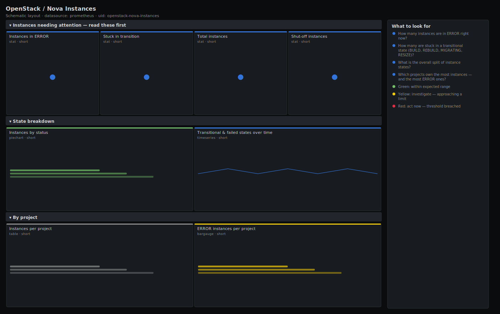

# OpenStack / Nova Instances

> Instance inventory and state breakdown for OpenStack Nova from openstack-exporter: how many servers are ACTIVE, SHUTOFF, ERROR or stuck in a transitional state, and how they split across projects. Answers "what is the fleet of instances actually doing, and which ones need attention?".

**Primary search phrase:** OpenStack Nova instances Grafana dashboard  
**Category:** `openstack/nova` · **UID:** `openstack-nova-instances` · **Datasource:** Prometheus



## Questions this dashboard answers

- How many instances are in ERROR right now?
- How many are stuck in a transitional state (BUILD, REBUILD, MIGRATING, RESIZE)?
- What is the overall split of instance states?
- Which projects own the most instances — and the most ERROR ones?
- Is the ACTIVE count steady, or churning from mass reboots/rebuilds?

## Production lessons — why this dashboard exists

Most instance incidents are not "the cloud is down" — they are a slow accumulation of servers wedged in ERROR or stuck half-way through a transition that the owner never notices. This dashboard leads with ERROR and transitional counts because those are the ones a human has to act on; ACTIVE and SHUTOFF are just inventory. The per-project table is the panel that ends arguments: when capacity is tight or ERROR is climbing it shows whether one tenant's runaway automation is the cause, so you can throttle the right project instead of adding hardware for everyone. A standing pool of SHUTOFF instances is its own quiet lesson — they still reserve disk and addresses while doing no work.

## Data source requirements

- **Prometheus** datasource (selected at import time via `${DS_PROMETHEUS}`).
- `openstack-exporter` (github.com/openstack-exporter/openstack-exporter) scraping the Nova API: `openstack_nova_server_status` (one series per instance, with `status`, `name`, `id` and tenant labels) and `openstack_nova_total_vms`.

## Template variables

| Variable | Label | Type | Purpose |
|----------|-------|------|---------|
| `${job}` | Job | query | Prometheus scrape job for your openstack-exporter target. |
| `${cloud}` | Cloud | query | Cloud/region in multi-cloud mode; All if single-cloud. |

## Panels

### Instances needing attention — read these first

- **Instances in ERROR** (stat, `short`) — Servers Nova reports in ERROR — failed builds, migrations, reboots or volume attach.
- **Stuck in transition** (stat, `short`) — Instances in BUILD, REBUILD, MIGRATING, RESIZE or VERIFY_RESIZE — states that should settle in minutes. A standing count means something is wedged.
- **Total instances** (stat, `short`) — Every server Nova knows about, in any state.
- **Shut-off instances** (stat, `short`) — Powered-off servers — still reserving disk and IPs while doing no work.

### State breakdown

- **Instances by status** (piechart, `short`) — Share of the fleet in each Nova status. ERROR and transitional slices should be thin.
- **Transitional & failed states over time** (timeseries, `short`) — ERROR plus transitional counts. A flat-but-nonzero ERROR line is the accumulation of abandoned instances.

### By project

- **Instances per project** (table, `short`) — Instance count by tenant. Sort to find the project driving growth or ERROR.
- **ERROR instances per project** (bargauge, `short`) — Which tenants own the failed instances — throttle or contact the noisy one.

## Import

**Grafana UI** — *Dashboards → New → Import*, upload `dashboards/openstack/nova/instances.json`, then pick your datasource when prompted.

**API:**

```bash
scripts/import-dashboard.sh dashboards/openstack/nova/instances.json
```

**Provisioning** — drop the JSON into a provisioned folder (see [provisioning guide](../../../provisioning.md)).

## Recommended alerts

Ready-to-use rules ship in `alerts/openstack.rules.yml`.

### NovaInstancesInError (`warning`)

```promql
count(openstack_nova_server_status{status="ERROR"}) > 5
```

- **Fires after:** `15m`
- **Why it matters:** Each ERROR instance is a customer-visible failure; a growing pool usually points at capacity, a sick back-end, or a tenant's bad automation.
- **Investigate:** Use the ERROR-per-project bargauge to find the owner; `openstack server show` a sample to read the fault.
- **Recovery:** Clears when fewer than 5 instances are in ERROR for 5m.
- **False positives:** Intentional failure testing in a tenant — scope by tenant_id or raise the threshold.

### NovaInstancesStuckTransitioning (`warning`)

```promql
count(openstack_nova_server_status{status=~"BUILD|REBUILD|MIGRATING|RESIZE|VERIFY_RESIZE"}) > 20
```

- **Fires after:** `15m`
- **Why it matters:** Transitional states should clear in minutes; a standing pool means stuck migrations/resizes holding resources and risking corruption if forced.
- **Investigate:** Check the transitional-states timeseries and current_workload per host; look for a slow volume/image back-end.
- **Recovery:** Clears when fewer than 20 instances are transitioning for 5m.
- **False positives:** A planned mass resize/migration window — silence during the maintenance.

## Troubleshooting

| Symptom | Likely cause | First action |
|---------|--------------|--------------|
| Per-project table shows blank tenant labels | The exporter build does not expose a tenant label on server_status, or RBAC hides it. | Confirm with `openstack server list --all-projects -c Project`; grant the exporter an admin-scoped role to read tenant ids. |
| Total instances disagrees with the status pie sum | `openstack_nova_total_vms` and per-instance `server_status` are collected from different API calls and can differ briefly. | Treat the pie (per-instance count) as authoritative for state; total_vms is a fast headline number. |
| ERROR count never falls | Abandoned ERROR instances are never cleaned up. | Delete or rebuild stale ERROR instances; the metric counts every server that exists. |

## Performance considerations

`openstack_nova_server_status` is one series per instance, so always reduce with `count` / `count by (status, tenant_id)` — never graph the raw series, which can be thousands of lines on a busy cloud. The status filters use regex alternation on the `status` label, evaluated cheaply at query time. A 1m refresh matches how fast states change.

## Customization

Adjust the transitional `status=~` set if your workflows use additional states, and the thresholds (5/20) to your fleet size. To focus on one tenant, add a `tenant_id` selector. Swap the per-project table's reducer to `ERROR`-only if you only care about failures by team.

## Related resources

- [Advanced observability guides](https://devopsaitoolkit.com/guides/)
- [Grafana & Prometheus tutorials](https://devopsaitoolkit.com/blog/)
- [AI Incident Response Assistant](https://devopsaitoolkit.com/dashboard/incident-response)
- [PromQL cookbook](../../../../promql/README.md) · [Alerting guide](../../../alerting.md) · [Dashboard catalog](../../../catalog.md)
