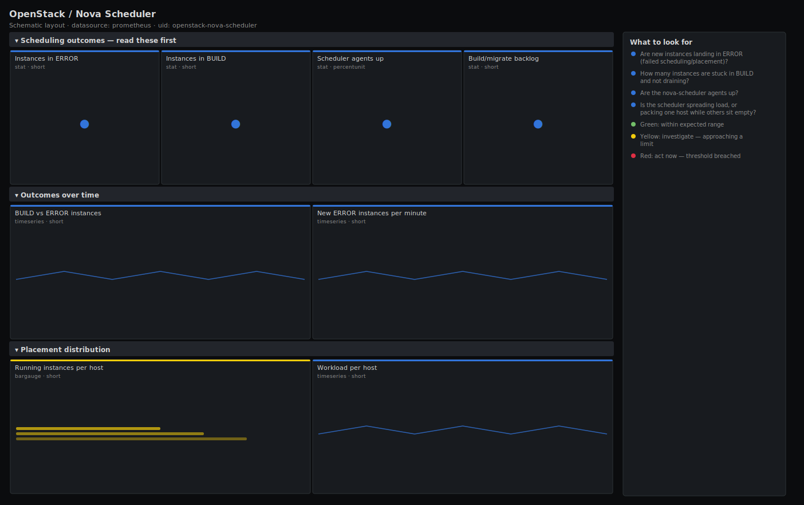

# OpenStack / Nova Scheduler

> Scheduler and placement health for OpenStack Nova via openstack-exporter: how many instances are landing in ERROR, how many are stuck in BUILD, whether the nova-scheduler agents are up, and how evenly work is being placed across the fleet. Answers "is the scheduler placing instances successfully, and fairly?".

**Primary search phrase:** OpenStack Nova scheduler Grafana dashboard  
**Category:** `openstack/nova` · **UID:** `openstack-nova-scheduler` · **Datasource:** Prometheus



## Questions this dashboard answers

- Are new instances landing in ERROR (failed scheduling/placement)?
- How many instances are stuck in BUILD and not draining?
- Are the nova-scheduler agents up?
- Is the scheduler spreading load, or packing one host while others sit empty?
- Is the build/migrate workload backing up cloud-wide?

## Production lessons — why this dashboard exists

Scheduler problems show up as *outcomes*, not as a tidy error counter: instances pile into BUILD, then flip to ERROR when "no valid host" is returned. So this dashboard leads with ERROR and BUILD counts and the rate at which ERROR is growing, not with internal scheduler stats the exporter does not expose. The distribution panel earns its place during capacity crunches — a healthy scheduler spreads new VMs, and when you see every new instance landing on the same two hosts it usually means the others are filtered out (full, disabled, or failing the affinity/aggregate filters), which is the real root cause behind a wave of failed builds.

## Data source requirements

- **Prometheus** datasource (selected at import time via `${DS_PROMETHEUS}`).
- `openstack-exporter` (github.com/openstack-exporter/openstack-exporter) scraping the Nova API: `openstack_nova_server_status` (status label), the per-host `openstack_nova_current_workload`, `openstack_nova_running_vms`, and `openstack_nova_agent_state{service="nova-scheduler"}`.

## Template variables

| Variable | Label | Type | Purpose |
|----------|-------|------|---------|
| `${job}` | Job | query | Prometheus scrape job for your openstack-exporter target. |
| `${cloud}` | Cloud | query | Cloud/region in multi-cloud mode; All if single-cloud. |
| `${hostname}` | Hypervisor | query | Compute host(s) to scope the distribution and workload panels to. |

## Panels

### Scheduling outcomes — read these first

- **Instances in ERROR** (stat, `short`) — Servers Nova flipped to ERROR — most often a placement/scheduling failure ("no valid host").
- **Instances in BUILD** (stat, `short`) — Servers still building. A handful is normal; a standing pool that never drains is a stuck scheduler or slow back-end.
- **Scheduler agents up** (stat, `percentunit`) — Fraction of nova-scheduler agents reporting up. Below 1 means reduced or zero scheduling capacity.
- **Build/migrate backlog** (stat, `short`) — Total in-flight current_workload across the fleet — the queue the scheduler and back-end are working through.

### Outcomes over time

- **BUILD vs ERROR instances** (timeseries, `short`) — Transitional and failed states together. ERROR rising while BUILD falls is failed scheduling, not slow scheduling.
- **New ERROR instances per minute** (timeseries, `short`) — Positive change in the ERROR count — the rate at which scheduling/placement is failing right now.

### Placement distribution

- **Running instances per host** (bargauge, `short`) — How the scheduler has spread instances. A steep imbalance means most hosts are being filtered out.
- **Workload per host** (timeseries, `short`) — Per-host current_workload over time. Concentration on a few hosts points at a slow back-end or restrictive filters.

## Import

**Grafana UI** — *Dashboards → New → Import*, upload `dashboards/openstack/nova/scheduler.json`, then pick your datasource when prompted.

**API:**

```bash
scripts/import-dashboard.sh dashboards/openstack/nova/scheduler.json
```

**Provisioning** — drop the JSON into a provisioned folder (see [provisioning guide](../../../provisioning.md)).

## Recommended alerts

Ready-to-use rules ship in `alerts/openstack.rules.yml`.

### NovaSchedulerAllDown (`critical`)

```promql
sum(openstack_nova_agent_state{service="nova-scheduler"}) == 0
```

- **Fires after:** `5m`
- **Why it matters:** With no scheduler up, no new instance can be placed cloud-wide; every launch and migration request queues or fails.
- **Investigate:** Open Nova Scheduler; check the scheduler hosts' service status and the message bus (RabbitMQ) / database the scheduler depends on.
- **Recovery:** Clears when at least one nova-scheduler reports up for 5m.
- **False positives:** A full control-plane redeploy — silence during the maintenance window.

### NovaSchedulingFailingToError (`warning`)

```promql
clamp_min(deriv(count(openstack_nova_server_status{status="ERROR"})[10m:1m]), 0) * 60 > 1
```

- **Fires after:** `10m`
- **Why it matters:** A sustained climb in ERROR instances means placement keeps returning "no valid host" or a back-end is rejecting builds — directly customer-visible.
- **Investigate:** Check capacity headroom and host filters; `openstack server show` a failed instance to read the fault reason.
- **Recovery:** Clears when the new-ERROR rate falls back to zero for 5m.
- **False positives:** A burst of intentionally failing test launches — scope by tenant or raise the threshold.

### NovaBuildQueueNotDraining (`warning`)

```promql
count(openstack_nova_server_status{status="BUILD"}) > 20
```

- **Fires after:** `15m`
- **Why it matters:** A standing BUILD pool that does not drain means the scheduler placed the work but the back-end (image, volume, network) cannot finish it.
- **Investigate:** Correlate with current_workload per host and Glance/Cinder/Neutron latency; look for one host carrying the backlog.
- **Recovery:** Clears when fewer than 20 instances are in BUILD for 5m.
- **False positives:** A deliberate mass-launch that is expected to drain over several minutes.

## Troubleshooting

| Symptom | Likely cause | First action |
|---------|--------------|--------------|
| New-ERROR-per-minute panel is always flat at zero but instances are failing | Failed instances are deleted faster than the 1m sampling, so the count never rises. | Watch the absolute ERROR/BUILD counts and the Nova API logs instead for fast-cycling failures. |
| Distribution looks lopsided but nothing is wrong | Anti-affinity, host aggregates or flavour extra-specs intentionally pin workloads. | Confirm the intent before rebalancing; filter `$hostname` to the relevant aggregate. |
| Scheduler-up reads 1 but builds still fail | The scheduler is healthy; the failure is capacity or a filter, not the scheduler process. | Move to the hypervisor-capacity and placement dashboards to find the exhausted resource. |

## Performance considerations

ERROR/BUILD panels use `count by`/`count` over `openstack_nova_server_status`, which is one series per instance — counting is cheap, graphing the raw series is not, so never drop the aggregation. The new-ERROR rate uses a subquery (`[10m:1m]`); keep the range modest so it stays light on large clouds. Distribution panels are one series per host.

## Customization

Tune the BUILD (5/20) and backlog (10/30) thresholds to your provisioning volume. To watch a single tier, scope `$hostname` to its aggregate. On clouds with very fast instance churn, widen the subquery window so the rate panel isn't aliased by short-lived ERROR instances.

## Related resources

- [Advanced observability guides](https://devopsaitoolkit.com/guides/)
- [Grafana & Prometheus tutorials](https://devopsaitoolkit.com/blog/)
- [AI Incident Response Assistant](https://devopsaitoolkit.com/dashboard/incident-response)
- [PromQL cookbook](../../../../promql/README.md) · [Alerting guide](../../../alerting.md) · [Dashboard catalog](../../../catalog.md)
