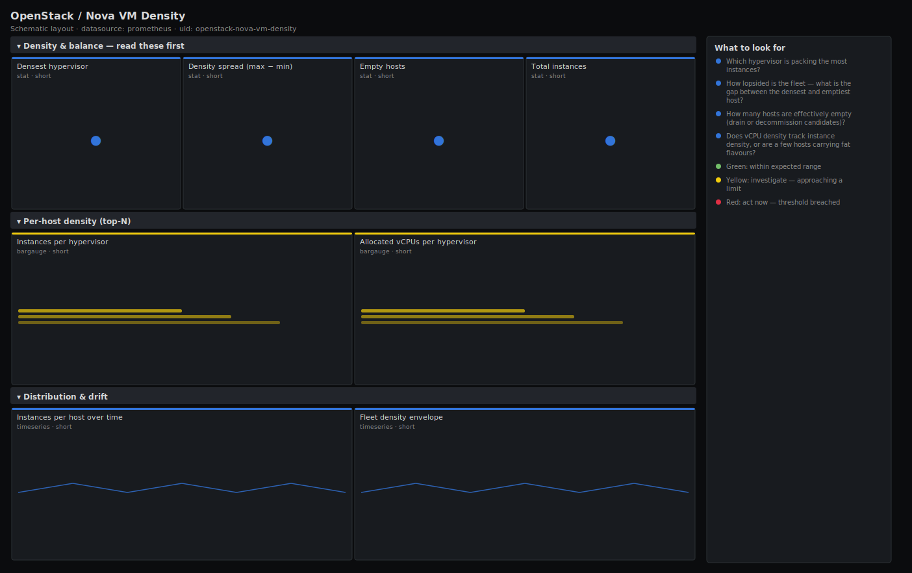

# OpenStack / Nova VM Density

> Instance density and balance across an OpenStack Nova fleet from openstack-exporter: VMs and vCPUs per hypervisor, the spread between the packed and the empty hosts, and how many hosts sit idle. Answers "is the fleet evenly loaded, and which host is the outlier?".

**Primary search phrase:** OpenStack Nova VM density Grafana dashboard  
**Category:** `openstack/nova` · **UID:** `openstack-nova-vm-density` · **Datasource:** Prometheus



## Questions this dashboard answers

- Which hypervisor is packing the most instances?
- How lopsided is the fleet — what is the gap between the densest and emptiest host?
- How many hosts are effectively empty (drain or decommission candidates)?
- Does vCPU density track instance density, or are a few hosts carrying fat flavours?
- Is density drifting toward a few hosts over time?

## Production lessons — why this dashboard exists

A balanced fleet and a lopsided one can share the same average and behave completely differently: the lopsided one fails builds and throws steal-time alerts on its hot hosts while paying to power near-empty ones. So this dashboard leads with the **densest host** and an **imbalance** measure rather than a mean. Two patterns recur in production — a few hosts hoarding instances because the others are filtered out by full memory or strict aggregates, and a cluster of near-empty hosts left behind after a migration that nobody rebalanced. Watching vCPU density alongside instance density catches the third case: a host with few but very large instances that is full on cores while looking sparse on VM count.

## Data source requirements

- **Prometheus** datasource (selected at import time via `${DS_PROMETHEUS}`).
- `openstack-exporter` (github.com/openstack-exporter/openstack-exporter) scraping the Nova API: `openstack_nova_running_vms` and `openstack_nova_vcpus_used`, labelled by `hostname` and `aggregate`.

## Template variables

| Variable | Label | Type | Purpose |
|----------|-------|------|---------|
| `${job}` | Job | query | Prometheus scrape job for your openstack-exporter target. |
| `${aggregate}` | Aggregate | query | Host aggregate / availability zone to scope to; All for the whole fleet. |
| `${hostname}` | Hypervisor | query | Compute host(s) to include; supports multi-select. |

## Panels

### Density & balance — read these first

- **Densest hypervisor** (stat, `short`) — Highest instance count on any single host in scope.
- **Density spread (max − min)** (stat, `short`) — Instance gap between the fullest and emptiest host. A wide gap means an unbalanced fleet.
- **Empty hosts** (stat, `short`) — Hosts in scope running zero instances — candidates to drain, decommission or schedule onto.
- **Total instances** (stat, `short`) — All running instances across the selected hosts.

### Per-host density (top-N)

- **Instances per hypervisor** (bargauge, `short`) — Ranked instance count per host. The bars should look even on a balanced fleet.
- **Allocated vCPUs per hypervisor** (bargauge, `short`) — vCPUs committed per host. Compare with instance count to spot hosts carrying fat flavours.

### Distribution & drift

- **Instances per host over time** (timeseries, `short`) — Density per hypervisor over the window. A line pulling away from the pack is drift toward imbalance.
- **Fleet density envelope** (timeseries, `short`) — Max, mean and min instances per host. A widening max-to-min band is the fleet going lopsided.

## Import

**Grafana UI** — *Dashboards → New → Import*, upload `dashboards/openstack/nova/vm-density.json`, then pick your datasource when prompted.

**API:**

```bash
scripts/import-dashboard.sh dashboards/openstack/nova/vm-density.json
```

**Provisioning** — drop the JSON into a provisioned folder (see [provisioning guide](../../../provisioning.md)).

## Recommended alerts

Ready-to-use rules ship in `alerts/openstack.rules.yml`.

### NovaFleetImbalanced (`warning`)

```promql
(max(openstack_nova_running_vms) - min(openstack_nova_running_vms)) > 30
```

- **Fires after:** `30m`
- **Why it matters:** A large density gap means the scheduler is concentrating load — hot hosts hit steal/capacity limits while paid-for hosts sit idle.
- **Investigate:** Open Nova VM Density; check whether the empty hosts are disabled, full on memory, or excluded by aggregate/affinity filters.
- **Recovery:** Clears when the spread falls back below 30 for 10m.
- **False positives:** Intentional pinning (dedicated/anti-affinity tiers) or a small fleet where one big host skews the gap — scope by aggregate.

### NovaHypervisorOverPacked (`warning`)

```promql
openstack_nova_running_vms > 50
```

- **Fires after:** `20m`
- **Why it matters:** Very high instance counts on one host raise noisy-neighbour contention and make the host a single large blast radius.
- **Investigate:** Check the host's vCPU/memory allocation and steal time; confirm the density is intended for its flavour mix.
- **Recovery:** Clears when the host drops below 50 instances for 10m.
- **False positives:** High-density small-flavour tiers run this hot by design — raise the threshold for that aggregate.

## Troubleshooting

| Symptom | Likely cause | First action |
|---------|--------------|--------------|
| Spread reads high but the fleet is fine | One legitimately large or one legitimately empty host dominates max/min in a small fleet. | Scope `$hostname`/`$aggregate` to comparable hosts before judging balance. |
| vCPU bars and instance bars disagree sharply | A host runs a few very large flavours, or many tiny ones — count and core load diverge. | That is the insight, not a bug; plan capacity on cores, not instance count, for those hosts. |
| Empty-hosts count is high after a migration | Instances were drained off hosts that were never repopulated or decommissioned. | Rebalance new builds onto the empty hosts or remove them from the fleet to save power. |

## Performance considerations

Every panel is one series per host (`openstack_nova_running_vms` / `openstack_nova_vcpus_used`), so the dashboard is cheap regardless of instance count — it never touches per-instance series. Aggregations (`max`/`min`/`avg`/`count`) collapse to a single series. A 1m refresh is plenty; density changes on the timescale of builds and migrations, not seconds.

## Customization

Set the density thresholds (30/50 instances) to your flavour mix and hardware, and the spread thresholds (15/30) to your tolerance for imbalance. Use the `aggregate` variable to compare like-for-like tiers. Add a `count(... > 0)` panel if you want utilisation of the host pool (non-empty hosts) rather than raw density.

## Related resources

- [Advanced observability guides](https://devopsaitoolkit.com/guides/)
- [Grafana & Prometheus tutorials](https://devopsaitoolkit.com/blog/)
- [AI Incident Response Assistant](https://devopsaitoolkit.com/dashboard/incident-response)
- [PromQL cookbook](../../../../promql/README.md) · [Alerting guide](../../../alerting.md) · [Dashboard catalog](../../../catalog.md)
