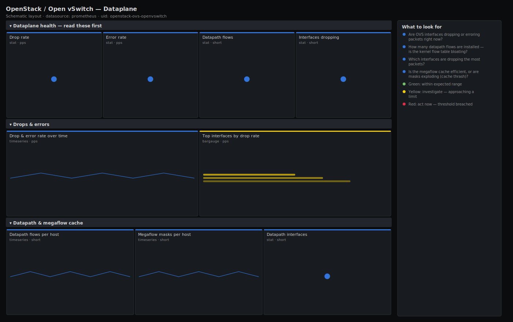

# OpenStack / Open vSwitch — Dataplane

> Open vSwitch dataplane health on OpenStack network and compute nodes: interface packet drops and errors, datapath flow count, and megaflow cache efficiency. Leads with drop/error rate and flow count so packet loss on the virtual switch surfaces before it shows up as tenant application latency.

**Primary search phrase:** Open vSwitch Grafana dashboard  
**Category:** `openstack/ovs` · **UID:** `openstack-ovs-openvswitch` · **Datasource:** Prometheus



## Questions this dashboard answers

- Are OVS interfaces dropping or erroring packets right now?
- How many datapath flows are installed — is the kernel flow table bloating?
- Which interfaces are dropping the most packets?
- Is the megaflow cache efficient, or are masks exploding (cache thrash)?
- Are rx or tx drops dominating — receive pressure vs send pressure?

## Production lessons — why this dashboard exists

When tenants complain that "the network is slow" but every link is up and every agent is alive, the culprit is usually the virtual switch silently dropping packets. OVS drops don't trigger an interface-down event — they accumulate in per-interface counters that nobody watches, so this dashboard leads with the aggregate **drop and error rate** and then ranks the worst interfaces. The second, subtler failure mode is **megaflow cache thrash**: when traffic is too diverse for the kernel datapath cache, the number of masks climbs and every packet pays for more subtable lookups, burning CPU on the network node. Watching mask count alongside flow count catches that before it turns into datapath CPU saturation. If your exporter uses different metric names, the dataplane counters below come from the ovs-exporter / openvswitch-exporter — adjust the names to match.

## Data source requirements

- **Prometheus** datasource (selected at import time via `${DS_PROMETHEUS}`).
- `ovs-exporter` (a.k.a. `openvswitch-exporter`) on each OVS host — exposes `ovs_dp_flows_total`, `ovs_dp_if_total`, `ovs_interface_rx_dropped`, `ovs_interface_tx_dropped`, `ovs_interface_rx_errors`, `ovs_interface_collisions`, `ovs_dp_masks_hit` and `ovs_dp_masks_total` (counters; rated over 5m).

## Template variables

| Variable | Label | Type | Purpose |
|----------|-------|------|---------|
| `${job}` | Job | query | Prometheus scrape job for your ovs-exporter targets. |
| `${instance}` | Host | query | OVS host(s) to display; supports multi-select. |

## Panels

### Dataplane health — read these first

- **Drop rate** (stat, `pps`) — Combined rx+tx packet drops per second across selected hosts.
- **Error rate** (stat, `pps`) — Receive errors per second — CRC/frame errors point at NIC or cabling, not just congestion.
- **Datapath flows** (stat, `short`) — Total flows installed in the kernel datapath across selected hosts.
- **Interfaces dropping** (stat, `short`) — Count of interfaces currently dropping packets — the breadth of the problem.

### Drops & errors

- **Drop & error rate over time** (timeseries, `pps`) — rx/tx drops and rx errors as rates — separates receive pressure from send pressure from hardware faults.
- **Top interfaces by drop rate** (bargauge, `pps`) — The worst-dropping interfaces, ranked — where to focus the investigation.

### Datapath & megaflow cache

- **Datapath flows per host** (timeseries, `short`) — Kernel flow-table size per host — a steady climb means flow-table bloat and rising lookup cost.
- **Megaflow masks per host** (timeseries, `short`) — Datapath mask count per host — climbing masks mean cache fragmentation and more subtable lookups per packet.
- **Datapath interfaces** (stat, `short`) — Interfaces attached to the OVS datapaths across selected hosts.

## Import

**Grafana UI** — *Dashboards → New → Import*, upload `dashboards/openstack/ovs/openvswitch.json`, then pick your datasource when prompted.

**API:**

```bash
scripts/import-dashboard.sh dashboards/openstack/ovs/openvswitch.json
```

**Provisioning** — drop the JSON into a provisioned folder (see [provisioning guide](../../../provisioning.md)).

## Recommended alerts

Ready-to-use rules ship in `alerts/openstack.rules.yml`.

### OVSInterfaceDrops (`warning`)

```promql
rate(ovs_interface_rx_dropped[5m]) + rate(ovs_interface_tx_dropped[5m]) > 10
```

- **Fires after:** `10m`
- **Why it matters:** Sustained drops on the virtual switch cause retransmits and tail latency that look like application problems, with every link reporting up.
- **Investigate:** Open OpenStack / Open vSwitch — Dataplane; check whether rx or tx dominates and whether one host or many are affected.
- **Recovery:** Clears when the drop rate falls below 10 pps for 5m.
- **False positives:** A brief traffic burst can spike drops momentarily — the 10m `for` filters transients.

### OVSInterfaceErrors (`warning`)

```promql
rate(ovs_interface_rx_errors[5m]) > 1
```

- **Fires after:** `10m`
- **Why it matters:** rx errors (CRC/frame) usually mean a hardware or cabling fault on the physical NIC behind the bridge, not just congestion — a different responder.
- **Investigate:** Check the underlying physical NIC counters and switch port; correlate with collisions on the same interface.
- **Recovery:** Clears when the error rate returns to zero for 5m.
- **False positives:** A single transient error during a link renegotiation is benign — the threshold and `for` ignore those.

### OVSDatapathFlowExplosion (`warning`)

```promql
ovs_dp_flows_total > 200000
```

- **Fires after:** `15m`
- **Why it matters:** A bloated kernel flow table and exploding megaflow masks drive up per-packet lookup cost and can saturate the network node's CPU (ovs-vswitchd).
- **Investigate:** Compare flow and mask counts on the megaflow panel; look for a noisy tenant generating highly diverse traffic (e.g. a scan).
- **Recovery:** Clears when the datapath flow count falls below 200k.
- **False positives:** Legitimately large hosts run high flow counts — raise the threshold to match your datapath sizing.

## Troubleshooting

| Symptom | Likely cause | First action |
|---------|--------------|--------------|
| All panels show "No data" | ovs-exporter not running, or the metric names differ from this exporter build. | Confirm `up{job="$job"}` and check the exporter's `/metrics` for the actual `ovs_*` names; adjust the spec if they differ. |
| Drop rate is high but errors are zero | Congestion/overload rather than a hardware fault. | Look at rx vs tx split and ring-buffer sizing; this is a capacity problem, not a cabling one. |
| Mask count climbs with flow count | Highly diverse traffic is fragmenting the megaflow cache. | Find the traffic source; expect elevated ovs-vswitchd CPU until it is contained. |

## Performance considerations

Rates use a 5m window (≥4× a typical 15-30s scrape) so counters survive resets. Aggregate panels collapse with `sum`/`sum by (instance)`; per-interface panels are bounded with `topk(10)`. On hosts with thousands of interfaces, scope `$instance` and prefer a recording rule for the combined drop-rate expression.

## Customization

Tune the drop/error/flow thresholds to your dataplane sizing — busy DPDK or high-throughput nodes run higher baselines. If your exporter names interface counters differently (e.g. `ovs_interface_statistics_*`), update the metric names and the `{{interface}}` legend label to match.

## Related resources

- [Advanced observability guides](https://devopsaitoolkit.com/guides/)
- [Grafana & Prometheus tutorials](https://devopsaitoolkit.com/blog/)
- [AI Incident Response Assistant](https://devopsaitoolkit.com/dashboard/incident-response)
- [PromQL cookbook](../../../../promql/README.md) · [Alerting guide](../../../alerting.md) · [Dashboard catalog](../../../catalog.md)
