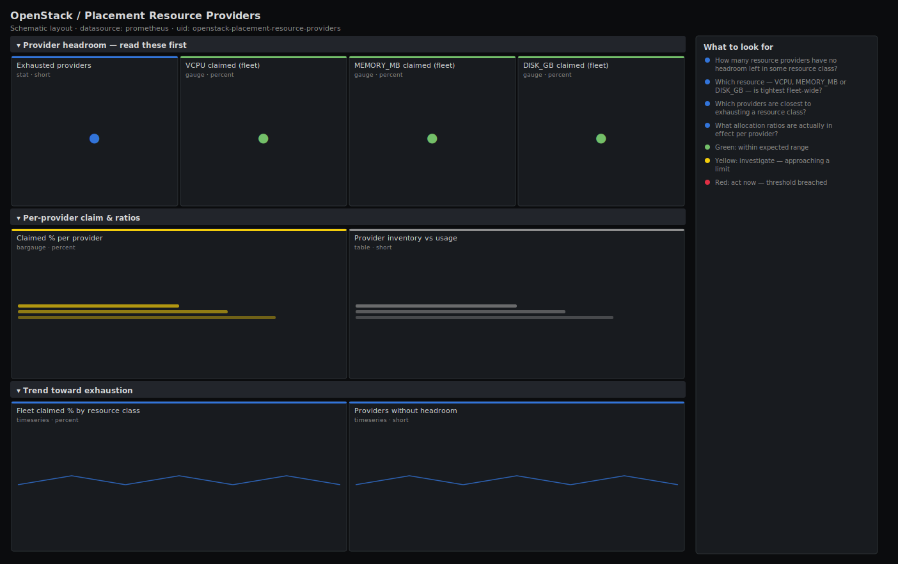

# OpenStack / Placement Resource Providers

> Placement-level capacity for an OpenStack cloud from openstack-exporter: per-provider inventory vs usage for VCPU, MEMORY_MB and DISK_GB, providers that have run out of a resource class, and the allocation ratios in effect. Answers "which providers can still accept a claim, and which resource runs out first?" — the same question the scheduler's placement step asks on every build.

**Primary search phrase:** OpenStack Placement Grafana dashboard  
**Category:** `openstack/placement` · **UID:** `openstack-placement-resource-providers` · **Datasource:** Prometheus



## Questions this dashboard answers

- How many resource providers have no headroom left in some resource class?
- Which resource — VCPU, MEMORY_MB or DISK_GB — is tightest fleet-wide?
- Which providers are closest to exhausting a resource class?
- What allocation ratios are actually in effect per provider?
- Is usage trending toward exhaustion on any resource class?

## Production lessons — why this dashboard exists

Placement is the source of truth the scheduler actually queries, so when builds fail with "no valid host" the answer is almost always here, not in nova-compute: a provider whose VCPU or MEMORY_MB inventory is fully claimed simply stops being returned as a candidate. This dashboard leads with the count of exhausted providers and the tightest resource class because a single saturated class blocks placement even when the other two look roomy — a host full of MEMORY_MB is useless however many free vCPUs it has. The allocation-ratio panel earns its place during incident review: a provider quietly reset to ratio 1.0 (after a redeploy or a config drift) loses most of its effective capacity overnight and looks "full" long before the hardware is, and only the ratio view explains why.

## Data source requirements

- **Prometheus** datasource (selected at import time via `${DS_PROMETHEUS}`).
- `openstack-exporter` (github.com/openstack-exporter/openstack-exporter) scraping the Placement API: `openstack_placement_resource_provider_capacity`, `openstack_placement_resource_provider_usage` and `openstack_placement_resource_provider_allocation_ratio`, labelled by `hostname` and `resourcetype` (VCPU, MEMORY_MB, DISK_GB).
- If your exporter build lacks the placement collector, derive equivalent VCPU usage from `openstack_nova_vcpus_used` / `openstack_nova_vcpus` per `hostname` on the Nova capacity dashboard.

## Template variables

| Variable | Label | Type | Purpose |
|----------|-------|------|---------|
| `${job}` | Job | query | Prometheus scrape job for your openstack-exporter target. |
| `${resourcetype}` | Resource class | query | Placement resource class(es) to scope the per-provider panels to. |
| `${hostname}` | Provider | query | Resource provider (compute host) to display; supports multi-select. |

## Panels

### Provider headroom — read these first

- **Exhausted providers** (stat, `short`) — Providers with at least one resource class above 90% claimed — the scheduler will skip these for anything needing that class.
- **VCPU claimed (fleet)** (gauge, `percent`) — Sum of VCPU usage ÷ capacity across providers. Red means little VCPU inventory left to place.
- **MEMORY_MB claimed (fleet)** (gauge, `percent`) — Sum of MEMORY_MB usage ÷ capacity. Usually the tightest class on general-purpose clouds.
- **DISK_GB claimed (fleet)** (gauge, `percent`) — Sum of DISK_GB usage ÷ capacity. The binding class on local-storage clouds.

### Per-provider claim & ratios

- **Claimed % per provider** (bargauge, `percent`) — Highest claimed resource class per provider, ranked. The top bars are about to stop accepting builds.
- **Provider inventory vs usage** (table, `short`) — Capacity, usage and effective allocation ratio per provider and resource class.

### Trend toward exhaustion

- **Fleet claimed % by resource class** (timeseries, `percent`) — VCPU, MEMORY_MB and DISK_GB claimed over time. The line nearing 100% is the next thing to run out.
- **Providers without headroom** (timeseries, `short`) — Count of providers above 90% on any resource class. Climbing means the cloud is filling up.

## Import

**Grafana UI** — *Dashboards → New → Import*, upload `dashboards/openstack/placement/resource-providers.json`, then pick your datasource when prompted.

**API:**

```bash
scripts/import-dashboard.sh dashboards/openstack/placement/resource-providers.json
```

**Provisioning** — drop the JSON into a provisioned folder (see [provisioning guide](../../../provisioning.md)).

## Recommended alerts

Ready-to-use rules ship in `alerts/openstack.rules.yml`.

### PlacementProviderExhausted (`warning`)

```promql
max by (hostname, resourcetype) (
  openstack_placement_resource_provider_usage
  / openstack_placement_resource_provider_capacity
) > 0.95
```

- **Fires after:** `15m`
- **Why it matters:** A resource class above 95% claimed means the scheduler will skip this provider for any new claim of that class — the direct cause of "no valid host".
- **Investigate:** Open Placement Resource Providers; check whether the host's allocation_ratio is correct and whether instances can be rebalanced off it.
- **Recovery:** Clears when the resource class drops below 95% claimed for 5m.
- **False positives:** Intentionally packed providers in a dedicated tier — scope the rule by resourcetype or aggregate.

### PlacementResourceClassNearlyFull (`warning`)

```promql
100 * sum by (resourcetype) (openstack_placement_resource_provider_usage) / sum by (resourcetype) (openstack_placement_resource_provider_capacity) > 90
```

- **Fires after:** `30m`
- **Why it matters:** When a whole resource class is over 90% claimed across the fleet there is almost nowhere left to place work needing it — capacity action is overdue.
- **Investigate:** Identify which providers dominate the usage; decide between adding capacity and rebalancing.
- **Recovery:** Clears when the class falls below 90% claimed for 10m.
- **False positives:** A deliberately near-full economy tier — raise the threshold for that resourcetype.

### PlacementAllocationRatioCollapsed (`critical`)

```promql
openstack_placement_resource_provider_allocation_ratio{resourcetype="VCPU"} <= 1
```

- **Fires after:** `10m`
- **Why it matters:** A VCPU allocation ratio that drops to 1.0 (often after a redeploy or config drift) silently strips most of a provider's effective capacity, making it look full long before the hardware is.
- **Investigate:** Compare the ratio against peer providers in the inventory table; check the compute node's nova.conf / placement aggregate settings.
- **Recovery:** Clears when the provider's VCPU ratio is restored above 1.0 for 5m.
- **False positives:** Pinned/dedicated CPU providers legitimately run at ratio 1.0 — exclude them by hostname or aggregate.

## Troubleshooting

| Symptom | Likely cause | First action |
|---------|--------------|--------------|
| All panels show "No data" | The exporter build lacks the placement collector, or it cannot reach the Placement API. | Enable the placement collector (or confirm the endpoint/credentials); otherwise use the Nova capacity dashboard's per-host vCPU derivation. |
| Claimed % exceeds 100 | Usage is measured against base inventory while the effective capacity includes the allocation ratio. | Read the inventory table's ratio column; multiply capacity by ratio for the true ceiling, or rely on the per-class fleet gauges. |
| A provider shows "full" but the host has free hardware | Its allocation_ratio was reset to 1.0, collapsing effective capacity. | Restore the intended ratio; the AllocationRatioCollapsed alert is designed to catch exactly this. |

## Performance considerations

Placement metrics are one series per (provider × resource class), a small, bounded set, so even `max by (hostname)` across all providers is cheap. Fleet gauges are simple `sum() / sum()` per resource class. A 1m refresh and 24h window match how slowly inventory and claims move; nothing here needs faster sampling.

## Customization

Adjust the exhaustion thresholds (90/95%) to your placement headroom policy, and exclude dedicated/pinned providers from the ratio alert by hostname. To plan one resource class, select it in the `resourcetype` variable. If your exporter exposes `..._reserved`, subtract it from capacity for an exact effective-capacity calculation.

## Related resources

- [Advanced observability guides](https://devopsaitoolkit.com/guides/)
- [Grafana & Prometheus tutorials](https://devopsaitoolkit.com/blog/)
- [AI Incident Response Assistant](https://devopsaitoolkit.com/dashboard/incident-response)
- [PromQL cookbook](../../../../promql/README.md) · [Alerting guide](../../../alerting.md) · [Dashboard catalog](../../../catalog.md)
