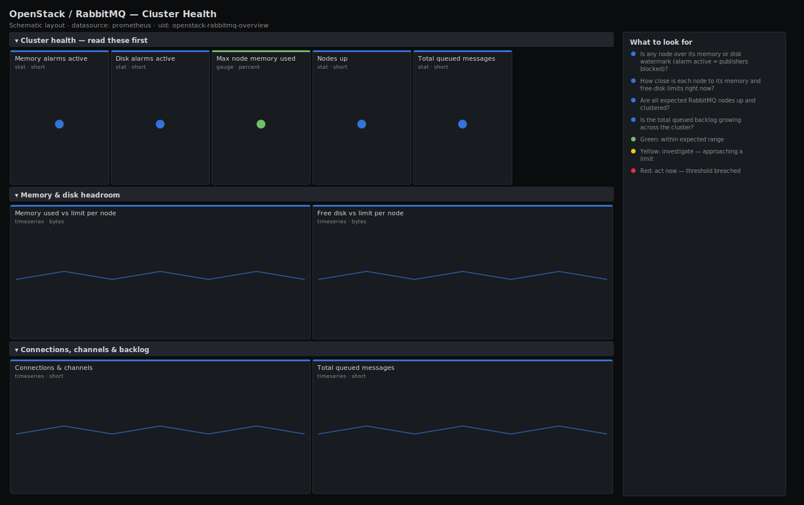

# OpenStack / RabbitMQ — Cluster Health

> RabbitMQ cluster health for the OpenStack control plane: memory and disk against their watermarks, active resource alarms, connection and channel counts, nodes up and total queued messages. Answers "is the message bus about to block publishers?" before Nova/Neutron RPC starts timing out.

**Primary search phrase:** RabbitMQ cluster Grafana dashboard  
**Category:** `openstack/rabbitmq` · **UID:** `openstack-rabbitmq-overview` · **Datasource:** Prometheus



## Questions this dashboard answers

- Is any node over its memory or disk watermark (alarm active = publishers blocked)?
- How close is each node to its memory and free-disk limits right now?
- Are all expected RabbitMQ nodes up and clustered?
- Is the total queued backlog growing across the cluster?

## Production lessons — why this dashboard exists

In OpenStack, RabbitMQ carries every RPC between control services, so when it blocks, Nova schedules nothing and Neutron stops wiring ports — but the symptom shows up as random API timeouts, not an obvious broker outage. The killer is the memory/disk **watermark alarm**: once tripped, RabbitMQ stops accepting publishes cluster-wide until the condition clears, so this dashboard leads with the alarm state and how close each node is to its limit. The second most useful signal is a steadily climbing total backlog, which means consumers (the agents) have died or fallen behind well before memory actually fills.

## Data source requirements

- **Prometheus** datasource (selected at import time via `${DS_PROMETHEUS}`).
- RabbitMQ with the built-in `rabbitmq_prometheus` plugin enabled (`rabbitmq-plugins enable rabbitmq_prometheus`), exposing the `rabbitmq_*` series on each node.
- Node count is derived from `rabbitmq_build_info` (one series per running node). Memory/disk watermark alarms come from `rabbitmq_alarms_memory_used_watermark` and `rabbitmq_alarms_free_disk_space_watermark` (1 = alarm active).

## Template variables

| Variable | Label | Type | Purpose |
|----------|-------|------|---------|
| `${job}` | Job | query | Prometheus scrape job for your RabbitMQ nodes. |
| `${instance}` | Node | query | RabbitMQ node endpoint(s); supports multi-select. |

## Panels

### Cluster health — read these first

- **Memory alarms active** (stat, `short`) — Number of nodes whose memory watermark alarm is set. Any value >0 means publishers are being blocked cluster-wide.
- **Disk alarms active** (stat, `short`) — Number of nodes whose free-disk watermark alarm is set. Non-zero blocks publishes until disk is reclaimed.
- **Max node memory used** (gauge, `percent`) — Highest memory-used vs configured high-watermark limit across nodes. At 100% the memory alarm trips.
- **Nodes up** (stat, `short`) — Count of RabbitMQ nodes currently reporting (one series of build_info per node). Compare to your expected cluster size.
- **Total queued messages** (stat, `short`) — Sum of all messages sitting in queues across the cluster. A rising backlog means consumers are behind.

### Memory & disk headroom

- **Memory used vs limit per node** (timeseries, `bytes`) — Per-node memory used against the high-watermark limit. The gap is your headroom before publishes block.
- **Free disk vs limit per node** (timeseries, `bytes`) — Per-node free disk against the free-disk watermark. When free dips to the limit the disk alarm fires.

### Connections, channels & backlog

- **Connections & channels** (timeseries, `short`) — Open connections and channels per node. A leak (ever-climbing channels) eventually exhausts memory.
- **Total queued messages** (timeseries, `short`) — Cluster-wide queued message count over time — the single clearest sign that consumers are keeping up or not.

## Import

**Grafana UI** — *Dashboards → New → Import*, upload `dashboards/openstack/rabbitmq/overview.json`, then pick your datasource when prompted.

**API:**

```bash
scripts/import-dashboard.sh dashboards/openstack/rabbitmq/overview.json
```

**Provisioning** — drop the JSON into a provisioned folder (see [provisioning guide](../../../provisioning.md)).

## Recommended alerts

Ready-to-use rules ship in `alerts/openstack.rules.yml`.

### RabbitMQMemoryAlarmActive (`critical`)

```promql
rabbitmq_alarms_memory_used_watermark == 1
```

- **Fires after:** `1m`
- **Why it matters:** When the memory alarm trips RabbitMQ blocks all publishing connections cluster-wide; OpenStack RPC stalls and Nova/Neutron operations start timing out.
- **Investigate:** Open OpenStack / RabbitMQ — Cluster Health, check memory used vs limit and total queued messages; a backlog usually caused the spike.
- **Recovery:** Clears when memory falls back below the high watermark.
- **False positives:** A brief spike during a node restart or queue sync; the 1m `for` filters most of these.

### RabbitMQDiskAlarmActive (`critical`)

```promql
rabbitmq_alarms_free_disk_space_watermark == 1
```

- **Fires after:** `1m`
- **Why it matters:** Below the free-disk watermark RabbitMQ blocks publishers to protect the broker from running the disk to zero, halting OpenStack messaging.
- **Investigate:** Check free disk vs limit per node; identify what filled the volume (persistent messages, logs, mnesia).
- **Recovery:** Clears when free disk rises above the configured limit.
- **False positives:** Log-rotation lag right after a burst; confirm against the disk panel before paging.

### RabbitMQNodeDown (`warning`)

```promql
count(rabbitmq_build_info) < 3
```

- **Fires after:** `5m`
- **Why it matters:** A shrunken cluster loses quorum/mirroring headroom; one more failure can split-brain or lose mirrored queues used by OpenStack RPC.
- **Investigate:** Confirm which node stopped reporting and check its rabbitmq-server service, Erlang cookie and network partition status.
- **Recovery:** Clears when the expected number of nodes report again.
- **False positives:** Rolling restarts/upgrades; adjust the threshold to your real cluster size or silence during maintenance.

## Troubleshooting

| Symptom | Likely cause | First action |
|---------|--------------|--------------|
| All panels show "No data" | The `rabbitmq_prometheus` plugin is not enabled or the metrics port (15692) is not scraped. | Run `rabbitmq-plugins enable rabbitmq_prometheus` and add the `:15692/metrics` target to Prometheus. |
| Memory % over 100 | A node reports used above its high-watermark limit momentarily during GC. | This is transient; watch the alarm panel rather than the exact percentage. |
| Nodes-up is lower than expected but the cluster is fine | One node's metrics endpoint is unreachable while the node itself is healthy. | Check the scrape target for that node; `count(rabbitmq_build_info)` counts reporting nodes, not cluster membership. |

## Performance considerations

All series are per node and low cardinality, so this dashboard is inexpensive at 30s refresh. The only `sum` across queues (`rabbitmq_queue_messages`) stays cheap unless you have tens of thousands of queues — in which case prefer the per-node aggregate and move per-queue detail to the Queue Depth dashboard.

## Customization

Tune the memory gauge thresholds to your `vm_memory_high_watermark` and the node-down alert to your real cluster size. If you run RabbitMQ behind HAProxy for OpenStack, pair this with the HAProxy backend dashboard to see broker health and load-balancer health side by side.

## Related resources

- [Advanced observability guides](https://devopsaitoolkit.com/guides/)
- [Grafana & Prometheus tutorials](https://devopsaitoolkit.com/blog/)
- [AI Incident Response Assistant](https://devopsaitoolkit.com/dashboard/incident-response)
- [PromQL cookbook](../../../../promql/README.md) · [Alerting guide](../../../alerting.md) · [Dashboard catalog](../../../catalog.md)
