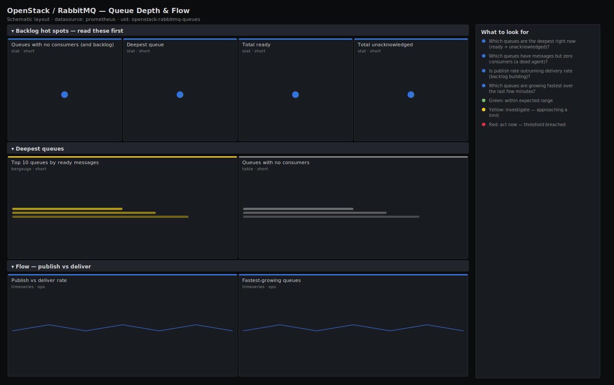

# OpenStack / RabbitMQ — Queue Depth & Flow

> Per-queue depth and message flow for the OpenStack message bus: which queues are deepest, which have no consumers, and whether publish rate is outrunning delivery. Answers "which agent stopped consuming?" — the usual root cause of a RabbitMQ backlog that eventually blocks the whole control plane.

**Primary search phrase:** RabbitMQ queue depth Grafana dashboard  
**Category:** `openstack/rabbitmq` · **UID:** `openstack-rabbitmq-queues` · **Datasource:** Prometheus



## Questions this dashboard answers

- Which queues are the deepest right now (ready + unacknowledged)?
- Which queues have messages but zero consumers (a dead agent)?
- Is publish rate outrunning delivery rate (backlog building)?
- Which queues are growing fastest over the last few minutes?

## Production lessons — why this dashboard exists

A RabbitMQ backlog in OpenStack is almost never the broker's fault — it is a consumer that died: a `nova-compute`, `neutron-agent` or `cinder-volume` that lost its connection and stopped acking, leaving its reply/fanout queue to grow until memory fills and the watermark alarm blocks everyone. The fastest path to root cause is "deepest queue with zero consumers", which names the broken agent directly. Watching publish-vs-deliver rate catches the same failure earlier, while the backlog is still small enough that nothing has paged yet.

## Data source requirements

- **Prometheus** datasource (selected at import time via `${DS_PROMETHEUS}`).
- RabbitMQ with the `rabbitmq_prometheus` plugin. Per-queue series (`rabbitmq_queue_messages_ready`, `_unacknowledged`, `_published_total`, `_delivered_total`, `rabbitmq_queue_consumers`) carry `queue` and `vhost` labels.
- On clusters with very high queue churn (e.g. per-RPC reply queues), enable the plugin's `detailed` metrics selectively — emitting every transient queue can be high-cardinality.

## Template variables

| Variable | Label | Type | Purpose |
|----------|-------|------|---------|
| `${job}` | Job | query | Prometheus scrape job for your RabbitMQ nodes. |
| `${vhost}` | Vhost | query | RabbitMQ virtual host (OpenStack usually uses "/"). |

## Panels

### Backlog hot spots — read these first

- **Queues with no consumers (and backlog)** (stat, `short`) — Queues holding ready messages but with zero consumers — each one is very likely a dead OpenStack agent.
- **Deepest queue** (stat, `short`) — Largest single-queue backlog (ready messages). Drill into the table below to name it.
- **Total ready** (stat, `short`) — Cluster-wide messages ready for delivery (not yet picked up by a consumer).
- **Total unacknowledged** (stat, `short`) — Messages delivered but not yet acked. A large persistent value means consumers are stuck mid-processing.

### Deepest queues

- **Top 10 queues by ready messages** (bargauge, `short`) — The ten queues with the most messages waiting for a consumer. The OpenStack service is usually obvious from the queue name.
- **Queues with no consumers** (table, `short`) — Every queue that has a backlog but no consumer attached — the shortlist of agents to restart.

### Flow — publish vs deliver

- **Publish vs deliver rate** (timeseries, `ops`) — Cluster-wide publish rate against delivery rate. When publish sits above deliver, the backlog is building.
- **Fastest-growing queues** (timeseries, `ops`) — Per-queue rate of change of ready messages (top 10). Positive and climbing means that queue is falling behind.

## Import

**Grafana UI** — *Dashboards → New → Import*, upload `dashboards/openstack/rabbitmq/queues.json`, then pick your datasource when prompted.

**API:**

```bash
scripts/import-dashboard.sh dashboards/openstack/rabbitmq/queues.json
```

**Provisioning** — drop the JSON into a provisioned folder (see [provisioning guide](../../../provisioning.md)).

## Recommended alerts

Ready-to-use rules ship in `alerts/openstack.rules.yml`.

### RabbitMQQueueNoConsumers (`warning`)

```promql
rabbitmq_queue_messages_ready > 100 and rabbitmq_queue_consumers == 0
```

- **Fires after:** `5m`
- **Why it matters:** A backlog with zero consumers means the OpenStack agent that drains this queue has died; the backlog will grow until it trips the broker memory alarm and stalls the control plane.
- **Investigate:** Open OpenStack / RabbitMQ — Queue Depth & Flow, read the no-consumer table to map the queue name to its service (nova/neutron/cinder).
- **Recovery:** Clears when a consumer reattaches or the queue drains below 100.
- **False positives:** Short-lived reply queues between RPC turns; the 100-message and 5m thresholds filter most of these.

### RabbitMQBacklogBuilding (`warning`)

```promql
sum(rate(rabbitmq_queue_messages_published_total[5m])) > 1.2 * sum(rate(rabbitmq_queue_messages_delivered_total[5m]))
```

- **Fires after:** `10m`
- **Why it matters:** Sustained publish-over-deliver means consumers cannot keep up and the backlog is compounding toward a memory alarm.
- **Investigate:** Compare publish vs deliver and the fastest-growing-queues panel to find which queue/service is the bottleneck.
- **Recovery:** Clears when delivery catches up to publishing.
- **False positives:** Brief bursts (e.g. mass instance launch) where consumers catch up within minutes.

## Troubleshooting

| Symptom | Likely cause | First action |
|---------|--------------|--------------|
| Tables and top-N are empty but the cluster is busy | Per-queue metrics are disabled or filtered out by the plugin's aggregation settings. | Enable per-queue metrics in `rabbitmq_prometheus` (or remove an over-aggressive metric filter) and re-scrape. |
| Hundreds of transient queues flood the table | Per-RPC reply queues are being exported individually. | Filter to durable queues by name regex on `$vhost`/queue, or have the plugin collapse reply queues. |
| Deriv panel shows large negatives | A queue drained rapidly — that is healthy, not a problem. | Focus on sustained positive growth; negatives mean consumers are winning. |

## Performance considerations

Per-queue series are the cardinality risk here. Rates use a 5m window. On clouds with many ephemeral reply queues, restrict the plugin to durable queues or push per-queue panels behind a recording rule; the top-N (`topk`) panels stay cheap because they bound the returned series to ten.

## Customization

Adjust the depth thresholds (1k/10k) to your normal queue sizes and the no-consumer alert floor to filter short-lived reply queues. Add a `queue` regex template variable to focus on a single service's notification/RPC queues during an incident.

## Related resources

- [Advanced observability guides](https://devopsaitoolkit.com/guides/)
- [Grafana & Prometheus tutorials](https://devopsaitoolkit.com/blog/)
- [AI Incident Response Assistant](https://devopsaitoolkit.com/dashboard/incident-response)
- [PromQL cookbook](../../../../promql/README.md) · [Alerting guide](../../../alerting.md) · [Dashboard catalog](../../../catalog.md)
