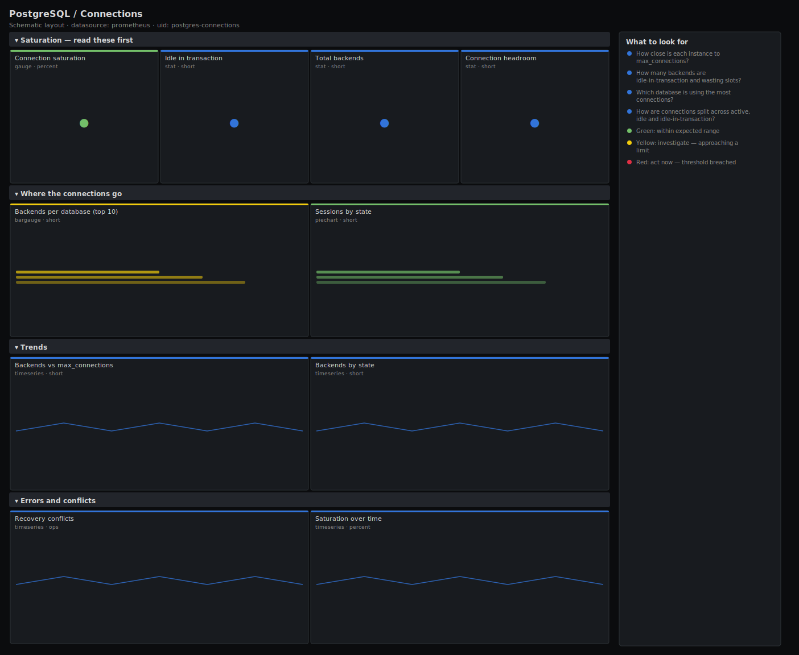

# PostgreSQL / Connections

> Connection-pool health for PostgreSQL via postgres_exporter: saturation against max_connections, backends per database, sessions by state, idle-in-transaction backends and recovery conflicts. Answers "do we have connection headroom, and where are the connections going?".

**Primary search phrase:** PostgreSQL connections Grafana dashboard  
**Category:** `postgres` · **UID:** `postgres-connections` · **Datasource:** Prometheus



## Questions this dashboard answers

- How close is each instance to max_connections?
- How many backends are idle-in-transaction and wasting slots?
- Which database is using the most connections?
- How are connections split across active, idle and idle-in-transaction?
- Are recovery conflicts terminating queries on standbys?

## Production lessons — why this dashboard exists

PostgreSQL has no built-in connection pool, so every application connection is a real backend process competing for max_connections. The failure mode is abrupt: at the limit the server refuses new connections and the whole application errors at once, with CPU and memory looking healthy. This dashboard leads with **saturation** and the **idle-in-transaction** count because idle backends consume slots while doing nothing, and a top-N-by-database view tells you which service to throttle. The fix is almost always a pooler (PgBouncer) plus smaller per-app pools — not a higher max_connections.

## Data source requirements

- **Prometheus** datasource (selected at import time via `${DS_PROMETHEUS}`).
- `postgres_exporter` with the `pg_stat_activity` collector (the `pg_stat_database_numbackends`, `pg_stat_activity_count`, `pg_settings_max_connections` and `pg_stat_database_conflicts` series).

## Template variables

| Variable | Label | Type | Purpose |
|----------|-------|------|---------|
| `${instance}` | Instance | query | PostgreSQL server(s) to display; supports multi-select. |
| `${datname}` | Database | query | Database(s) for the per-database backend panels. |

## Panels

### Saturation — read these first

- **Connection saturation** (gauge, `percent`) — Worst instance's backends as a percentage of its max_connections. At 100% the server refuses clients.
- **Idle in transaction** (stat, `short`) — Backends holding an open transaction while idle — slots wasted and locks held.
- **Total backends** (stat, `short`) — Server-side connections in use across the selected instances.
- **Connection headroom** (stat, `short`) — Free connection slots remaining on the tightest instance before max_connections.

### Where the connections go

- **Backends per database (top 10)** (bargauge, `short`) — Which databases hold the most connections — the candidates to pool or throttle.
- **Sessions by state** (piechart, `short`) — Current split of backends across active, idle and idle-in-transaction.

### Trends

- **Backends vs max_connections** (timeseries, `short`) — Used connections against the configured ceiling per instance. Watch the gap close under load.
- **Backends by state** (timeseries, `short`) — Connection states over time. A rising idle-in-transaction band predicts trouble.

### Errors and conflicts

- **Recovery conflicts** (timeseries, `ops`) — Queries cancelled on standbys because they conflicted with WAL replay.
- **Saturation over time** (timeseries, `percent`) — Per-instance connection saturation — confirm whether a spike was momentary or sustained.

## Import

**Grafana UI** — *Dashboards → New → Import*, upload `dashboards/postgres/connections.json`, then pick your datasource when prompted.

**API:**

```bash
scripts/import-dashboard.sh dashboards/postgres/connections.json
```

**Provisioning** — drop the JSON into a provisioned folder (see [provisioning guide](../../provisioning.md)).

## Recommended alerts

Ready-to-use rules ship in `alerts/postgres.rules.yml`.

### PostgresConnectionsNearMax (`critical`)

```promql
100 * sum by (instance) (pg_stat_database_numbackends) / on (instance) pg_settings_max_connections > 90
```

- **Fires after:** `5m`
- **Why it matters:** Past ~90% the server is one burst away from refusing connections and failing the whole application.
- **Investigate:** Open PostgreSQL / Connections; find the top database and any idle-in-transaction backends.
- **Recovery:** Clears when saturation falls below 90% for 5m.
- **False positives:** Short deploy-time spikes; if your pooler recycles connections, raise `for`.

### PostgresIdleInTransactionHigh (`warning`)

```promql
sum by (instance) (pg_stat_activity_count{state="idle in transaction"}) > 10
```

- **Fires after:** `10m`
- **Why it matters:** Idle-in-transaction backends waste connection slots and hold locks that block VACUUM and other writers.
- **Investigate:** Identify the sessions and the application code path that left a transaction open.
- **Recovery:** Clears when the count falls below 10 for 5m.
- **False positives:** Some frameworks legitimately hold a transaction per request; tune to your baseline.

### PostgresRecoveryConflicts (`warning`)

```promql
sum by (instance) (rate(pg_stat_database_conflicts[5m])) > 0
```

- **Fires after:** `10m`
- **Why it matters:** Read queries on the standby are being cancelled by WAL replay, surfacing as errors to read-replica users.
- **Investigate:** Check which conflict type dominates and how long the offending read queries run.
- **Recovery:** Clears when conflicts stop for 5m.
- **False positives:** Occasional conflicts under heavy write+read load are expected; alert only on a sustained rate.

## Troubleshooting

| Symptom | Likely cause | First action |
|---------|--------------|--------------|
| Saturation gauge reads 0 or "No data" | pg_settings_max_connections not exported, so the ratio has no denominator. | Enable the settings collector in postgres_exporter and re-scrape. |
| Top-N database panel includes template databases | numbackends is emitted for template0/template1 too. | Scope `$datname` with a regex that excludes the template and postgres databases. |
| Headroom goes negative | Background workers and superuser-reserved connections are counted in numbackends. | Treat small negative values as "effectively full"; the saturation gauge is the cleaner signal. |

## Performance considerations

Saturation joins numbackends to max_connections on `instance` with `on (instance)`, keeping the result one series per server. The conflicts panel uses a 5m rate window so a restart never produces a false spike.

## Customization

Set the 90% critical and 75% warning thresholds to leave room for your superuser and replication reserved slots. Add a per-`usename` breakdown if you need to attribute connections to specific application users.

## Related resources

- [Advanced observability guides](https://devopsaitoolkit.com/guides/)
- [Grafana & Prometheus tutorials](https://devopsaitoolkit.com/blog/)
- [AI Incident Response Assistant](https://devopsaitoolkit.com/dashboard/incident-response)
- [PromQL cookbook](../../../promql/README.md) · [Alerting guide](../../alerting.md) · [Dashboard catalog](../../catalog.md)
