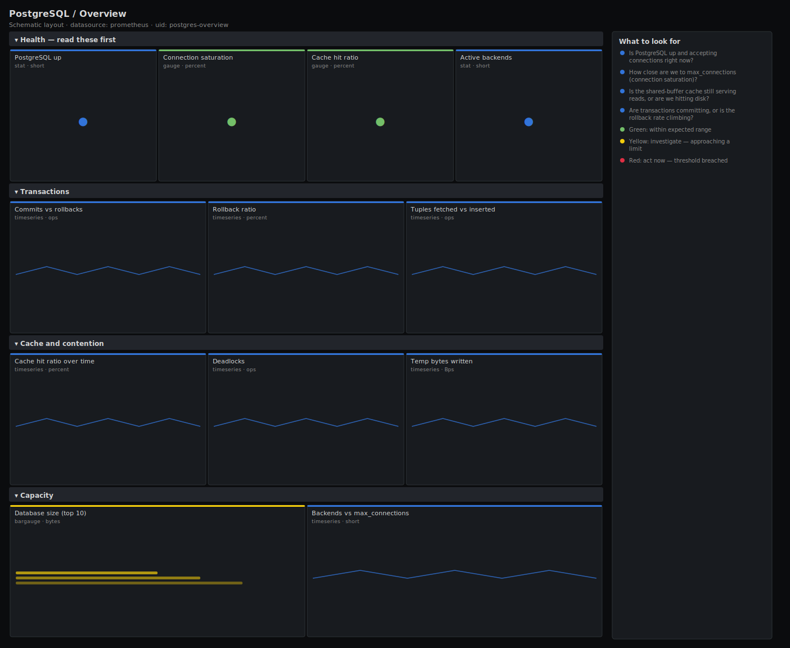

# PostgreSQL / Overview

> Top-level health for PostgreSQL servers scraped by postgres_exporter: liveness, connection saturation against max_connections, shared-buffer cache hit ratio, the commit-vs-rollback transaction mix, deadlocks and per-database size. Answers "is this instance healthy and does it have headroom?" in five seconds.

**Primary search phrase:** PostgreSQL Grafana dashboard  
**Category:** `postgres` · **UID:** `postgres-overview` · **Datasource:** Prometheus



## Questions this dashboard answers

- Is PostgreSQL up and accepting connections right now?
- How close are we to max_connections (connection saturation)?
- Is the shared-buffer cache still serving reads, or are we hitting disk?
- Are transactions committing, or is the rollback rate climbing?
- Which database is growing and how fast?

## Production lessons — why this dashboard exists

Most Postgres incidents are not slow queries — they are connection exhaustion and a cache that fell off a cliff after a plan or workload change. A server at 95% of max_connections will refuse new clients while looking "fine" on CPU, so this dashboard leads with **saturation** and **cache hit ratio**, the two numbers that predict an outage. A cache hit ratio that drops from 99% to 90% means reads are now going to disk and latency has already changed; pair it with the commit/rollback mix to tell a healthy busy server from one thrashing on aborted work.

## Data source requirements

- **Prometheus** datasource (selected at import time via `${DS_PROMETHEUS}`).
- `postgres_exporter` pointed at each server (the `pg_up`, `pg_stat_database_*`, `pg_settings_max_connections` and `pg_database_size_bytes` series).

## Template variables

| Variable | Label | Type | Purpose |
|----------|-------|------|---------|
| `${instance}` | Instance | query | PostgreSQL server(s) to display; supports multi-select. |
| `${datname}` | Database | query | Database(s) for the per-database throughput and size panels. |

## Panels

### Health — read these first

- **PostgreSQL up** (stat, `short`) — Liveness from postgres_exporter. 1 = the exporter reached the server.
- **Connection saturation** (gauge, `percent`) — Worst instance's active backends as a percentage of its max_connections.
- **Cache hit ratio** (gauge, `percent`) — Share of block reads served from shared buffers over the last 5m. Below ~95% means reads are hitting disk.
- **Active backends** (stat, `short`) — Total server-side connections in use across the selected instances.

### Transactions

- **Commits vs rollbacks** (timeseries, `ops`) — Transaction throughput. A rising rollback line points at application errors or lock/serialisation failures.
- **Rollback ratio** (timeseries, `percent`) — Percentage of transactions that rolled back. Sustained values above a few percent are worth a look.
- **Tuples fetched vs inserted** (timeseries, `ops`) — Read (fetched) and write (inserted) row throughput — the shape of the workload.

### Cache and contention

- **Cache hit ratio over time** (timeseries, `percent`) — The headline gauge as a trend — spot the moment a plan change pushed reads to disk.
- **Deadlocks** (timeseries, `ops`) — Deadlocks resolved per second. Any sustained rate means two transactions are taking locks in opposite order.
- **Temp bytes written** (timeseries, `Bps`) — Bytes spilled to temp files for sorts/hashes that exceeded work_mem.

### Capacity

- **Database size (top 10)** (bargauge, `bytes`) — On-disk size of the largest databases. Track growth against your volume headroom.
- **Backends vs max_connections** (timeseries, `short`) — Used connections against the configured ceiling per instance. The gap is your headroom.

## Import

**Grafana UI** — *Dashboards → New → Import*, upload `dashboards/postgres/overview.json`, then pick your datasource when prompted.

**API:**

```bash
scripts/import-dashboard.sh dashboards/postgres/overview.json
```

**Provisioning** — drop the JSON into a provisioned folder (see [provisioning guide](../../provisioning.md)).

## Recommended alerts

Ready-to-use rules ship in `alerts/postgres.rules.yml`.

### PostgresInstanceDown (`critical`)

```promql
pg_up == 0
```

- **Fires after:** `1m`
- **Why it matters:** The exporter cannot reach the server — clients are likely failing too.
- **Investigate:** Check the postgres service and host; confirm the exporter's DSN and that the server accepts connections.
- **Recovery:** Clears once pg_up reports 1 again.
- **False positives:** Exporter restart or credential rotation can briefly trip this — keep `for` at 1m.

### PostgresConnectionSaturationHigh (`warning`)

```promql
100 * sum by (instance) (pg_stat_database_numbackends) / on (instance) pg_settings_max_connections > 85
```

- **Fires after:** `10m`
- **Why it matters:** At 100% the server refuses new connections and the application starts failing, even with spare CPU and RAM.
- **Investigate:** Open PostgreSQL / Connections, look for idle-in-transaction backends and a missing pooler.
- **Recovery:** Clears when saturation drops below 85% for 5m.
- **False positives:** Brief spikes during deploys or connection-pool warm-up; raise `for` if your pooler cycles connections.

### PostgresCacheHitRatioLow (`warning`)

```promql
100 * sum by (instance) (rate(pg_stat_database_blks_hit[5m])) / clamp_min(
    sum by (instance) (rate(pg_stat_database_blks_hit[5m]))
    + sum by (instance) (rate(pg_stat_database_blks_read[5m])), 1) < 95
```

- **Fires after:** `15m`
- **Why it matters:** Reads are going to disk instead of shared buffers, so query latency has already risen.
- **Investigate:** Check for a large sequential scan, a cold cache after restart, or a working set that outgrew shared_buffers.
- **Recovery:** Clears when the ratio recovers above 95% for 5m.
- **False positives:** Expected for the first minutes after a restart or for a deliberate full-table analytics scan.

## Troubleshooting

| Symptom | Likely cause | First action |
|---------|--------------|--------------|
| All panels show "No data" | postgres_exporter not scraped or wrong `$instance`. | Check `pg_up` in Explore and confirm the instance label matches your scrape config. |
| Cache hit ratio reads 100% with no traffic | Both blks_hit and blks_read rates are ~0, so the ratio is dominated by the clamp. | Read it together with the transaction-rate panel; the number is only meaningful under load. |
| Saturation gauge above 100% | numbackends counts background workers the configured max_connections does not. | Treat values near 100% as the signal; the absolute backend count is in the Capacity row. |

## Performance considerations

Every rate uses a 5m window (≥4× a typical 15–30s scrape) so counters survive a reset. Cache-hit and rollback ratios clamp their denominator with `clamp_min(...,1)` to stay defined at zero traffic. Sums are bounded with `by (instance)` so series count scales with servers, not databases.

## Customization

Tune the 85% saturation and 95%/99% cache thresholds to your SLOs — OLAP boxes run lower hit ratios by design. Scope `$datname` to exclude template databases, and add a `pg_database_size_bytes` panel override if you provision volumes per database.

## Related resources

- [Advanced observability guides](https://devopsaitoolkit.com/guides/)
- [Grafana & Prometheus tutorials](https://devopsaitoolkit.com/blog/)
- [AI Incident Response Assistant](https://devopsaitoolkit.com/dashboard/incident-response)
- [PromQL cookbook](../../../promql/README.md) · [Alerting guide](../../alerting.md) · [Dashboard catalog](../../catalog.md)
