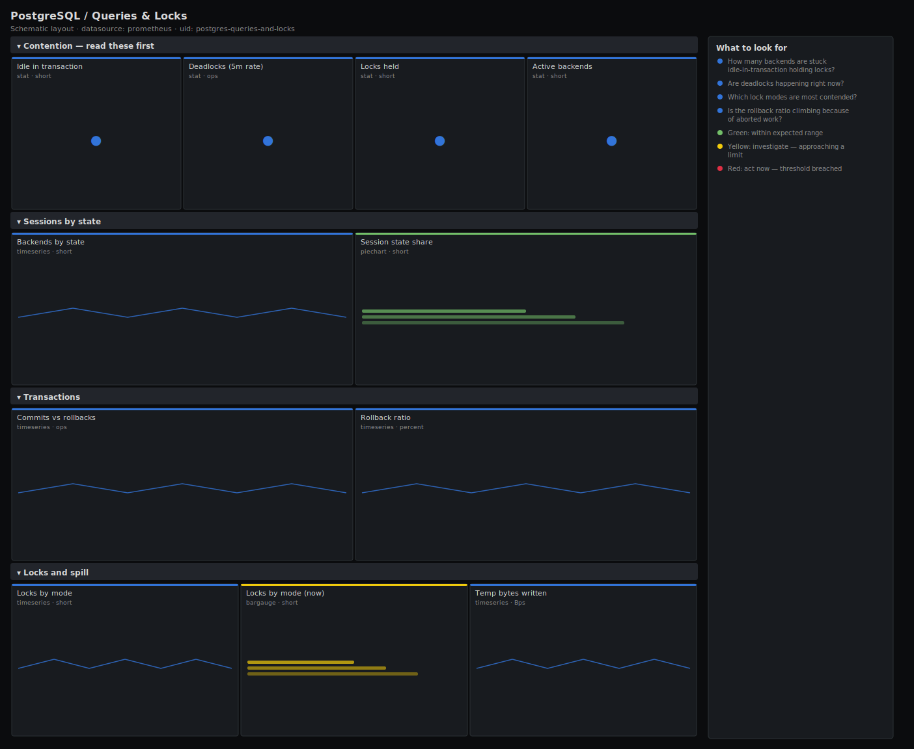

# PostgreSQL / Queries & Locks

> Session and locking behaviour for PostgreSQL via postgres_exporter: transaction throughput and rollback ratio, sessions by state (active vs idle-in-transaction), locks held by mode, deadlocks and temp-file spill. Answers "what is blocking, and who is holding the locks?".

**Primary search phrase:** PostgreSQL locks Grafana dashboard  
**Category:** `postgres` · **UID:** `postgres-queries-and-locks` · **Datasource:** Prometheus



## Questions this dashboard answers

- How many backends are stuck idle-in-transaction holding locks?
- Are deadlocks happening right now?
- Which lock modes are most contended?
- Is the rollback ratio climbing because of aborted work?
- Are queries spilling to temp files for want of work_mem?

## Production lessons — why this dashboard exists

The single most damaging Postgres anti-pattern is a backend left **idle in transaction**: it pins an open snapshot and holds row locks while doing nothing, blocking VACUUM and serialising everyone behind it. This dashboard leads with that count, the deadlock rate and lock pressure, because those three explain almost every "the database is slow" page that is really a contention problem, not a capacity one. Deadlocks are always an application bug (two transactions taking the same locks in opposite order) — the rate tells you how often it bites, the locks-by-mode panel tells you which objects are hot.

## Data source requirements

- **Prometheus** datasource (selected at import time via `${DS_PROMETHEUS}`).
- `postgres_exporter` with `pg_stat_activity` and `pg_locks` collectors enabled (the `pg_stat_activity_count`, `pg_locks_count`, `pg_stat_database_xact_*`, `pg_stat_database_deadlocks` and `pg_stat_database_temp_bytes` series).

## Template variables

| Variable | Label | Type | Purpose |
|----------|-------|------|---------|
| `${instance}` | Instance | query | PostgreSQL server(s) to display; supports multi-select. |
| `${datname}` | Database | query | Database(s) for the transaction and deadlock panels. |

## Panels

### Contention — read these first

- **Idle in transaction** (stat, `short`) — Backends holding an open transaction while doing no work. These pin snapshots and block VACUUM.
- **Deadlocks (5m rate)** (stat, `ops`) — Deadlocks resolved per second. Anything above zero is an application lock-ordering bug.
- **Locks held** (stat, `short`) — Total lock objects across all modes — a proxy for overall lock pressure.
- **Active backends** (stat, `short`) — Backends currently executing a query.

### Sessions by state

- **Backends by state** (timeseries, `short`) — How connections are spending their time. A growing idle-in-transaction band is the warning sign.
- **Session state share** (piechart, `short`) — Current split of backends by state.

### Transactions

- **Commits vs rollbacks** (timeseries, `ops`) — Transaction throughput. Rollbacks rising with deadlocks confirms a contention problem.
- **Rollback ratio** (timeseries, `percent`) — Share of transactions that aborted. Persistent values above a few percent need investigation.

### Locks and spill

- **Locks by mode** (timeseries, `short`) — Lock objects grouped by mode. AccessExclusiveLock spikes mean DDL or VACUUM FULL is blocking readers.
- **Locks by mode (now)** (bargauge, `short`) — Current lock count per mode — which lock type dominates right now.
- **Temp bytes written** (timeseries, `Bps`) — Bytes spilled to disk for sorts and hashes too large for work_mem. Correlate with slow analytics queries.

## Import

**Grafana UI** — *Dashboards → New → Import*, upload `dashboards/postgres/queries-and-locks.json`, then pick your datasource when prompted.

**API:**

```bash
scripts/import-dashboard.sh dashboards/postgres/queries-and-locks.json
```

**Provisioning** — drop the JSON into a provisioned folder (see [provisioning guide](../../provisioning.md)).

## Recommended alerts

Ready-to-use rules ship in `alerts/postgres.rules.yml`.

### PostgresIdleInTransactionHigh (`warning`)

```promql
sum by (instance) (pg_stat_activity_count{state="idle in transaction"}) > 10
```

- **Fires after:** `10m`
- **Why it matters:** Idle-in-transaction sessions pin snapshots, hold locks and block VACUUM, causing bloat and stalls.
- **Investigate:** Find the offending sessions in pg_stat_activity and the application path that opened the transaction.
- **Recovery:** Clears when the count falls below 10 for 5m.
- **False positives:** Some ORMs hold a transaction across a request; tune the threshold to your normal baseline.

### PostgresDeadlocksDetected (`warning`)

```promql
sum by (instance) (rate(pg_stat_database_deadlocks[5m])) > 0
```

- **Fires after:** `5m`
- **Why it matters:** Deadlocks mean transactions take locks in conflicting order; one is aborted every time, losing work.
- **Investigate:** Check the postgres log for the deadlock detail showing both statements and the objects involved.
- **Recovery:** Clears when no deadlocks occur for 5m.
- **False positives:** A one-off deadlock during a migration is usually benign; the 5m `for` window filters single events.

### PostgresHighRollbackRatio (`warning`)

```promql
100 * sum by (instance) (rate(pg_stat_database_xact_rollback[5m])) / clamp_min(
    sum by (instance) (rate(pg_stat_database_xact_commit[5m]))
    + sum by (instance) (rate(pg_stat_database_xact_rollback[5m])), 1) > 5
```

- **Fires after:** `15m`
- **Why it matters:** A high rollback share signals application errors, failed constraints or serialisation conflicts wasting capacity.
- **Investigate:** Correlate with deadlocks and application error logs; check for SERIALIZABLE retries.
- **Recovery:** Clears when the ratio drops below 5% for 5m.
- **False positives:** Batch jobs that use rollback for dry-runs inflate the ratio; scope by datname if needed.

## Troubleshooting

| Symptom | Likely cause | First action |
|---------|--------------|--------------|
| Locks-by-mode panel is empty | The pg_locks collector is not enabled in postgres_exporter. | Enable the locks collector (or the relevant queries file) and re-scrape. |
| The idle-in-transaction state never appears | pg_stat_activity_count only emits states that currently have backends. | This is expected — the band appears only when such backends exist. |
| Deadlock stat flickers above zero then clears | rate() smooths a single deadlock across the 5m window. | Use the deadlocks timeseries and the postgres log for exact counts and statements. |

## Performance considerations

All counters use a 5m rate window so a server restart does not produce a spike. The by-state and by-mode aggregations are bounded by a small, fixed label set, so panel cardinality is independent of connection count.

## Customization

Adjust the idle-in-transaction thresholds to your application's normal pattern, and add a state-timeline for AccessExclusiveLock if DDL contention is a recurring theme. Scope `$datname` to a single application database to remove noise from shared servers.

## Related resources

- [Advanced observability guides](https://devopsaitoolkit.com/guides/)
- [Grafana & Prometheus tutorials](https://devopsaitoolkit.com/blog/)
- [AI Incident Response Assistant](https://devopsaitoolkit.com/dashboard/incident-response)
- [PromQL cookbook](../../../promql/README.md) · [Alerting guide](../../alerting.md) · [Dashboard catalog](../../catalog.md)
