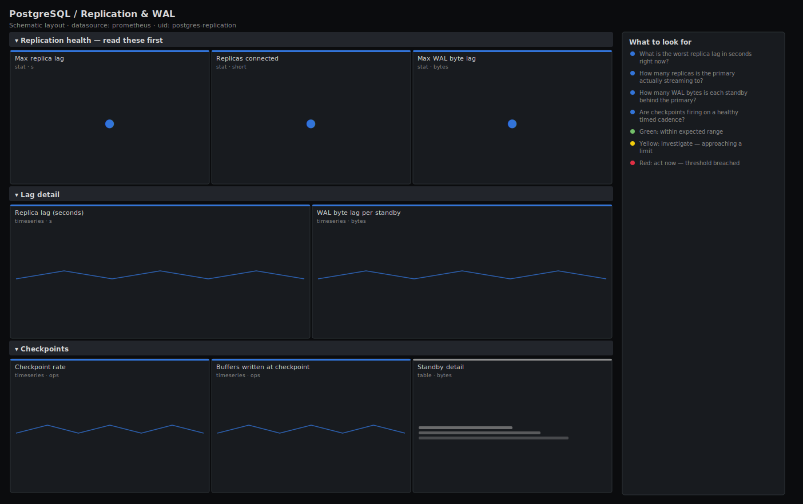

# PostgreSQL / Replication & WAL

> Streaming-replication health for PostgreSQL via postgres_exporter: replica lag in seconds, WAL byte lag per connected standby, how many replicas the primary sees, and checkpoint activity. Answers "are my replicas keeping up, and is a safe failover possible right now?".

**Primary search phrase:** PostgreSQL replication Grafana dashboard  
**Category:** `postgres` · **UID:** `postgres-replication` · **Datasource:** Prometheus



## Questions this dashboard answers

- What is the worst replica lag in seconds right now?
- How many replicas is the primary actually streaming to?
- How many WAL bytes is each standby behind the primary?
- Are checkpoints firing on a healthy timed cadence?

## Production lessons — why this dashboard exists

Replica lag is a data-loss budget, not a performance metric: if the primary fails with a standby 40 seconds behind, promoting it loses 40 seconds of committed writes. This dashboard leads with lag **in seconds** and the **replica count** so you know before an incident whether failover is safe. WAL byte lag is the leading indicator — it climbs first under write bursts or a slow standby, and the seconds-behind figure follows. A drop in the connected-replica count is its own page: a standby that silently disconnected is no longer protecting you.

## Data source requirements

- **Prometheus** datasource (selected at import time via `${DS_PROMETHEUS}`).
- `postgres_exporter` on the primary and replicas (the `pg_replication_lag`, `pg_stat_replication_pg_wal_lsn_diff`, `pg_stat_bgwriter_checkpoints_timed_total` and `pg_stat_bgwriter_buffers_checkpoint_total` series).

## Template variables

| Variable | Label | Type | Purpose |
|----------|-------|------|---------|
| `${instance}` | Instance | query | PostgreSQL primaries and replicas to display; supports multi-select. |

## Panels

### Replication health — read these first

- **Max replica lag** (stat, `s`) — Highest standby lag in seconds. This is your failover data-loss exposure.
- **Replicas connected** (stat, `short`) — Standbys the primary is currently streaming to. A drop means a replica disconnected.
- **Max WAL byte lag** (stat, `bytes`) — Largest WAL backlog any standby has yet to replay, in bytes.

### Lag detail

- **Replica lag (seconds)** (timeseries, `s`) — Per-instance replication delay. Sustained climbs mean the standby cannot keep up with the write rate.
- **WAL byte lag per standby** (timeseries, `bytes`) — WAL bytes each standby is behind the primary. The leading indicator — it moves before seconds-behind does.

### Checkpoints

- **Checkpoint rate** (timeseries, `ops`) — Timed checkpoints per second. A healthy server checkpoints on its scheduled cadence, not in bursts.
- **Buffers written at checkpoint** (timeseries, `ops`) — Buffers flushed to disk during checkpoints. Large spikes pressure I/O and can stall the WAL stream.
- **Standby detail** (table, `bytes`) — Current per-standby WAL byte lag, newest first.

## Import

**Grafana UI** — *Dashboards → New → Import*, upload `dashboards/postgres/replication.json`, then pick your datasource when prompted.

**API:**

```bash
scripts/import-dashboard.sh dashboards/postgres/replication.json
```

**Provisioning** — drop the JSON into a provisioned folder (see [provisioning guide](../../provisioning.md)).

## Recommended alerts

Ready-to-use rules ship in `alerts/postgres.rules.yml`.

### PostgresReplicationLagHigh (`warning`)

```promql
pg_replication_lag > 30
```

- **Fires after:** `5m`
- **Why it matters:** A standby 30s behind means a failover would lose up to 30s of committed transactions.
- **Investigate:** Open PostgreSQL / Replication & WAL; check WAL byte lag, standby I/O and the primary's write rate.
- **Recovery:** Clears when lag drops below 30s for 5m.
- **False positives:** A large batch import or a standby running heavy read queries can lag transiently.

### PostgresNoReplicasConnected (`critical`)

```promql
count by (instance) (pg_stat_replication_pg_wal_lsn_diff) == 0
```

- **Fires after:** `5m`
- **Why it matters:** With zero streaming standbys there is no hot failover target — the primary is a single point of failure.
- **Investigate:** Check the standbys' recovery state and the primary's pg_stat_replication; look for an auth or network break.
- **Recovery:** Clears once at least one replica reconnects.
- **False positives:** Standalone primaries with no replicas by design — scope this rule to instances that should have standbys.

### PostgresWALLagHigh (`warning`)

```promql
pg_stat_replication_pg_wal_lsn_diff > 268435456
```

- **Fires after:** `10m`
- **Why it matters:** A growing WAL backlog precedes seconds-behind lag and can exhaust WAL retention, breaking the replica entirely.
- **Investigate:** Compare standby replay rate against the primary's WAL generation; check disk and replay bottlenecks.
- **Recovery:** Clears when WAL lag falls below 256MB for 5m.
- **False positives:** Short bursts during bulk loads; raise the threshold for write-heavy primaries.

## Troubleshooting

| Symptom | Likely cause | First action |
|---------|--------------|--------------|
| Replica count and WAL panels are empty | pg_stat_replication is only populated on the primary; the exporter is scraping a replica. | Point these panels at the primary's exporter, or include the primary in `$instance`. |
| pg_replication_lag is missing | The metric only exists on a server in recovery (a standby). | Scrape the replicas with postgres_exporter; the primary will not export this series. |
| WAL byte lag is huge but seconds-behind is small | A write burst just produced WAL the standby has not yet acknowledged. | Watch the trend — if it keeps climbing the standby is genuinely falling behind. |

## Performance considerations

Checkpoint and buffer panels use a 5m rate window so a restart never spikes them. Lag panels read instantaneous gauges, so they are cheap regardless of fleet size.

## Customization

Set the 10s/30s lag thresholds to your RPO. If you use replication slots, add a `pg_replication_slots`-based panel for retained WAL. For cascading replicas, group the WAL-lag panel by `application_name` to separate each tier.

## Related resources

- [Advanced observability guides](https://devopsaitoolkit.com/guides/)
- [Grafana & Prometheus tutorials](https://devopsaitoolkit.com/blog/)
- [AI Incident Response Assistant](https://devopsaitoolkit.com/dashboard/incident-response)
- [PromQL cookbook](../../../promql/README.md) · [Alerting guide](../../alerting.md) · [Dashboard catalog](../../catalog.md)
