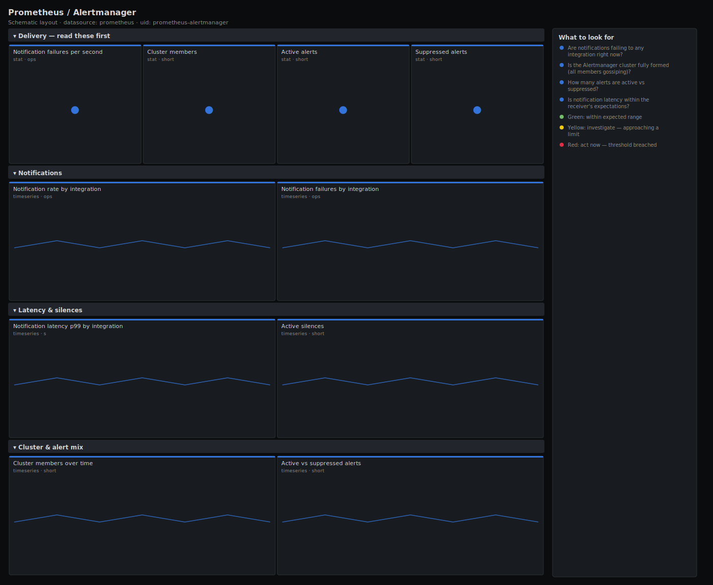

# Prometheus / Alertmanager

> Delivery health for Alertmanager: notification success vs failure, end-to-end notify latency, cluster gossip membership, active vs suppressed alerts and silences. Answers "if something pages tonight, will the notification actually get out?"

**Primary search phrase:** Alertmanager Grafana dashboard  
**Category:** `prometheus` · **UID:** `prometheus-alertmanager` · **Datasource:** Prometheus



## Questions this dashboard answers

- Are notifications failing to any integration right now?
- Is the Alertmanager cluster fully formed (all members gossiping)?
- How many alerts are active vs suppressed?
- Is notification latency within the receiver's expectations?
- How many silences are active, and could one be hiding a real alert?

## Production lessons — why this dashboard exists

The cruellest failure in monitoring is an alert that fires correctly and never reaches a human. We lead with notification failures and cluster membership because those are the two ways delivery breaks: a dead integration (bad token, receiver down) or a split-brain cluster that dedupes itself into silence. Active vs suppressed alerts and silence counts come next — a forgotten broad silence is the most common reason a real incident goes unpaged.

## Data source requirements

- **Prometheus** datasource (selected at import time via `${DS_PROMETHEUS}`).
- `alertmanager` exposing `/metrics` (the `alertmanager_alerts`, `alertmanager_notifications_total`, `alertmanager_notifications_failed_total`, `alertmanager_notification_latency_seconds_bucket`, `alertmanager_silences` and `alertmanager_cluster_members` series).

## Template variables

| Variable | Label | Type | Purpose |
|----------|-------|------|---------|
| `${job}` | Job | query | Scrape job for your Alertmanager targets. |
| `${instance}` | Instance | query | Alertmanager instance(s); keep All for clustered deployments. |

## Panels

### Delivery — read these first

- **Notification failures per second** (stat, `ops`) — Rate of failed notifications across all integrations. Anything sustained above zero means pages may not be landing.
- **Cluster members** (stat, `short`) — Peers visible in the gossip cluster. A drop below your replica count risks split-brain dedup.
- **Active alerts** (stat, `short`) — Alerts currently firing into Alertmanager.
- **Suppressed alerts** (stat, `short`) — Alerts held back by a silence or inhibition — a high count can mean a real alert is being masked.

### Notifications

- **Notification rate by integration** (timeseries, `ops`) — Successful notifications per second per receiver type — confirms the path is alive.
- **Notification failures by integration** (timeseries, `ops`) — Failures per second per receiver — pinpoints which channel (email, webhook, pager) is broken.

### Latency & silences

- **Notification latency p99 by integration** (timeseries, `s`) — End-to-end notify time at the 99th percentile — rising latency on a pager integration delays response.
- **Active silences** (timeseries, `short`) — Silences in effect — a sudden jump can explain why expected alerts went quiet.

### Cluster & alert mix

- **Cluster members over time** (timeseries, `short`) — Gossip membership trend — flapping here means peers can't reach each other and dedup is unreliable.
- **Active vs suppressed alerts** (timeseries, `short`) — The alert mix over time — a growing suppressed band warrants a silence audit.

## Import

**Grafana UI** — *Dashboards → New → Import*, upload `dashboards/prometheus/alertmanager.json`, then pick your datasource when prompted.

**API:**

```bash
scripts/import-dashboard.sh dashboards/prometheus/alertmanager.json
```

**Provisioning** — drop the JSON into a provisioned folder (see [provisioning guide](../../provisioning.md)).

## Recommended alerts

Ready-to-use rules ship in `alerts/prometheus.rules.yml`.

### AlertmanagerNotificationsFailing (`critical`)

```promql
rate(alertmanager_notifications_failed_total[5m]) > 0
```

- **Fires after:** `5m`
- **Why it matters:** A failing integration means alerts are firing but the notification never reaches the on-call — the worst kind of silent failure.
- **Investigate:** Open Prometheus / Alertmanager, find the failing integration, and check its credentials/endpoint and the Alertmanager log.
- **Recovery:** Clears when no failures occur for 5m on that integration.
- **False positives:** A brief provider outage can trip this; pair with a route that has a backup receiver.

### AlertmanagerClusterDegraded (`warning`)

```promql
alertmanager_cluster_members < 3
```

- **Fires after:** `10m`
- **Why it matters:** A shrunken gossip cluster risks duplicate or dropped notifications because peers can no longer coordinate dedup.
- **Investigate:** Check connectivity on the gossip port between peers and whether a replica crashed or was descheduled.
- **Recovery:** Clears when membership returns to the expected size for 5m.
- **False positives:** Non-clustered single-node deployments — disable this alert or set the threshold to 1.

### AlertmanagerNotificationLatencyHigh (`warning`)

```promql
histogram_quantile(0.99, sum by (le, integration) (rate(alertmanager_notification_latency_seconds_bucket[5m]))) > 10
```

- **Fires after:** `10m`
- **Why it matters:** Slow delivery delays human response and can cause Alertmanager to retry and duplicate notifications.
- **Investigate:** Check the downstream provider's response times and any rate-limiting on the integration.
- **Recovery:** Clears when p99 drops below 10s for 5m.
- **False positives:** Email/SMTP relays are inherently slower — set a higher threshold for those integrations.

## Troubleshooting

| Symptom | Likely cause | First action |
|---------|--------------|--------------|
| Cluster members shows 1 but you run an HA pair | Peers cannot reach each other on the gossip port, so each sees only itself. | Open the cluster port between nodes and confirm --cluster.peer addresses resolve. |
| No failures but alerts never arrive | A broad active silence or an inhibition rule is suppressing them. | Audit active silences and the suppressed-alerts panel; expire stale silences. |
| Latency histogram is empty | No notifications have been sent in the window, or the integration label is absent. | Trigger a test alert with amtool and widen the time range. |

## Performance considerations

Notification counters use 5m rates; latency uses a native histogram aggregated by `le` and `integration` only, keeping cardinality bounded. Alert-state panels read the `alertmanager_alerts` gauge directly, which is cheap regardless of fleet size.

## Customization

Set the cluster-member threshold to your replica count (default rule assumes 3). Raise the latency threshold for slow channels like email. For single-node setups, drop the cluster alert entirely and rely on the self-scrape up check instead.

## Related resources

- [Advanced observability guides](https://devopsaitoolkit.com/guides/)
- [Grafana & Prometheus tutorials](https://devopsaitoolkit.com/blog/)
- [AI Incident Response Assistant](https://devopsaitoolkit.com/dashboard/incident-response)
- [PromQL cookbook](../../../promql/README.md) · [Alerting guide](../../alerting.md) · [Dashboard catalog](../../catalog.md)
