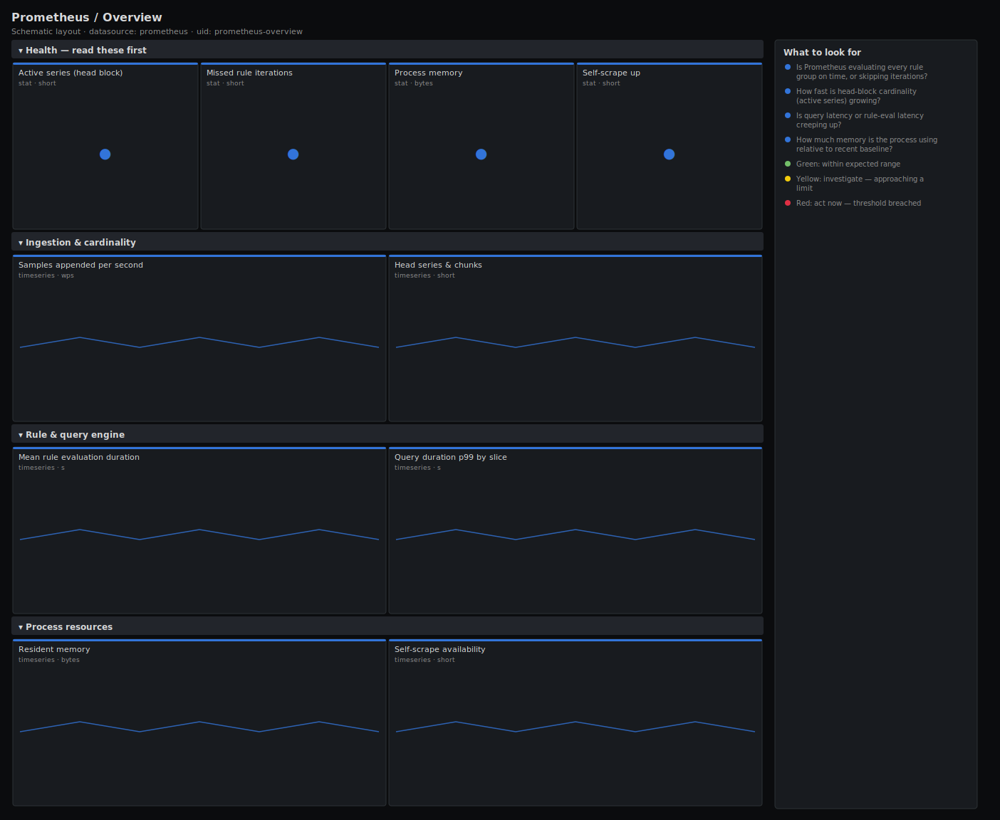

# Prometheus / Overview

> Headline health of a Prometheus server monitoring itself: head-block cardinality, sample ingestion, rule-engine timing, query latency and process memory. Answers "is the server that watches everything else keeping up?" before you trust any other dashboard it renders.

**Primary search phrase:** Prometheus self-monitoring Grafana dashboard  
**Category:** `prometheus` · **UID:** `prometheus-overview` · **Datasource:** Prometheus



## Questions this dashboard answers

- Is Prometheus evaluating every rule group on time, or skipping iterations?
- How fast is head-block cardinality (active series) growing?
- Is query latency or rule-eval latency creeping up?
- How much memory is the process using relative to recent baseline?
- Is Prometheus successfully scraping itself (the canary for everything else)?

## Production lessons — why this dashboard exists

A blind Prometheus is the worst kind of outage: dashboards stay green because nothing is updating them. The two signals that predict a meltdown are missed rule-group iterations (the engine is behind and alerts are now stale) and unbounded head-series growth (a cardinality bomb that ends in an OOM kill). We lead with those plus resident memory, then break out ingestion, rule and query timing. Average CPU tells you little here — the head block and the rule engine are what fall over first.

## Data source requirements

- **Prometheus** datasource (selected at import time via `${DS_PROMETHEUS}`).
- `prometheus` exposing its own `/metrics` (the `prometheus_tsdb_*`, `prometheus_rule_*`, `prometheus_engine_*` and `process_*` series).

## Template variables

| Variable | Label | Type | Purpose |
|----------|-------|------|---------|
| `${job}` | Job | query | Scrape job under which Prometheus scrapes itself. |
| `${instance}` | Instance | query | Prometheus server instance(s); supports multi-select for HA pairs. |

## Panels

### Health — read these first

- **Active series (head block)** (stat, `short`) — Distinct time series held in the in-memory head block — the primary cardinality and memory driver.
- **Missed rule iterations** (stat, `short`) — Rule-group evaluations skipped because the engine ran behind. Anything sustained above zero means alerts are now stale.
- **Process memory** (stat, `bytes`) — Resident set size of the Prometheus process — compare to recent baseline; a steady climb tracks cardinality.
- **Self-scrape up** (stat, `short`) — Whether Prometheus is currently scraping its own target — the canary for the entire pipeline.

### Ingestion & cardinality

- **Samples appended per second** (timeseries, `wps`) — Rate of samples written into the head block — your effective ingestion throughput.
- **Head series & chunks** (timeseries, `short`) — In-memory series and chunks over time — a steep, monotonic climb signals a cardinality leak.

### Rule & query engine

- **Mean rule evaluation duration** (timeseries, `s`) — Average wall-clock per rule evaluation. When this approaches the group interval, iterations start getting missed.
- **Query duration p99 by slice** (timeseries, `s`) — 99th-percentile PromQL engine timing per execution slice — rising inner_eval points at expensive queries or dashboards.

### Process resources

- **Resident memory** (timeseries, `bytes`) — Process RSS trend — the line that precedes an OOM kill on a cardinality runaway.
- **Self-scrape availability** (timeseries, `short`) — up for the Prometheus self-target — gaps here mean the server lost sight of itself.

## Import

**Grafana UI** — *Dashboards → New → Import*, upload `dashboards/prometheus/overview.json`, then pick your datasource when prompted.

**API:**

```bash
scripts/import-dashboard.sh dashboards/prometheus/overview.json
```

**Provisioning** — drop the JSON into a provisioned folder (see [provisioning guide](../../provisioning.md)).

## Recommended alerts

Ready-to-use rules ship in `alerts/prometheus.rules.yml`.

### PrometheusRuleEvaluationsMissed (`critical`)

```promql
increase(prometheus_rule_group_iterations_missed_total[5m]) > 0
```

- **Fires after:** `10m`
- **Why it matters:** Missed iterations mean alerting and recording rules are not evaluating on schedule, so alerts can be silently late or stale.
- **Investigate:** Open Prometheus / Overview, check mean rule evaluation duration vs the group interval and head-series growth.
- **Recovery:** Clears when no iterations are missed for 5m.
- **False positives:** A one-off spike during reload or a slow restart can miss a single iteration — the 10m for filters that out.

### PrometheusHeadSeriesHigh (`warning`)

```promql
sum by (instance, job) (prometheus_tsdb_head_series) > 5000000
```

- **Fires after:** `30m`
- **Why it matters:** Head cardinality drives memory; unbounded growth ends in an OOM kill that takes down all monitoring.
- **Investigate:** Find the offending metric with topk on series count by __name__; identify a recently added high-cardinality label.
- **Recovery:** Clears when head series drops back below 5M for 5m.
- **False positives:** Large but healthy installations — tune the threshold to your provisioned memory.

### PrometheusSelfScrapeDown (`critical`)

```promql
up{job=~".*prometheus.*"} == 0
```

- **Fires after:** `5m`
- **Why it matters:** If Prometheus cannot scrape its own metrics, its self-health is invisible and the process may be wedged.
- **Investigate:** Check the process is running and the self-scrape target's endpoint is reachable from the server.
- **Recovery:** Clears when the self-scrape returns up for 5m.
- **False positives:** Planned restarts and config reloads cause brief gaps — covered by the 5m for.

## Troubleshooting

| Symptom | Likely cause | First action |
|---------|--------------|--------------|
| All panels show "No data" | Prometheus is not scraping its own /metrics, or $job does not match. | Check `up{job="$job"}` in Explore and confirm a self-scrape job exists. |
| Missed iterations climbing but eval duration looks fine | A few heavy groups dominate while the average stays low. | Break out duration per rule group and split or thin the slow groups. |
| Memory climbs but series count is flat | Long query/range load or churn (high series turnover) rather than raw cardinality. | Check query duration p99 and head chunk churn; throttle expensive dashboards. |

## Performance considerations

All rates use a 5m window (>=4x a typical scrape) so counters survive a restart. Aggregations use `sum by (instance)` to keep one series per server. The query p99 panel reads the engine summary directly rather than a histogram, so it adds no quantile computation cost.

## Customization

Tune the 5M head-series and 8/16 GiB memory thresholds to your provisioned capacity. For HA pairs, leave `$instance` on All to compare both replicas side by side. Swap the 5m rate window for 1m if you need faster reaction at the cost of more noise.

## Related resources

- [Advanced observability guides](https://devopsaitoolkit.com/guides/)
- [Grafana & Prometheus tutorials](https://devopsaitoolkit.com/blog/)
- [AI Incident Response Assistant](https://devopsaitoolkit.com/dashboard/incident-response)
- [PromQL cookbook](../../../promql/README.md) · [Alerting guide](../../alerting.md) · [Dashboard catalog](../../catalog.md)
