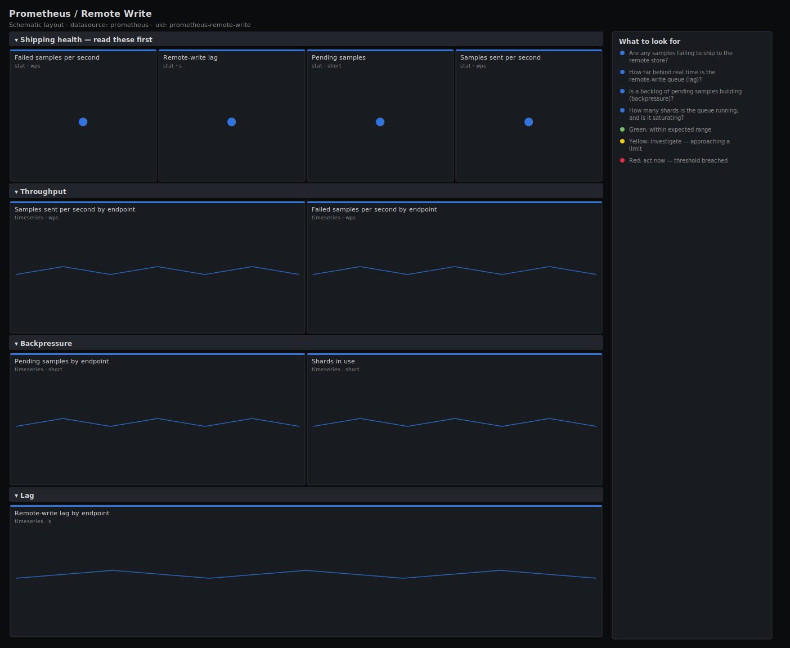

# Prometheus / Remote Write

> Health of Prometheus remote_write to a long-term store: samples sent vs failed, pending backlog, shard count and how far behind the queue has fallen. Answers "is my data reaching long-term storage, and how stale is it?"

**Primary search phrase:** Prometheus remote write Grafana dashboard  
**Category:** `prometheus` · **UID:** `prometheus-remote-write` · **Datasource:** Prometheus



## Questions this dashboard answers

- Are any samples failing to ship to the remote store?
- How far behind real time is the remote-write queue (lag)?
- Is a backlog of pending samples building (backpressure)?
- How many shards is the queue running, and is it saturating?
- Which remote endpoint is the bottleneck?

## Production lessons — why this dashboard exists

Remote_write fails quietly: local Prometheus stays healthy while long-term storage silently falls hours behind or drops samples, and you only notice when a historical query returns a gap. The two signals that catch it are failed samples (data being dropped outright) and lag — the difference between the newest sample Prometheus has and the newest it has confirmed shipped. Pending samples and shard count explain *why*: a slow or rate-limited endpoint forces the queue to buffer and fan out shards until it either catches up or blows its memory budget.

## Data source requirements

- **Prometheus** datasource (selected at import time via `${DS_PROMETHEUS}`).
- `prometheus` with a `remote_write` config, exposing the `prometheus_remote_storage_*` series (samples, failures, pending, shards and the highest-timestamp gauges).

## Template variables

| Variable | Label | Type | Purpose |
|----------|-------|------|---------|
| `${job}` | Job | query | Scrape job for the Prometheus doing remote_write. |
| `${instance}` | Instance | query | Prometheus instance(s). |

## Panels

### Shipping health — read these first

- **Failed samples per second** (stat, `wps`) — Samples rejected by the remote endpoint and dropped. Any sustained value is permanent data loss.
- **Remote-write lag** (stat, `s`) — Seconds between the newest local sample and the newest one confirmed shipped — your effective staleness in long-term storage.
- **Pending samples** (stat, `short`) — Samples buffered in the queue waiting to ship — a rising backlog is backpressure from a slow endpoint.
- **Samples sent per second** (stat, `wps`) — Throughput to the remote store — should track local ingestion when healthy.

### Throughput

- **Samples sent per second by endpoint** (timeseries, `wps`) — Per-remote shipping rate — split helps when you fan out to several stores.
- **Failed samples per second by endpoint** (timeseries, `wps`) — Per-remote drop rate — isolates which store is rejecting writes.

### Backpressure

- **Pending samples by endpoint** (timeseries, `short`) — Queue backlog per remote — a sawtooth is healthy catch-up; a steady climb is a losing battle.
- **Shards in use** (timeseries, `short`) — Active queue shards per remote — the queue scales these up to push harder; pinned at max means it cannot keep up.

### Lag

- **Remote-write lag by endpoint** (timeseries, `s`) — Per-remote staleness in seconds — the single most important SLO for long-term storage freshness.

## Import

**Grafana UI** — *Dashboards → New → Import*, upload `dashboards/prometheus/remote-write.json`, then pick your datasource when prompted.

**API:**

```bash
scripts/import-dashboard.sh dashboards/prometheus/remote-write.json
```

**Provisioning** — drop the JSON into a provisioned folder (see [provisioning guide](../../provisioning.md)).

## Recommended alerts

Ready-to-use rules ship in `alerts/prometheus.rules.yml`.

### RemoteWriteFailingSamples (`critical`)

```promql
rate(prometheus_remote_storage_samples_failed_total[5m]) > 0
```

- **Fires after:** `10m`
- **Why it matters:** Failed samples are dropped permanently, leaving gaps in long-term storage that no retry will fill.
- **Investigate:** Open Prometheus / Remote Write, isolate the failing endpoint, and check the remote store's logs for 4xx/5xx.
- **Recovery:** Clears when no samples fail for 5m.
- **False positives:** A brief remote outage trips this; retries recover pending samples but not already-failed ones.

### RemoteWriteLagHigh (`warning`)

```promql
prometheus_remote_storage_highest_timestamp_in_seconds - ignoring(remote_name, url) group_right prometheus_remote_storage_queue_highest_sent_timestamp_seconds > 120
```

- **Fires after:** `15m`
- **Why it matters:** Lagging remote_write means recent data is missing from long-term storage, so dashboards and alerts on that store are stale.
- **Investigate:** Check pending samples and shard count for the same endpoint, and the remote store's ingest latency.
- **Recovery:** Clears when lag falls below 120s for 5m.
- **False positives:** A large initial backfill after a restart shows transient lag that self-resolves.

### RemoteWriteBacklogGrowing (`warning`)

```promql
prometheus_remote_storage_samples_pending > 1000000
```

- **Fires after:** `15m`
- **Why it matters:** A growing pending queue is backpressure that consumes memory and ends in dropped samples if it cannot drain.
- **Investigate:** Confirm whether shards are pinned at max and whether the remote endpoint latency is rising.
- **Recovery:** Clears when pending samples drain below 1M for 5m.
- **False positives:** Catch-up after an endpoint outage temporarily inflates the backlog.

## Troubleshooting

| Symptom | Likely cause | First action |
|---------|--------------|--------------|
| Lag panel is negative or empty | Clock skew between Prometheus and the metric scrape, or no samples sent yet. | Verify NTP on the Prometheus host; confirm remote_write is actually configured and active. |
| Sent rate is zero but no failures | remote_write is disabled or the queue has no data because local ingestion stopped. | Check the remote_write config block and local samples-appended rate. |
| Shards pinned at max with rising pending | The remote endpoint cannot absorb the write rate. | Scale the remote store or reduce series volume; raise max_shards only if the store has headroom. |

## Performance considerations

Throughput and failure panels use 5m rates so they survive restarts. The lag expression subtracts two highest-timestamp gauges with `ignoring(remote_name, url)` matching, which keeps the join cheap and one series per endpoint. Pending and shard panels read gauges directly.

## Customization

Tune the 120s lag and 1M pending thresholds to your freshness SLO and the Prometheus memory budget. When fanning out to multiple stores, the per-endpoint panels already separate them by `remote_name`; scope `$instance` to one server when chasing a single replica's backlog.

## Related resources

- [Advanced observability guides](https://devopsaitoolkit.com/guides/)
- [Grafana & Prometheus tutorials](https://devopsaitoolkit.com/blog/)
- [AI Incident Response Assistant](https://devopsaitoolkit.com/dashboard/incident-response)
- [PromQL cookbook](../../../promql/README.md) · [Alerting guide](../../alerting.md) · [Dashboard catalog](../../catalog.md)
