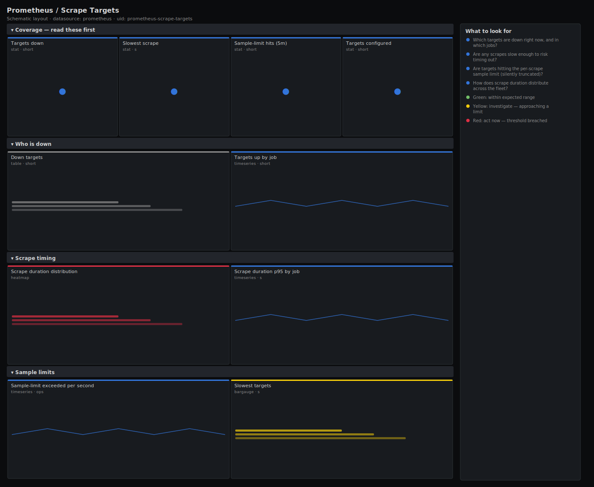

# Prometheus / Scrape Targets

> Scrape-side health for a Prometheus server: which targets are down, how long scrapes take, and which jobs are hitting sample limits. Answers "is my monitoring data complete, or am I blind to part of the fleet?"

**Primary search phrase:** Prometheus scrape targets Grafana dashboard  
**Category:** `prometheus` · **UID:** `prometheus-scrape-targets` · **Datasource:** Prometheus



## Questions this dashboard answers

- Which targets are down right now, and in which jobs?
- Are any scrapes slow enough to risk timing out?
- Are targets hitting the per-scrape sample limit (silently truncated)?
- How does scrape duration distribute across the fleet?
- Which job has the most missing targets?

## Production lessons — why this dashboard exists

A down target is not just one missing host — it is a hole in every dashboard and alert that depends on it, and Prometheus will happily stay green while you fly blind. The two signals that catch this early are targets reporting up == 0 and scrape durations creeping toward the scrape timeout. Sample-limit truncation is the sneakiest failure: the target is up, the scrape succeeds, but series past the limit are dropped, so panels look fine while data is quietly incomplete.

## Data source requirements

- **Prometheus** datasource (selected at import time via `${DS_PROMETHEUS}`).
- `prometheus` and the `up`, `scrape_duration_seconds`, `prometheus_target_scrape_pool_targets` and `prometheus_target_scrapes_exceeded_sample_limit_total` series it exposes.

## Template variables

| Variable | Label | Type | Purpose |
|----------|-------|------|---------|
| `${job}` | Job | query | Scrape job to inspect; All shows every job. |

## Panels

### Coverage — read these first

- **Targets down** (stat, `short`) — Count of selected targets currently reporting up == 0. Anything above zero is a hole in your visibility.
- **Slowest scrape** (stat, `s`) — Longest current scrape duration across selected targets — compare to your scrape_timeout.
- **Sample-limit hits (5m)** (stat, `short`) — Scrapes truncated by the per-target sample limit in the last 5m — data is silently incomplete.
- **Targets configured** (stat, `short`) — Total targets across the selected scrape pools.

### Who is down

- **Down targets** (table, `short`) — Every target currently failing its scrape — start here in an incident.
- **Targets up by job** (timeseries, `short`) — Count of healthy targets per job over time — a step down marks the moment coverage dropped.

### Scrape timing

- **Scrape duration distribution** (heatmap, `s`) — How scrape durations spread across the fleet — a fattening right tail warns of impending timeouts.
- **Scrape duration p95 by job** (timeseries, `s`) — 95th-percentile scrape time per job — the line that creeps toward scrape_timeout.

### Sample limits

- **Sample-limit exceeded per second** (timeseries, `ops`) — Rate of truncated scrapes — every increment is series being dropped from a healthy-looking target.
- **Slowest targets** (bargauge, `s`) — Top scrape durations right now — the targets most at risk of timing out.

## Import

**Grafana UI** — *Dashboards → New → Import*, upload `dashboards/prometheus/scrape-targets.json`, then pick your datasource when prompted.

**API:**

```bash
scripts/import-dashboard.sh dashboards/prometheus/scrape-targets.json
```

**Provisioning** — drop the JSON into a provisioned folder (see [provisioning guide](../../provisioning.md)).

## Recommended alerts

Ready-to-use rules ship in `alerts/prometheus.rules.yml`.

### PrometheusTargetDown (`critical`)

```promql
up == 0
```

- **Fires after:** `5m`
- **Why it matters:** A down target leaves a gap in every dashboard and alert that depends on it, and Prometheus stays green while you go blind.
- **Investigate:** Open Prometheus / Scrape Targets, find the target in the down table, then check reachability and the exporter on that host.
- **Recovery:** Clears when the target reports up for 5m.
- **False positives:** Rolling deploys and autoscaling churn cause brief down states — covered by the 5m for, or use absent-style alerts for ephemeral targets.

### PrometheusScrapeSampleLimitExceeded (`warning`)

```promql
increase(prometheus_target_scrapes_exceeded_sample_limit_total[10m]) > 0
```

- **Fires after:** `10m`
- **Why it matters:** Truncated scrapes drop series silently — the target looks healthy but its data is incomplete.
- **Investigate:** Identify the high-cardinality metric on the target; check whether a recent change added a label.
- **Recovery:** Clears when no scrapes are truncated for 10m.
- **False positives:** A deliberately raised limit during onboarding can still trip this until the limit is updated.

### PrometheusScrapeSlow (`warning`)

```promql
scrape_duration_seconds > 5
```

- **Fires after:** `10m`
- **Why it matters:** A scrape approaching the timeout will eventually fail outright and the target will flap up/down.
- **Investigate:** Check the exporter's own load and the number of series it exposes; look for a slow collector.
- **Recovery:** Clears when scrape duration drops below 5s for 5m.
- **False positives:** Very large exporters (kube-state-metrics, cAdvisor) are legitimately slow — scope the rule per job.

## Troubleshooting

| Symptom | Likely cause | First action |
|---------|--------------|--------------|
| Down table is empty but you expect a failure | The target was dropped from service discovery, so there is no up series to be zero. | Check the Targets page in the Prometheus UI for dropped/absent targets. |
| p95 scrape duration panel is blank | Only one target per job, so the quantile collapses, or no data in the window. | Use the heatmap or the slowest-targets bargauge instead for single-target jobs. |
| Sample-limit counter rising with no obvious metric | A relabel rule is multiplying series via a high-cardinality label. | Inspect the raw scrape with `curl` and count series by name. |

## Performance considerations

Counter panels use 5m rates; the down table and bargauge are instant queries so they reflect the current scrape cycle. The heatmap calculates buckets from the raw gauge in Grafana rather than a server-side histogram, which is cheap for fleets up to a few thousand targets — above that, prefer a recording rule.

## Customization

Tune the 5s slow-scrape and 2s warn thresholds to your scrape_timeout. Scope `$job` to a tier to cut noise. For ephemeral targets (CI runners, autoscaled pods) replace the up == 0 alert with an absent()-based check to avoid flapping.

## Related resources

- [Advanced observability guides](https://devopsaitoolkit.com/guides/)
- [Grafana & Prometheus tutorials](https://devopsaitoolkit.com/blog/)
- [AI Incident Response Assistant](https://devopsaitoolkit.com/dashboard/incident-response)
- [PromQL cookbook](../../../promql/README.md) · [Alerting guide](../../alerting.md) · [Dashboard catalog](../../catalog.md)
