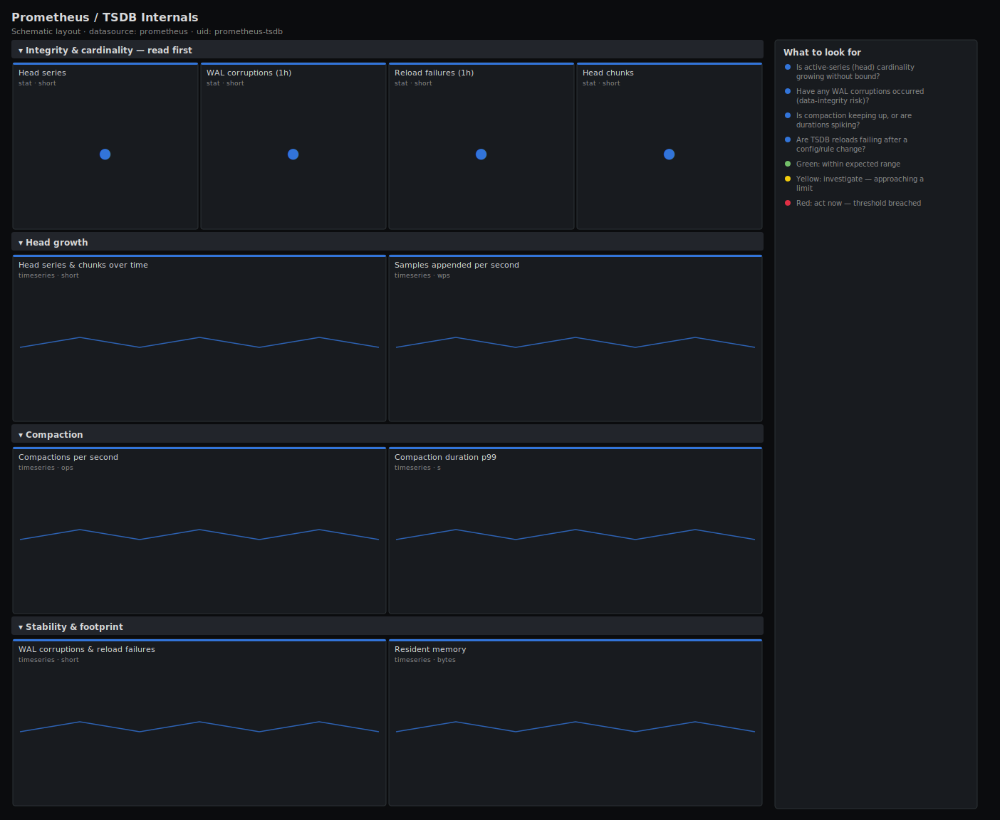

# Prometheus / TSDB Internals

> The storage engine under Prometheus: head-block cardinality growth, block compaction timing and rate, WAL corruptions, reload failures and on-disk footprint. Answers "is the time-series database healthy, or about to fall over?"

**Primary search phrase:** Prometheus TSDB Grafana dashboard  
**Category:** `prometheus` · **UID:** `prometheus-tsdb` · **Datasource:** Prometheus



## Questions this dashboard answers

- Is active-series (head) cardinality growing without bound?
- Have any WAL corruptions occurred (data-integrity risk)?
- Is compaction keeping up, or are durations spiking?
- Are TSDB reloads failing after a config/rule change?
- How much resident memory is the storage engine consuming?

## Production lessons — why this dashboard exists

TSDB problems are quiet until they are catastrophic. A WAL corruption can cost you the unflushed head on the next restart, and a cardinality runaway ends in an OOM kill — both invisible on a request-rate dashboard. We lead with cardinality growth and WAL corruptions because those are the two failure modes that lose data, then cover compaction (the background job that bounds disk and query cost) and reload failures (the silent reason a new rule never took effect).

## Data source requirements

- **Prometheus** datasource (selected at import time via `${DS_PROMETHEUS}`).
- `prometheus` exposing its own `/metrics` (the `prometheus_tsdb_*` and `process_*` series).

## Template variables

| Variable | Label | Type | Purpose |
|----------|-------|------|---------|
| `${job}` | Job | query | Scrape job under which Prometheus scrapes itself. |
| `${instance}` | Instance | query | Prometheus server instance(s). |

## Panels

### Integrity & cardinality — read first

- **Head series** (stat, `short`) — Active in-memory series. Watch the trend, not the absolute — sustained growth is a cardinality leak.
- **WAL corruptions (1h)** (stat, `short`) — Write-ahead-log corruptions detected in the last hour. Any non-zero value is a data-integrity incident.
- **Reload failures (1h)** (stat, `short`) — Failed TSDB reloads in the last hour — a new config or rule set may not have applied.
- **Head chunks** (stat, `short`) — In-memory chunks held by the head block — tracks alongside series and memory.

### Head growth

- **Head series & chunks over time** (timeseries, `short`) — The shape that matters — a straight diagonal line is a leak; a sawtooth is healthy compaction.
- **Samples appended per second** (timeseries, `wps`) — Head ingestion throughput — a step change here usually explains a step change in series.

### Compaction

- **Compactions per second** (timeseries, `ops`) — Rate of completed block compactions — the background job that bounds query cost and disk.
- **Compaction duration p99** (timeseries, `s`) — 99th-percentile compaction wall-clock. Spikes mean larger blocks or I/O pressure and can stall the head.

### Stability & footprint

- **WAL corruptions & reload failures** (timeseries, `short`) — Cumulative integrity events — any upward step is worth a page.
- **Resident memory** (timeseries, `bytes`) — Process RSS — the storage engine is the dominant consumer, so this tracks head cardinality closely.

## Import

**Grafana UI** — *Dashboards → New → Import*, upload `dashboards/prometheus/tsdb.json`, then pick your datasource when prompted.

**API:**

```bash
scripts/import-dashboard.sh dashboards/prometheus/tsdb.json
```

**Provisioning** — drop the JSON into a provisioned folder (see [provisioning guide](../../provisioning.md)).

## Recommended alerts

Ready-to-use rules ship in `alerts/prometheus.rules.yml`.

### PrometheusWALCorruption (`critical`)

```promql
increase(prometheus_tsdb_wal_corruptions_total[10m]) > 0
```

- **Fires after:** `1m`
- **Why it matters:** A corrupt write-ahead log risks losing the unflushed head block on the next restart — silent data loss.
- **Investigate:** Check disk health and free space on the data volume; review recent OOMs or unclean shutdowns in the logs.
- **Recovery:** Fires once per detection; acknowledge after confirming storage is healthy.
- **False positives:** Effectively none — treat every corruption as real.

### PrometheusTSDBReloadFailing (`warning`)

```promql
increase(prometheus_tsdb_reloads_failures_total[10m]) > 0
```

- **Fires after:** `5m`
- **Why it matters:** A failed reload means a recent config or block change did not take effect, so the server may be running stale state.
- **Investigate:** Check the Prometheus log around the reload time and verify free disk on the data volume.
- **Recovery:** Clears when no reload failures occur for 5m.
- **False positives:** A transient disk-full that self-resolves can trip this briefly.

### PrometheusHeadCardinalityGrowing (`warning`)

```promql
deriv(prometheus_tsdb_head_series[30m]) > 1000
```

- **Fires after:** `30m`
- **Why it matters:** Sustained linear growth in active series is the classic cardinality bomb that ends in an OOM kill.
- **Investigate:** Use topk by __name__ on series count to find the metric and the newly added high-cardinality label.
- **Recovery:** Clears when the growth slope flattens for 5m.
- **False positives:** Legitimate onboarding of new targets causes temporary growth — confirm against a deploy.

## Troubleshooting

| Symptom | Likely cause | First action |
|---------|--------------|--------------|
| Compaction duration p99 is empty | No compactions have completed in the window, or the bucket metric is filtered out. | Widen the time range; confirm the server has been up long enough to compact a block. |
| Head series sawtooths instead of climbing | This is healthy — the head truncates to disk on each compaction cycle. | No action; watch the floor of the sawtooth for the real baseline. |
| Reload failures with no config change | Disk full or permission error on the data directory during background reload. | Free space / fix permissions on the TSDB volume and reload. |

## Performance considerations

Counter panels use 5m rates so they survive restarts; the compaction p99 reads a native histogram bucket aggregated by `le` only, keeping series count flat. WAL and reload panels use raw counters so a single increment is unmistakable.

## Customization

Adjust the 5M head-series and per-second growth thresholds to your provisioned memory and ingestion profile. On multi-server setups keep `$instance` on All to compare replicas; scope to one instance when chasing a specific OOM.

## Related resources

- [Advanced observability guides](https://devopsaitoolkit.com/guides/)
- [Grafana & Prometheus tutorials](https://devopsaitoolkit.com/blog/)
- [AI Incident Response Assistant](https://devopsaitoolkit.com/dashboard/incident-response)
- [PromQL cookbook](../../../promql/README.md) · [Alerting guide](../../alerting.md) · [Dashboard catalog](../../catalog.md)
