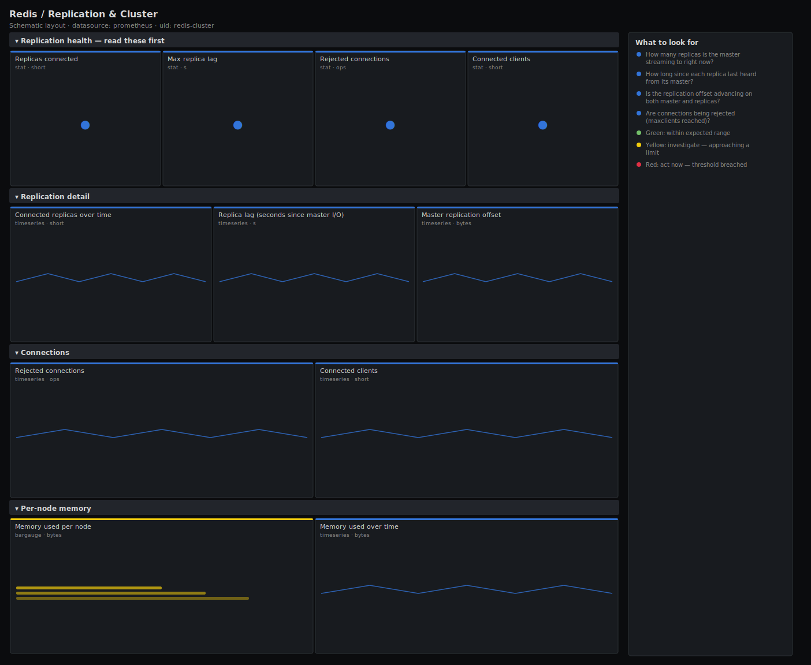

# Redis / Replication & Cluster

> Replication and topology health for Redis via redis_exporter: connected replicas, the master replication offset, replica lag measured as seconds since last master contact, rejected connections, and per-node memory. Answers "are my replicas attached and current, and would a failover lose data?".

**Primary search phrase:** Redis replication Grafana dashboard  
**Category:** `redis` · **UID:** `redis-cluster` · **Datasource:** Prometheus



## Questions this dashboard answers

- How many replicas is the master streaming to right now?
- How long since each replica last heard from its master?
- Is the replication offset advancing on both master and replicas?
- Are connections being rejected (maxclients reached)?
- How is memory distributed across the nodes?

## Production lessons — why this dashboard exists

Redis replication is asynchronous, so a replica can silently fall behind or detach and you only discover it during a failover that loses the un-replicated tail of writes. This dashboard leads with the **connected-replica count** (a drop is a detached replica that no longer protects you) and **seconds since last master contact** (the replica's freshness — Sentinel and Cluster failover decisions hinge on it). Watch **rejected connections** too: under a connection storm Redis hits maxclients and starts refusing clients, which looks like an application bug but is really a topology limit.

## Data source requirements

- **Prometheus** datasource (selected at import time via `${DS_PROMETHEUS}`).
- `redis_exporter` on every node (the `redis_connected_slaves`, `redis_master_repl_offset`, `redis_master_last_io_seconds_ago`, `redis_rejected_connections_total`, `redis_connected_clients` and `redis_memory_used_bytes` series).

## Template variables

| Variable | Label | Type | Purpose |
|----------|-------|------|---------|
| `${instance}` | Instance | query | Redis node(s) to display; supports multi-select. |

## Panels

### Replication health — read these first

- **Replicas connected** (stat, `short`) — Replicas the master is currently streaming to. A drop means a replica detached.
- **Max replica lag** (stat, `s`) — Longest time any replica has gone without contact from its master, in seconds.
- **Rejected connections** (stat, `ops`) — Connections refused per second because maxclients was reached.
- **Connected clients** (stat, `short`) — Total open client connections across the selected nodes.

### Replication detail

- **Connected replicas over time** (timeseries, `short`) — Replica count per master node. A step down marks the moment a replica detached.
- **Replica lag (seconds since master I/O)** (timeseries, `s`) — How fresh each replica is. A sustained climb means the replica lost its link to the master.
- **Master replication offset** (timeseries, `bytes`) — The replication stream position. It must keep advancing on master and replicas alike.

### Connections

- **Rejected connections** (timeseries, `ops`) — Connections refused per second. Above zero means the node hit maxclients.
- **Connected clients** (timeseries, `short`) — Open client connections per node. Compare against maxclients to find the node under pressure.

### Per-node memory

- **Memory used per node** (bargauge, `bytes`) — Memory consumed on each node — spot an unbalanced shard or a replica drifting from its master.
- **Memory used over time** (timeseries, `bytes`) — Per-node memory trend. Master and its replicas should track closely; divergence signals a sync problem.

## Import

**Grafana UI** — *Dashboards → New → Import*, upload `dashboards/redis/cluster.json`, then pick your datasource when prompted.

**API:**

```bash
scripts/import-dashboard.sh dashboards/redis/cluster.json
```

**Provisioning** — drop the JSON into a provisioned folder (see [provisioning guide](../../provisioning.md)).

## Recommended alerts

Ready-to-use rules ship in `alerts/redis.rules.yml`.

### RedisNoConnectedReplicas (`warning`)

```promql
redis_connected_slaves == 0
```

- **Fires after:** `5m`
- **Why it matters:** With zero replicas there is no failover target — the node is a single point of failure for its data.
- **Investigate:** Check the replicas' replication state and the master's client list; look for a network or auth break.
- **Recovery:** Clears once at least one replica reconnects.
- **False positives:** Standalone instances with no replicas by design — scope this rule to masters that should have them.

### RedisReplicaLagHigh (`warning`)

```promql
redis_master_last_io_seconds_ago > 10
```

- **Fires after:** `5m`
- **Why it matters:** A replica that has not heard from its master in seconds is stale and may be dropped or trigger a failover.
- **Investigate:** Check the network between replica and master, master load, and whether the replication link broke.
- **Recovery:** Clears when last-I/O age drops below 10s for 5m.
- **False positives:** A brief gap during a planned failover or master restart.

### RedisRejectedConnections (`warning`)

```promql
sum by (instance) (rate(redis_rejected_connections_total[5m])) > 0
```

- **Fires after:** `5m`
- **Why it matters:** The node hit its maxclients limit and is refusing new clients, surfacing as connection errors in the application.
- **Investigate:** Check connected_clients against maxclients and look for a client leak or a missing connection pool.
- **Recovery:** Clears when rejected connections stop for 5m.
- **False positives:** A short connection storm during a deploy can trip this briefly.

## Troubleshooting

| Symptom | Likely cause | First action |
|---------|--------------|--------------|
| Replica-lag panel is empty on the master | redis_master_last_io_seconds_ago is reported by replicas, not the master. | Include the replica nodes in `$instance`; the master will not export this series. |
| Connected-replicas count is 0 on a known master | The replicas have detached, or the exporter is scraping a replica (which reports its own slave count). | Scrape the master and confirm replicas with REPLICAOF pointed at it. |
| Replication offset is flat | No writes are flowing, or the replication link is broken. | Confirm writes on the master; a flat offset under active writes means replication has stalled. |

## Performance considerations

Counter panels use a 5m rate window so restarts never spike them. Replica count, lag and offset read instantaneous gauges, so the dashboard stays cheap regardless of how many nodes are in the topology.

## Customization

Set the 5s/10s lag thresholds to your failover sensitivity, and adjust the connected-replica threshold to your expected replica count per master. For Cluster mode, add the shard label to the legends so each shard's master and replicas group together.

## Related resources

- [Advanced observability guides](https://devopsaitoolkit.com/guides/)
- [Grafana & Prometheus tutorials](https://devopsaitoolkit.com/blog/)
- [AI Incident Response Assistant](https://devopsaitoolkit.com/dashboard/incident-response)
- [PromQL cookbook](../../../promql/README.md) · [Alerting guide](../../alerting.md) · [Dashboard catalog](../../catalog.md)
