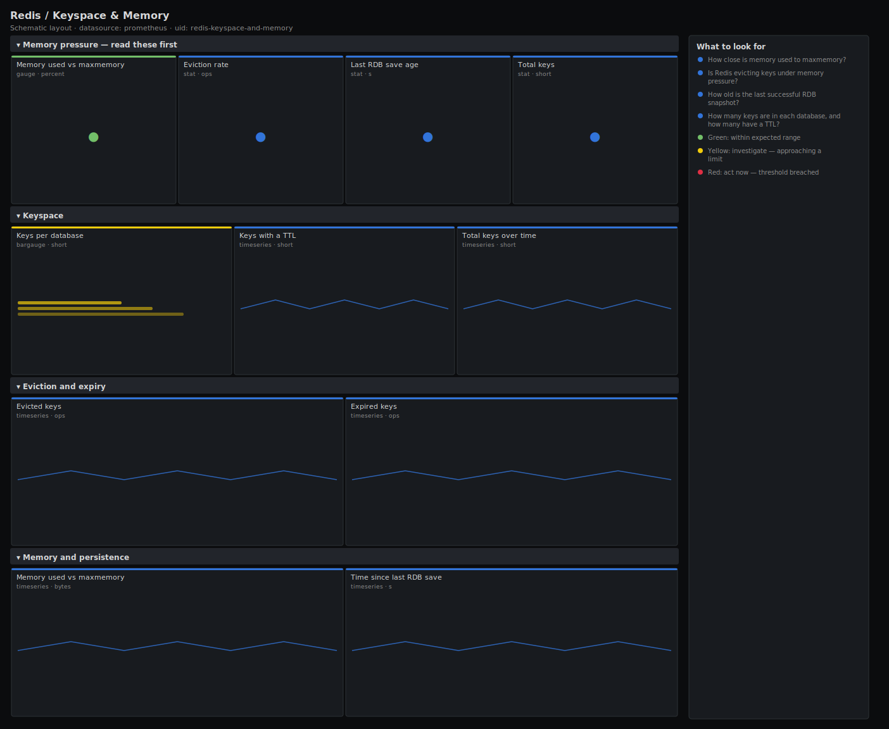

# Redis / Keyspace & Memory

> Keyspace and memory detail for Redis via redis_exporter: keys per database, keys with a TTL, eviction and expiration rates, memory used against maxmemory, and the age of the last RDB save. Answers "where is the memory going, is Redis evicting, and is my last snapshot recent enough?".

**Primary search phrase:** Redis memory Grafana dashboard  
**Category:** `redis` · **UID:** `redis-keyspace-and-memory` · **Datasource:** Prometheus



## Questions this dashboard answers

- How close is memory used to maxmemory?
- Is Redis evicting keys under memory pressure?
- How old is the last successful RDB snapshot?
- How many keys are in each database, and how many have a TTL?
- Are keys expiring at the expected rate?

## Production lessons — why this dashboard exists

Two slow-burn Redis failures hide in the keyspace. The first is **unbounded growth**: keys written without a TTL accumulate until memory crosses maxmemory and evictions begin — the ratio of keys-with-a-TTL to total keys is the early warning. The second is **stale persistence**: if RDB saves stop (disk full, fork failure, save disabled) the data looks fine in RAM but a restart loses everything since the last snapshot, so this dashboard leads with the **age of the last save**. Evictions above zero are never silent-safe — every evicted key is a downstream cache miss hitting your database.

## Data source requirements

- **Prometheus** datasource (selected at import time via `${DS_PROMETHEUS}`).
- `redis_exporter` with keyspace stats (the `redis_db_keys`, `redis_db_keys_expiring`, `redis_evicted_keys_total`, `redis_expired_keys_total`, `redis_memory_used_bytes`, `redis_memory_max_bytes` and `redis_rdb_last_save_timestamp_seconds` series).

## Template variables

| Variable | Label | Type | Purpose |
|----------|-------|------|---------|
| `${instance}` | Instance | query | Redis instance(s) to display; supports multi-select. |
| `${db}` | Database | query | Redis logical database(s) for the per-db key panels. |

## Panels

### Memory pressure — read these first

- **Memory used vs maxmemory** (gauge, `percent`) — Worst instance's memory as a percentage of maxmemory. Meaningless when maxmemory is 0 (unlimited).
- **Eviction rate** (stat, `ops`) — Keys evicted per second under memory pressure. Any sustained rate means you are over maxmemory.
- **Last RDB save age** (stat, `s`) — Time since the last successful RDB snapshot. A growing value means persistence has stalled.
- **Total keys** (stat, `short`) — Total keys across the selected instances and databases.

### Keyspace

- **Keys per database** (bargauge, `short`) — Key count in each logical database — find where the keyspace actually lives.
- **Keys with a TTL** (timeseries, `short`) — Keys carrying an expiry per database. A flat line while total keys grow means TTLs are missing.
- **Total keys over time** (timeseries, `short`) — Keyspace size trend. A monotonic climb without expirations is the unbounded-growth pattern.

### Eviction and expiry

- **Evicted keys** (timeseries, `ops`) — Keys removed because Redis hit maxmemory. Each one is a downstream cache miss.
- **Expired keys** (timeseries, `ops`) — Keys removed by TTL expiry. Healthy and expected — this is the keyspace self-pruning.

### Memory and persistence

- **Memory used vs maxmemory** (timeseries, `bytes`) — Memory consumed against the configured ceiling per instance. The gap before eviction.
- **Time since last RDB save** (timeseries, `s`) — Age of the most recent snapshot per instance. A staircase that keeps climbing means saves are failing.

## Import

**Grafana UI** — *Dashboards → New → Import*, upload `dashboards/redis/keyspace-and-memory.json`, then pick your datasource when prompted.

**API:**

```bash
scripts/import-dashboard.sh dashboards/redis/keyspace-and-memory.json
```

**Provisioning** — drop the JSON into a provisioned folder (see [provisioning guide](../../provisioning.md)).

## Recommended alerts

Ready-to-use rules ship in `alerts/redis.rules.yml`.

### RedisEvictingKeys (`warning`)

```promql
sum by (instance) (rate(redis_evicted_keys_total[5m])) > 0
```

- **Fires after:** `5m`
- **Why it matters:** Evictions mean Redis is over maxmemory and discarding data; every evicted key becomes a database cache miss.
- **Investigate:** Open Redis / Keyspace & Memory; check memory %, key growth and whether large keys lack a TTL.
- **Recovery:** Clears when evictions stop for 5m.
- **False positives:** An allkeys-lru cache is designed to evict; scope this to instances where eviction is not expected.

### RedisMemoryHigh (`warning`)

```promql
100 * redis_memory_used_bytes / clamp_min(redis_memory_max_bytes, 1) > 90
```

- **Fires after:** `5m`
- **Why it matters:** Approaching maxmemory means eviction or write rejection is imminent depending on the policy.
- **Investigate:** Check key growth, the largest keys and missing TTLs in Redis / Keyspace & Memory.
- **Recovery:** Clears when memory falls below 90% of maxmemory for 5m.
- **False positives:** Instances with maxmemory=0 (unlimited); scope the rule to instances with a configured limit.

### RedisRDBSaveStale (`warning`)

```promql
time() - redis_rdb_last_save_timestamp_seconds > 86400
```

- **Fires after:** `10m`
- **Why it matters:** A stalled RDB save means a restart would lose everything since the last snapshot — silent durability loss.
- **Investigate:** Check the Redis log for bgsave/fork errors, disk space, and whether save points are configured.
- **Recovery:** Clears once a successful save updates the timestamp within 24h.
- **False positives:** Instances using AOF-only persistence or with saving disabled by design — scope the rule accordingly.

## Troubleshooting

| Symptom | Likely cause | First action |
|---------|--------------|--------------|
| Last-save age is enormous or negative | redis_rdb_last_save_timestamp_seconds is missing or the host clock is skewed. | Confirm the metric exists and that Prometheus and the Redis host agree on time. |
| Keys-per-database panel is empty | All databases are empty, or the keyspace section is not exported. | Confirm `redis_db_keys` exists and at least one db holds keys. |
| Memory percentage looks wrong | maxmemory is 0 (unlimited), so the ratio is undefined. | Use the absolute memory panel against host RAM, or configure maxmemory. |

## Performance considerations

Counter panels use a 5m rate window so restarts never spike them. Save-age uses `time() - timestamp`, which is cheap, and per-db aggregation keeps cardinality at one series per database rather than per key.

## Customization

Tune the 1h/24h save-age thresholds to your snapshot schedule, and the eviction thresholds to whether eviction is expected for the instance's role. If your exporter exposes `redis_mem_fragmentation_ratio`, add it here to separate logical memory from RSS held by the allocator.

## Related resources

- [Advanced observability guides](https://devopsaitoolkit.com/guides/)
- [Grafana & Prometheus tutorials](https://devopsaitoolkit.com/blog/)
- [AI Incident Response Assistant](https://devopsaitoolkit.com/dashboard/incident-response)
- [PromQL cookbook](../../../promql/README.md) · [Alerting guide](../../alerting.md) · [Dashboard catalog](../../catalog.md)
