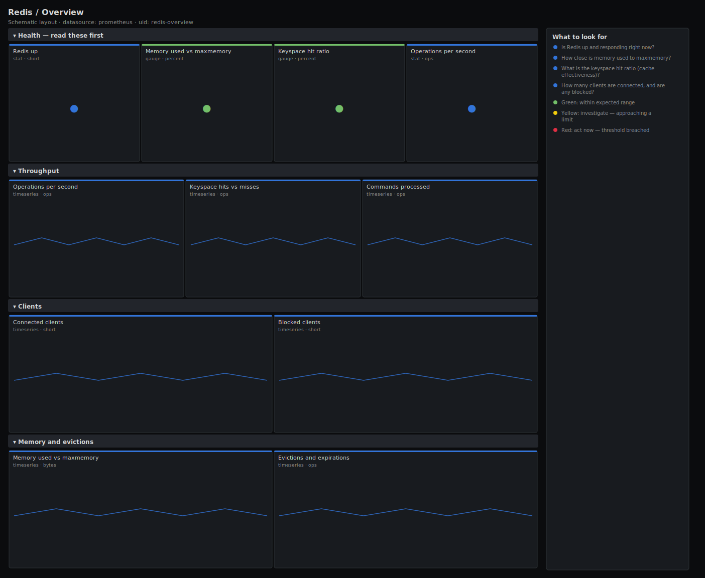

# Redis / Overview

> Top-level health for Redis instances scraped by redis_exporter: liveness, memory used against maxmemory, keyspace hit ratio, throughput, connected and blocked clients, and evictions. Answers "is this Redis healthy, and is it about to start evicting or rejecting?".

**Primary search phrase:** Redis Grafana dashboard  
**Category:** `redis` · **UID:** `redis-overview` · **Datasource:** Prometheus



## Questions this dashboard answers

- Is Redis up and responding right now?
- How close is memory used to maxmemory?
- What is the keyspace hit ratio (cache effectiveness)?
- How many clients are connected, and are any blocked?
- Is Redis evicting keys under memory pressure?

## Production lessons — why this dashboard exists

Redis is single-threaded for command execution, so its health is dominated by memory and latency, not CPU. The number that predicts an incident is **memory used vs maxmemory**: cross the limit and, depending on the policy, Redis either starts evicting keys (cache misses spike downstream) or rejects writes outright. This dashboard leads with that ratio, the **hit ratio** (is the cache still earning its keep) and **blocked clients** (commands like BLPOP waiting, often a sign of a stuck consumer). A note on memory: when maxmemory is 0 the instance is unlimited and the percentage is meaningless — track absolute bytes against the host's RAM instead.

## Data source requirements

- **Prometheus** datasource (selected at import time via `${DS_PROMETHEUS}`).
- `redis_exporter` pointed at each instance (the `redis_up`, `redis_memory_used_bytes`, `redis_memory_max_bytes`, `redis_keyspace_hits_total`, `redis_keyspace_misses_total`, `redis_connected_clients` and `redis_evicted_keys_total` series).

## Template variables

| Variable | Label | Type | Purpose |
|----------|-------|------|---------|
| `${instance}` | Instance | query | Redis instance(s) to display; supports multi-select. |

## Panels

### Health — read these first

- **Redis up** (stat, `short`) — Liveness from redis_exporter. 1 = the exporter reached the instance.
- **Memory used vs maxmemory** (gauge, `percent`) — Worst instance's memory as a percentage of its maxmemory. Meaningless when maxmemory is 0 (unlimited).
- **Keyspace hit ratio** (gauge, `percent`) — Share of key lookups that hit over 5m. A low ratio means the cache is cold or under-sized.
- **Operations per second** (stat, `ops`) — Commands processed per second across selected instances — the throughput baseline.

### Throughput

- **Operations per second** (timeseries, `ops`) — Instantaneous ops/s per instance — the live command rate.
- **Keyspace hits vs misses** (timeseries, `ops`) — Lookup outcomes per second. A rising miss line is a cold or under-sized cache.
- **Commands processed** (timeseries, `ops`) — Total commands per second from the cumulative counter — a smoother view than instantaneous ops.

### Clients

- **Connected clients** (timeseries, `short`) — Open client connections per instance. A sudden climb can exhaust maxclients.
- **Blocked clients** (timeseries, `short`) — Clients blocked on BLPOP/BRPOP/WAIT and similar. Persistent blocking points at a stuck consumer.

### Memory and evictions

- **Memory used vs maxmemory** (timeseries, `bytes`) — Memory consumed against the configured ceiling per instance. The gap is your headroom before eviction.
- **Evictions and expirations** (timeseries, `ops`) — Keys evicted under memory pressure vs keys expired by TTL. Evictions above zero mean you are over maxmemory.

## Import

**Grafana UI** — *Dashboards → New → Import*, upload `dashboards/redis/overview.json`, then pick your datasource when prompted.

**API:**

```bash
scripts/import-dashboard.sh dashboards/redis/overview.json
```

**Provisioning** — drop the JSON into a provisioned folder (see [provisioning guide](../../provisioning.md)).

## Recommended alerts

Ready-to-use rules ship in `alerts/redis.rules.yml`.

### RedisInstanceDown (`critical`)

```promql
redis_up == 0
```

- **Fires after:** `1m`
- **Why it matters:** The exporter cannot reach the instance — dependent services losing their cache or queue are likely failing.
- **Investigate:** Check the redis-server process and host; confirm the exporter address and that Redis accepts connections.
- **Recovery:** Clears once redis_up reports 1 again.
- **False positives:** Exporter restart can briefly trip this — keep `for` at 1m.

### RedisMemoryHigh (`warning`)

```promql
100 * redis_memory_used_bytes / clamp_min(redis_memory_max_bytes, 1) > 90
```

- **Fires after:** `5m`
- **Why it matters:** Past maxmemory Redis either evicts keys (cache misses spike) or rejects writes, depending on the policy.
- **Investigate:** Open Redis / Keyspace & Memory; check key growth, large keys and whether a TTL is missing.
- **Recovery:** Clears when memory falls below 90% of maxmemory for 5m.
- **False positives:** Instances with maxmemory=0 (unlimited) make this ratio meaningless — scope the rule to instances with a limit.

### RedisLowHitRatio (`warning`)

```promql
100 * sum by (instance) (rate(redis_keyspace_hits_total[5m])) / clamp_min(
    sum by (instance) (rate(redis_keyspace_hits_total[5m]))
    + sum by (instance) (rate(redis_keyspace_misses_total[5m])), 1) < 80
```

- **Fires after:** `15m`
- **Why it matters:** A low hit ratio means most lookups miss, pushing load onto the backing database the cache was meant to protect.
- **Investigate:** Check whether the cache is cold after a restart, undersized, or being used as a primary store.
- **Recovery:** Clears when the hit ratio recovers above 80% for 5m.
- **False positives:** Write-heavy or queue workloads have naturally low hit ratios; scope this to read-cache instances.

## Troubleshooting

| Symptom | Likely cause | First action |
|---------|--------------|--------------|
| All panels show "No data" | redis_exporter not scraped or wrong `$instance`. | Check `redis_up` in Explore and confirm the instance label matches your scrape config. |
| Memory percentage reads 0 or a huge number | maxmemory is 0 (unlimited), so the ratio is undefined and dominated by the clamp. | Track absolute redis_memory_used_bytes against host RAM instead, or set maxmemory. |
| Hit ratio is 100% with no traffic | Hit and miss rates are both ~0, so the clamp dominates. | Read it alongside ops/s; the ratio is only meaningful under load. |

## Performance considerations

Rates use a 5m window so a restart never spikes them, and hit-ratio/memory ratios clamp their denominator with `clamp_min(...,1)` to stay defined at zero traffic or unlimited memory. Per-instance aggregation keeps series count proportional to nodes.

## Customization

Tune the 80%/90% memory and hit-ratio thresholds to your role — a queue broker is not a read cache. If you run many DB indexes, pair this with Redis / Keyspace & Memory for per-db key counts.

## Related resources

- [Advanced observability guides](https://devopsaitoolkit.com/guides/)
- [Grafana & Prometheus tutorials](https://devopsaitoolkit.com/blog/)
- [AI Incident Response Assistant](https://devopsaitoolkit.com/dashboard/incident-response)
- [PromQL cookbook](../../../promql/README.md) · [Alerting guide](../../alerting.md) · [Dashboard catalog](../../catalog.md)
