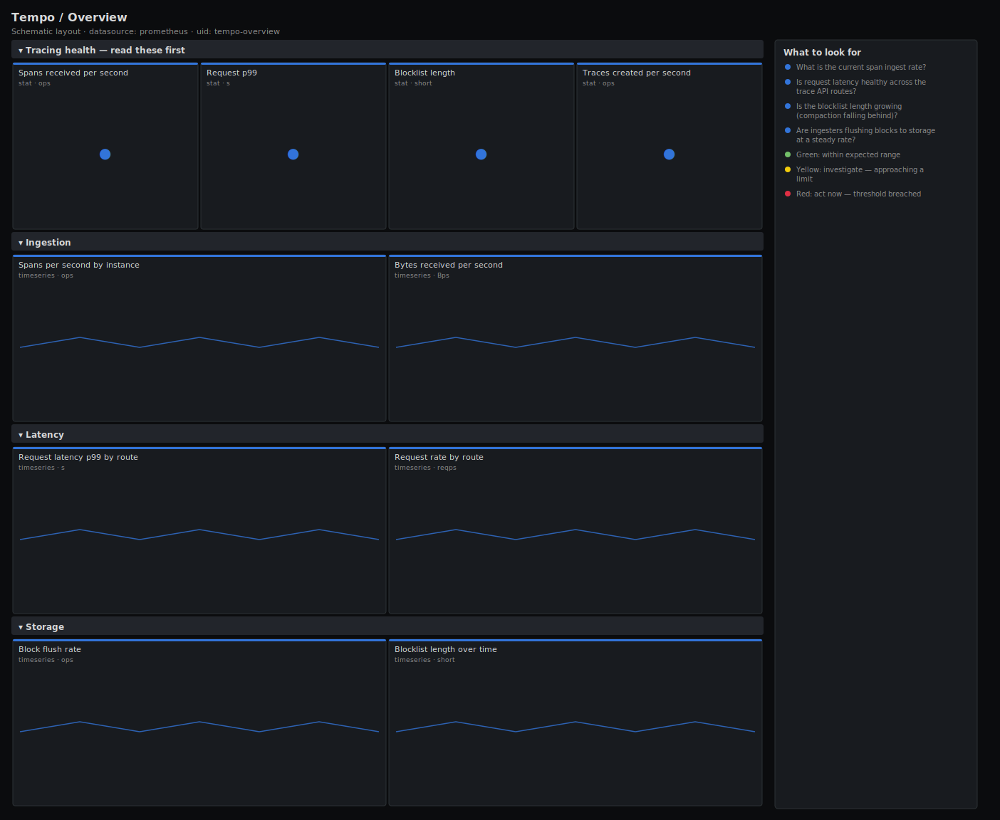

# Tempo / Overview

> Top-level health of a Tempo deployment: spans and bytes received, traces created, request latency, block flush rate and blocklist length. Answers "is the tracing backend ingesting spans and writing them to long-term storage cleanly?"

**Primary search phrase:** Grafana Tempo Grafana dashboard  
**Category:** `tempo` · **UID:** `tempo-overview` · **Datasource:** Prometheus



## Questions this dashboard answers

- What is the current span ingest rate?
- Is request latency healthy across the trace API routes?
- Is the blocklist length growing (compaction falling behind)?
- Are ingesters flushing blocks to storage at a steady rate?
- How many traces and bytes are being created and received?

## Production lessons — why this dashboard exists

Tempo is mostly a pipe to object storage, so its two real failure modes are obvious once you watch the right signals: spans stop arriving (the collectors or distributors broke) or blocks stop reaching storage and the blocklist balloons (compaction or the backend is struggling). We lead with span ingest, request p99 and blocklist length because that trio covers "are we receiving data, serving it, and storing it?" A blocklist that grows without bound eventually slows every read and signals that compaction cannot keep pace with ingestion.

## Data source requirements

- **Prometheus** datasource (selected at import time via `${DS_PROMETHEUS}`).
- `tempo` components exposing `tempo_distributor_spans_received_total`, `tempo_distributor_bytes_received_total`, `tempo_ingester_traces_created_total`, `tempo_ingester_blocks_flushed_total`, `tempodb_blocklist_length` and `tempo_request_duration_seconds_*`.

## Template variables

| Variable | Label | Type | Purpose |
|----------|-------|------|---------|
| `${job}` | Job | query | Tempo component job (distributor, ingester, querier, compactor). |

## Panels

### Tracing health — read these first

- **Spans received per second** (stat, `ops`) — Spans accepted by the distributors — the tracing workload's ingest rate.
- **Request p99** (stat, `s`) — 99th-percentile latency across Tempo request routes — the read/write SLO in one number.
- **Blocklist length** (stat, `short`) — Number of blocks the compactor tracks. Steady growth means compaction is falling behind and reads will slow.
- **Traces created per second** (stat, `ops`) — New traces assembled by the ingesters — confirms spans are being grouped into traces.

### Ingestion

- **Spans per second by instance** (timeseries, `ops`) — Per-distributor span rate — a node falling behind shows up as a divergence here.
- **Bytes received per second** (timeseries, `Bps`) — Trace volume into the distributors — the bandwidth and storage-cost driver.

### Latency

- **Request latency p99 by route** (timeseries, `s`) — 99th-percentile request duration per route — separates slow ingest from slow trace queries.
- **Request rate by route** (timeseries, `reqps`) — Requests per second per route — the workload behind the latency numbers above.

### Storage

- **Block flush rate** (timeseries, `ops`) — Blocks flushed to object storage per second — a stall means data is held in memory and at risk.
- **Blocklist length over time** (timeseries, `short`) — Tracked blocks over time — a steady climb is the signature of compaction not keeping up.

## Import

**Grafana UI** — *Dashboards → New → Import*, upload `dashboards/tempo/overview.json`, then pick your datasource when prompted.

**API:**

```bash
scripts/import-dashboard.sh dashboards/tempo/overview.json
```

**Provisioning** — drop the JSON into a provisioned folder (see [provisioning guide](../../provisioning.md)).

## Recommended alerts

Ready-to-use rules ship in `alerts/tempo.rules.yml`.

### TempoNoSpansReceived (`critical`)

```promql
sum(rate(tempo_distributor_spans_received_total[5m])) == 0
```

- **Fires after:** `10m`
- **Why it matters:** Zero span ingest means tracing has gone dark — either the collectors stopped sending or the distributors are broken.
- **Investigate:** Open Tempo / Overview, check distributor request rate and the OTLP/Jaeger receiver endpoints from the agents.
- **Recovery:** Clears when span ingest returns above zero for 5m.
- **False positives:** Genuinely idle environments (nights, dev) receive no spans — scope this to production or raise the `for`.

### TempoBlocklistGrowing (`warning`)

```promql
tempodb_blocklist_length > 5000
```

- **Fires after:** `30m`
- **Why it matters:** A growing blocklist means compaction cannot keep up, which slows every trace read and inflates object-storage cost.
- **Investigate:** Check the compactor's throughput and CPU, and whether ingestion recently increased.
- **Recovery:** Clears when the blocklist falls below 5000 for 5m.
- **False positives:** Large, high-retention clusters legitimately track many blocks — tune the threshold to your scale.

### TempoRequestLatencyHigh (`warning`)

```promql
histogram_quantile(0.99, sum by (le, route) (rate(tempo_request_duration_seconds_bucket[5m]))) > 5
```

- **Fires after:** `10m`
- **Why it matters:** Slow requests degrade trace ingest or make trace lookups unusable when an engineer is mid-incident.
- **Investigate:** Identify the route, then check the owning component's CPU and object-storage latency.
- **Recovery:** Clears when p99 falls below 5s for 5m.
- **False positives:** A heavy trace-search query can spike read latency briefly.

## Troubleshooting

| Symptom | Likely cause | First action |
|---------|--------------|--------------|
| Spans received is zero but apps are running | The trace pipeline (agent/collector to Tempo) is broken, not Tempo itself. | Check the collector's exporter logs and the Tempo receiver ports. |
| Blocklist climbs but flush rate looks fine | Ingesters flush fine, but the compactor cannot merge blocks fast enough. | Scale the compactor and raise compaction concurrency. |
| Latency by route is empty | The route label differs in your Tempo version, or no traffic in the window. | List route label values in Explore and widen the time range. |

## Performance considerations

Latency panels read native `tempo_request_duration_seconds_bucket` histograms aggregated by `le` plus `route`. Ingest and flush panels use 5m rates aggregated per instance. The blocklist panel reads a gauge directly, so it is cheap.

## Customization

Tune the 5000-block and 5s latency thresholds to your retention and SLO. Scope the no-spans alert to production with a label selector so idle dev environments do not page. Use `$job` to focus on a single component.

## Related resources

- [Advanced observability guides](https://devopsaitoolkit.com/guides/)
- [Grafana & Prometheus tutorials](https://devopsaitoolkit.com/blog/)
- [AI Incident Response Assistant](https://devopsaitoolkit.com/dashboard/incident-response)
- [PromQL cookbook](../../../promql/README.md) · [Alerting guide](../../alerting.md) · [Dashboard catalog](../../catalog.md)
