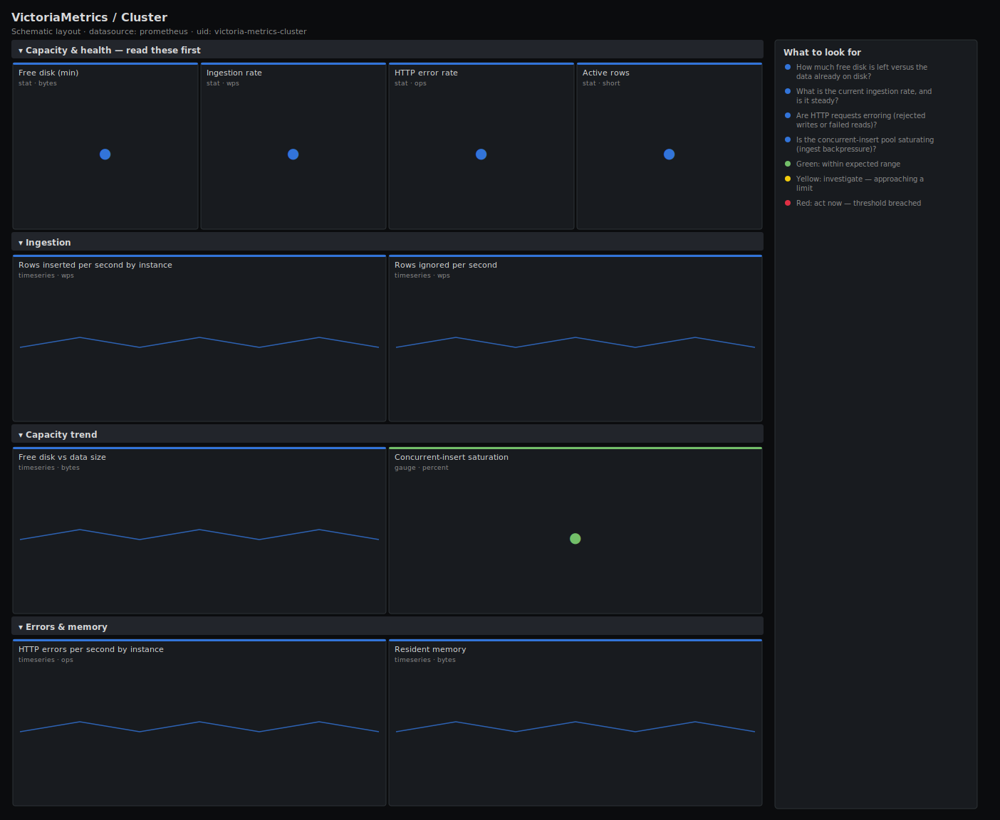

# VictoriaMetrics / Cluster

> Health of a VictoriaMetrics store: active rows, ingestion rate, free disk vs data size, HTTP error rate and concurrent-insert saturation. Answers "is the long-term metrics store keeping up and will it run out of disk?"

**Primary search phrase:** VictoriaMetrics Grafana dashboard  
**Category:** `victoria-metrics` · **UID:** `victoria-metrics-cluster` · **Datasource:** Prometheus



## Questions this dashboard answers

- How much free disk is left versus the data already on disk?
- What is the current ingestion rate, and is it steady?
- Are HTTP requests erroring (rejected writes or failed reads)?
- Is the concurrent-insert pool saturating (ingest backpressure)?
- Are rows being ignored (dropped) on ingest?

## Production lessons — why this dashboard exists

VictoriaMetrics is unusually forgiving until it hits two walls: disk and the concurrent-insert limiter. Free disk is the one number that ends the cluster outright, so it leads, followed by ingestion rate and HTTP errors. The concurrent-insert pool is the subtle one — when current inserts pin against capacity, writers queue and remote_write upstreams start buffering, so we surface that as a saturation gauge rather than burying it. Ignored rows reveal malformed or out-of-retention data that silently never lands.

## Data source requirements

- **Prometheus** datasource (selected at import time via `${DS_PROMETHEUS}`).
- `victoria-metrics` (single-node or cluster vmstorage/vminsert) exposing the `vm_rows`, `vm_rows_inserted_total`, `vm_free_disk_space_bytes`, `vm_data_size_bytes`, `vm_http_request_errors_total`, `vm_concurrent_insert_*` and `vm_rows_ignored_total` series.

## Template variables

| Variable | Label | Type | Purpose |
|----------|-------|------|---------|
| `${job}` | Job | query | Scrape job for your VictoriaMetrics targets. |
| `${instance}` | Instance | query | VictoriaMetrics instance(s); keep All for clustered storage. |

## Panels

### Capacity & health — read these first

- **Free disk (min)** (stat, `bytes`) — Smallest free-disk figure across selected nodes. When this hits zero the store stops accepting writes.
- **Ingestion rate** (stat, `wps`) — Rows inserted per second across selected nodes — your effective write throughput.
- **HTTP error rate** (stat, `ops`) — HTTP request errors per second — rejected writes or failed reads against the store.
- **Active rows** (stat, `short`) — Rows currently tracked by the store — a proxy for active time series and the memory/disk driver.

### Ingestion

- **Rows inserted per second by instance** (timeseries, `wps`) — Per-node insert throughput — a node falling behind shows up as a divergence here.
- **Rows ignored per second** (timeseries, `wps`) — Dropped rows (malformed, out-of-order, past retention) — every increment is data that never landed.

### Capacity trend

- **Free disk vs data size** (timeseries, `bytes`) — Free space and on-disk data over time — extrapolate the gap to estimate days-to-full.
- **Concurrent-insert saturation** (gauge, `percent`) — Current concurrent inserts as a fraction of capacity. Near 100% means writers are queueing.

### Errors & memory

- **HTTP errors per second by instance** (timeseries, `ops`) — Where request errors are concentrated — a single bad node or a fleet-wide rejection.
- **Resident memory** (timeseries, `bytes`) — Process RSS per node — VictoriaMetrics trades memory for ingest speed, so watch this against active rows.

## Import

**Grafana UI** — *Dashboards → New → Import*, upload `dashboards/victoria-metrics/cluster.json`, then pick your datasource when prompted.

**API:**

```bash
scripts/import-dashboard.sh dashboards/victoria-metrics/cluster.json
```

**Provisioning** — drop the JSON into a provisioned folder (see [provisioning guide](../../provisioning.md)).

## Recommended alerts

Ready-to-use rules ship in `alerts/victoria-metrics.rules.yml`.

### VictoriaMetricsLowDisk (`critical`)

```promql
vm_free_disk_space_bytes < 53687091200
```

- **Fires after:** `10m`
- **Why it matters:** When free disk runs out VictoriaMetrics stops accepting writes and you lose ingestion until space is recovered.
- **Investigate:** Open VictoriaMetrics / Cluster, check the free-vs-data trend to estimate time-to-full and recent data growth.
- **Recovery:** Clears when free disk rises back above 50 GiB for 5m.
- **False positives:** Small dev instances run intentionally tight — tune the threshold to the node's volume size.

### VictoriaMetricsInsertSaturation (`warning`)

```promql
vm_concurrent_insert_current / clamp_min(vm_concurrent_insert_capacity, 1) > 0.9
```

- **Fires after:** `10m`
- **Why it matters:** A saturated insert limiter queues writers and pushes backpressure to remote_write upstreams, risking dropped samples there.
- **Investigate:** Check ingestion rate and CPU on the node, and whether a burst of new series arrived.
- **Recovery:** Clears when saturation falls below 90% for 5m.
- **False positives:** Brief saturation during a backfill or scrape-storm is expected.

### VictoriaMetricsHTTPErrors (`warning`)

```promql
sum by (instance, job) (rate(vm_http_request_errors_total[5m])) > 1
```

- **Fires after:** `10m`
- **Why it matters:** Sustained HTTP errors mean writes are being rejected or reads are failing, so data is lost or queries break.
- **Investigate:** Correlate with insert saturation and disk; check the VictoriaMetrics log for the error class.
- **Recovery:** Clears when the error rate drops below 1/s for 5m.
- **False positives:** A scraper sending malformed data inflates this without the store itself being unhealthy.

## Troubleshooting

| Symptom | Likely cause | First action |
|---------|--------------|--------------|
| Free-disk stat is red but the node has space | The metric reflects the data directory's volume, which may differ from root. | Check df on the actual -storageDataPath volume, not the host root. |
| Saturation gauge stuck at 0 | vm_concurrent_insert_capacity is unset on this version, so the ratio collapses. | Use the ingestion-rate panel and CPU instead on older builds. |
| Ignored rows climbing | A client is sending out-of-order or out-of-retention timestamps. | Inspect the client's clock and the configured retention; fix the offending writer. |

## Performance considerations

Rate panels use 5m windows. The saturation expression guards the divisor with `clamp_min(..., 1)` so it never divides by zero on a fresh start. Disk and rows panels read gauges directly and aggregate per instance to bound series count.

## Customization

Tune the 50/200 GiB disk thresholds to your volume sizes and the 90% saturation threshold to your latency tolerance. For cluster mode, scope `$instance` to the vmstorage role when chasing disk, and to vminsert when chasing insert saturation.

## Related resources

- [Advanced observability guides](https://devopsaitoolkit.com/guides/)
- [Grafana & Prometheus tutorials](https://devopsaitoolkit.com/blog/)
- [AI Incident Response Assistant](https://devopsaitoolkit.com/dashboard/incident-response)
- [PromQL cookbook](../../../promql/README.md) · [Alerting guide](../../alerting.md) · [Dashboard catalog](../../catalog.md)
