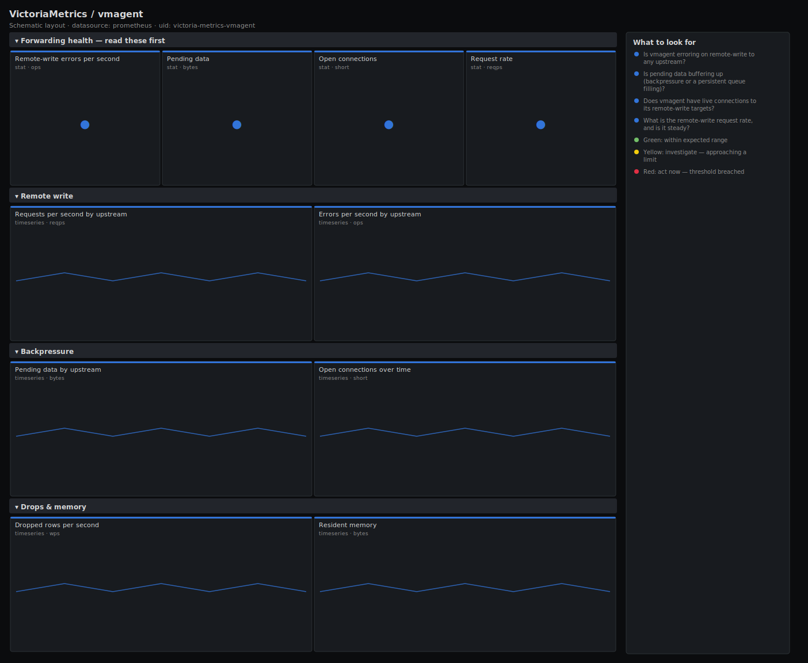

# VictoriaMetrics / vmagent

> Forwarding health for vmagent: remote-write request and error rate, pending-data backpressure, open connections and dropped rows. Answers "is the agent that scrapes and ships my metrics actually delivering them?"

**Primary search phrase:** vmagent Grafana dashboard  
**Category:** `victoria-metrics` · **UID:** `victoria-metrics-vmagent` · **Datasource:** Prometheus



## Questions this dashboard answers

- Is vmagent erroring on remote-write to any upstream?
- Is pending data buffering up (backpressure or a persistent queue filling)?
- Does vmagent have live connections to its remote-write targets?
- What is the remote-write request rate, and is it steady?
- Are rows being dropped before they ship?

## Production lessons — why this dashboard exists

vmagent sits between your scrape targets and storage, so when it stalls the whole pipeline goes dark while every component looks individually healthy. The two signals that matter are remote-write errors (deliveries failing) and pending-data bytes (the on-disk/in-memory buffer filling because the upstream is slow or down). Connections confirm the agent can even reach its targets, and dropped rows reveal data lost before it ever left the agent. A buffer that fills to its cap silently drops the oldest data.

## Data source requirements

- **Prometheus** datasource (selected at import time via `${DS_PROMETHEUS}`).
- `vmagent` exposing the `vmagent_remotewrite_requests_total`, `vmagent_remotewrite_errors_total`, `vmagent_remotewrite_pending_data_bytes`, `vmagent_remotewrite_conn`, `vm_rows_ignored_total` and `process_*` series.

## Template variables

| Variable | Label | Type | Purpose |
|----------|-------|------|---------|
| `${job}` | Job | query | Scrape job for your vmagent targets. |
| `${instance}` | Instance | query | vmagent instance(s). |

## Panels

### Forwarding health — read these first

- **Remote-write errors per second** (stat, `ops`) — Failed remote-write requests across upstreams. Sustained errors mean data is buffering or being lost.
- **Pending data** (stat, `bytes`) — Bytes buffered awaiting delivery. A rising figure is backpressure; at the buffer cap, oldest data is dropped.
- **Open connections** (stat, `short`) — Live connections to remote-write upstreams. Zero means the agent cannot reach any target.
- **Request rate** (stat, `reqps`) — Remote-write requests per second — should be non-zero whenever the agent is scraping data.

### Remote write

- **Requests per second by upstream** (timeseries, `reqps`) — Per-target remote-write request rate — confirms each upstream is receiving traffic.
- **Errors per second by upstream** (timeseries, `ops`) — Per-target failure rate — pinpoints which upstream is rejecting or unreachable.

### Backpressure

- **Pending data by upstream** (timeseries, `bytes`) — Per-target buffer size — a steady climb means that upstream cannot keep up and the queue is filling.
- **Open connections over time** (timeseries, `short`) — Connection count per agent — flapping to zero marks reachability problems with an upstream.

### Drops & memory

- **Dropped rows per second** (timeseries, `wps`) — Rows ignored before shipping (relabel-dropped or malformed) — confirm these are intentional.
- **Resident memory** (timeseries, `bytes`) — Process RSS per agent — a buffer that is growing in memory shows up here before it spills to disk.

## Import

**Grafana UI** — *Dashboards → New → Import*, upload `dashboards/victoria-metrics/vmagent.json`, then pick your datasource when prompted.

**API:**

```bash
scripts/import-dashboard.sh dashboards/victoria-metrics/vmagent.json
```

**Provisioning** — drop the JSON into a provisioned folder (see [provisioning guide](../../provisioning.md)).

## Recommended alerts

Ready-to-use rules ship in `alerts/victoria-metrics.rules.yml`.

### VMAgentRemoteWriteErrors (`critical`)

```promql
rate(vmagent_remotewrite_errors_total[5m]) > 0
```

- **Fires after:** `10m`
- **Why it matters:** Failed remote-write means scraped metrics are buffering and, once the buffer caps, being dropped — a pipeline-wide blind spot.
- **Investigate:** Open VictoriaMetrics / vmagent, find the erroring upstream, and check its availability and auth.
- **Recovery:** Clears when no errors occur for 5m.
- **False positives:** A short upstream outage trips this; the persistent queue replays once it recovers.

### VMAgentBackpressure (`warning`)

```promql
vmagent_remotewrite_pending_data_bytes > 1073741824
```

- **Fires after:** `15m`
- **Why it matters:** A large pending buffer means the upstream cannot keep up; if it reaches the cap, the oldest data is discarded.
- **Investigate:** Check the matching upstream's ingest rate and the agent's disk/memory headroom.
- **Recovery:** Clears when pending data drains below 1 GiB for 5m.
- **False positives:** Catch-up after an upstream outage temporarily inflates the buffer.

### VMAgentNoConnections (`critical`)

```promql
sum by (instance, job) (vmagent_remotewrite_conn) == 0
```

- **Fires after:** `5m`
- **Why it matters:** With zero connections the agent cannot ship anything, so all scraped data is held locally and will eventually be lost.
- **Investigate:** Check network reachability to the configured -remoteWrite.url targets and DNS resolution from the agent.
- **Recovery:** Clears when at least one connection is established for 5m.
- **False positives:** A single-upstream agent restarting briefly shows zero — covered by the 5m for.

## Troubleshooting

| Symptom | Likely cause | First action |
|---------|--------------|--------------|
| Pending data climbing with no errors | The upstream accepts writes but slowly, so the queue fills faster than it drains. | Compare request rate to upstream ingest capacity; scale the upstream. |
| Dropped rows is high but expected | Aggressive relabel_configs are intentionally discarding series. | Confirm the drop rules; no action if the drops are by design. |
| Connections panel blank | This vmagent version does not export the conn metric, or the job label differs. | Fall back to request-rate as a liveness signal on older builds. |

## Performance considerations

Request and error panels use 5m rates. Per-upstream panels aggregate by `url` to keep one series per remote target. The no-connections alert sums per instance so a multi-upstream agent does not false-fire when a single target blips.

## Customization

Set the 256 MiB / 1 GiB pending thresholds to your -remoteWrite.maxDiskUsagePerURL budget. For agents with many upstreams, the per-url panels already separate them; scope `$instance` to one agent when chasing a specific buffer.

## Related resources

- [Advanced observability guides](https://devopsaitoolkit.com/guides/)
- [Grafana & Prometheus tutorials](https://devopsaitoolkit.com/blog/)
- [AI Incident Response Assistant](https://devopsaitoolkit.com/dashboard/incident-response)
- [PromQL cookbook](../../../promql/README.md) · [Alerting guide](../../alerting.md) · [Dashboard catalog](../../catalog.md)
